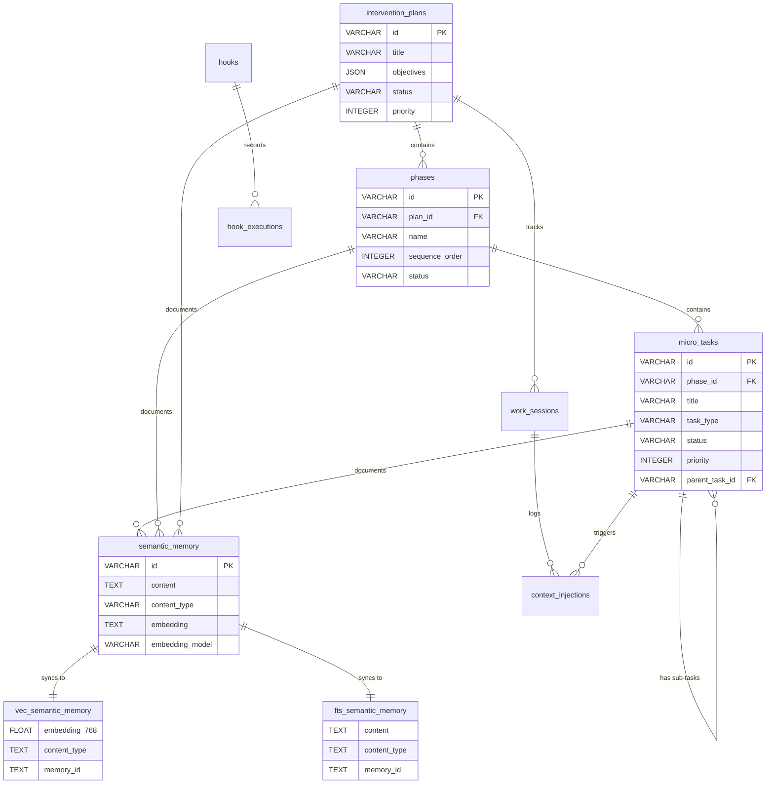
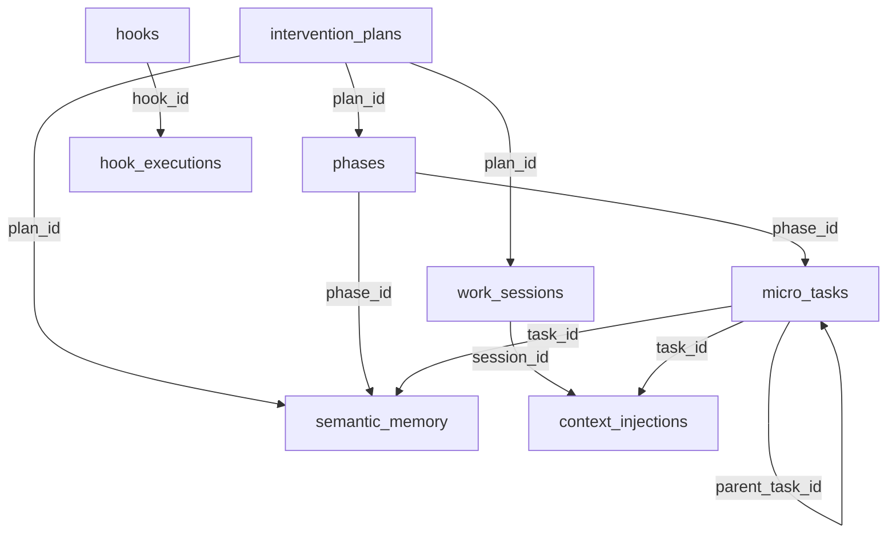

# DevStream Database Schema Reference

**Version**: 2.1.0 | **Last Updated**: 2025-10-01 | **Status**: Production

Complete reference for DevStream's SQLite database schema with vector search extensions.

---

## Table of Contents

- [Overview](#overview)
- [Schema Architecture](#schema-architecture)
- [Core Tables](#core-tables)
  - [schema_version](#schema_version)
  - [intervention_plans](#intervention_plans)
  - [phases](#phases)
  - [micro_tasks](#micro_tasks)
  - [semantic_memory](#semantic_memory)
- [Virtual Tables](#virtual-tables)
  - [vec_semantic_memory](#vec_semantic_memory)
  - [fts_semantic_memory](#fts_semantic_memory)
- [System Tables](#system-tables)
  - [agents](#agents)
  - [hooks](#hooks)
  - [hook_executions](#hook_executions)
  - [work_sessions](#work_sessions)
  - [context_injections](#context_injections)
  - [learning_insights](#learning_insights)
  - [performance_metrics](#performance_metrics)
- [Triggers](#triggers)
- [Indexes](#indexes)
- [Relationships](#relationships)
- [Example Queries](#example-queries)
- [Performance Optimization](#performance-optimization)

---

## Overview

DevStream database combines traditional relational tables with modern vector search capabilities for semantic memory and knowledge management.

### Key Features

- **SQLite 3.46+**: Modern SQLite with JSON support
- **sqlite-vec Extension**: Vector similarity search (768D embeddings)
- **FTS5 Extension**: Full-text keyword search with BM25 ranking
- **Automatic Triggers**: Sync semantic_memory → vec0 + FTS5
- **Comprehensive Indexing**: Optimized for read-heavy workloads

### Database Statistics

| Metric | Value |
|--------|-------|
| **Total Tables** | 14 (11 regular + 3 virtual) |
| **Total Indexes** | 24 |
| **Total Triggers** | 3 (insert/update/delete sync) |
| **Foreign Keys** | 12 relationships |
| **Extensions** | sqlite-vec (vec0), FTS5 (built-in) |

---

## Schema Architecture

### Entity Relationship Diagram



### Table Hierarchy

```
Level 1: SCHEMA METADATA
  └── schema_version

Level 2: PROJECT STRUCTURE
  └── intervention_plans
      └── phases
          └── micro_tasks

Level 3: KNOWLEDGE MANAGEMENT
  └── semantic_memory
      ├── vec_semantic_memory (virtual table)
      └── fts_semantic_memory (virtual table)

Level 4: AUTOMATION & MONITORING
  ├── agents
  ├── hooks → hook_executions
  ├── work_sessions → context_injections
  ├── learning_insights
  └── performance_metrics
```

---

## Core Tables

### schema_version

Track schema migrations and version history.

#### Schema

| Column | Type | Constraints | Description |
|--------|------|-------------|-------------|
| `version` | TEXT | PRIMARY KEY | Semantic version (e.g., '2.1.0') |
| `applied_at` | TIMESTAMP | DEFAULT CURRENT_TIMESTAMP | Migration timestamp |
| `description` | TEXT | - | Migration description |

#### Example Data

```sql
INSERT INTO schema_version (version, description) VALUES
('2.1.0', 'Initial DevStream production schema with vector search and full-text search');
```

#### Usage

```sql
-- Check current schema version
SELECT version, applied_at, description
FROM schema_version
ORDER BY applied_at DESC
LIMIT 1;

-- Result: version='2.1.0', applied_at='2025-10-01 10:00:00'
```

---

### intervention_plans

Top-level project/feature planning with objectives and technical specifications.

#### Schema

| Column | Type | Constraints | Description |
|--------|------|-------------|-------------|
| `id` | VARCHAR(32) | PRIMARY KEY | UUID format (e.g., 'PLAN-001') |
| `title` | VARCHAR(200) | NOT NULL | Human-readable plan title |
| `description` | TEXT | - | Detailed plan description |
| `objectives` | JSON | NOT NULL | JSON array: `["objective1", "objective2"]` |
| `technical_specs` | JSON | - | JSON object: `{"framework": "FastAPI", ...}` |
| `expected_outcome` | TEXT | NOT NULL | Success criteria |
| `status` | VARCHAR(20) | CHECK IN ('draft', 'active', 'completed', 'archived', 'cancelled') | Lifecycle state |
| `priority` | INTEGER | CHECK BETWEEN 1 AND 10 | Priority level (higher = more important) |
| `estimated_hours` | FLOAT | - | Initial time estimate |
| `actual_hours` | FLOAT | - | Actual time spent |
| `tags` | JSON | - | JSON array: `["backend", "api"]` |
| `metadata` | JSON | - | Additional structured data |
| `created_at` | TIMESTAMP | DEFAULT CURRENT_TIMESTAMP | Creation timestamp |
| `updated_at` | TIMESTAMP | DEFAULT CURRENT_TIMESTAMP | Last update timestamp |
| `completed_at` | TIMESTAMP | - | Completion timestamp (NULL until completed) |

#### Status Values

| Status | Description | Transitions To |
|--------|-------------|----------------|
| `draft` | Initial planning | `active`, `cancelled` |
| `active` | Currently in progress | `completed`, `paused`, `cancelled` |
| `completed` | Successfully finished | `archived` |
| `paused` | Temporarily stopped | `active`, `cancelled` |
| `archived` | Historical record | - |
| `cancelled` | Abandoned | - |

#### Example Data

```sql
INSERT INTO intervention_plans (
  id, title, description, objectives, expected_outcome,
  status, priority, estimated_hours, actual_hours
) VALUES (
  'PLAN-001',
  'RUSTY Trading Platform Development',
  'Complete development of RUSTY Trading Platform with real-time market data',
  '["Implement core engine", "Add market data integration", "Deploy to production"]',
  'Fully functional trading platform with 99.9% uptime',
  'active',
  9,
  100.0,
  67.5
);
```

#### Indexes

- `idx_intervention_plans_status` (status)
- `idx_intervention_plans_priority` (priority DESC)
- `idx_intervention_plans_created_at` (created_at DESC)

---

### phases

Logical phases within intervention plans with sequence ordering and dependency tracking.

#### Schema

| Column | Type | Constraints | Description |
|--------|------|-------------|-------------|
| `id` | VARCHAR(32) | PRIMARY KEY | UUID format |
| `plan_id` | VARCHAR(32) | NOT NULL, FOREIGN KEY → intervention_plans(id) | Parent plan |
| `name` | VARCHAR(200) | NOT NULL | Phase name (e.g., "Core Engine & Infrastructure") |
| `description` | TEXT | - | Phase description |
| `sequence_order` | INTEGER | NOT NULL | Execution order (1, 2, 3, ...) |
| `is_parallel` | BOOLEAN | - | Can run concurrently with other phases |
| `dependencies` | JSON | - | JSON array: `["PHASE-001", "PHASE-002"]` |
| `status` | VARCHAR(20) | CHECK IN ('pending', 'active', 'completed', 'blocked', 'skipped') | Phase status |
| `estimated_minutes` | INTEGER | - | Time estimate for phase |
| `actual_minutes` | INTEGER | - | Actual time spent |
| `blocking_reason` | TEXT | - | Description of blocker (if status='blocked') |
| `completion_criteria` | TEXT | - | What defines "done" |
| `created_at` | TIMESTAMP | DEFAULT CURRENT_TIMESTAMP | Creation timestamp |
| `started_at` | TIMESTAMP | - | When phase started |
| `completed_at` | TIMESTAMP | - | When phase completed |

#### Relationships

**Foreign Keys**:
- `plan_id` → `intervention_plans(id)` (CASCADE DELETE)

**Self-Referential**:
- `dependencies` (JSON array) references other phase IDs

#### Example Data

```sql
INSERT INTO phases (
  id, plan_id, name, description, sequence_order,
  status, estimated_minutes, actual_minutes
) VALUES (
  'PHASE-001',
  'PLAN-001',
  'Core Engine & Infrastructure',
  'Build foundational async event loop and core data structures',
  1,
  'completed',
  1200,  -- 20 hours
  1350   -- 22.5 hours actual
);
```

#### Indexes

- `idx_phases_plan_id` (plan_id)
- `idx_phases_status` (status)
- `idx_phases_sequence_order` (plan_id, sequence_order)

---

### micro_tasks

Atomic work units (max 10 minutes) with agent assignment and execution tracking.

#### Schema

| Column | Type | Constraints | Description |
|--------|------|-------------|-------------|
| `id` | VARCHAR(32) | PRIMARY KEY | UUID format |
| `phase_id` | VARCHAR(32) | NOT NULL, FOREIGN KEY → phases(id) | Parent phase |
| `title` | VARCHAR(200) | NOT NULL | Task title |
| `description` | TEXT | NOT NULL | Detailed task description |
| `max_duration_minutes` | INTEGER | CHECK <= 10 | Hard limit (10 min for micro-tasks) |
| `max_context_tokens` | INTEGER | - | Token budget |
| `assigned_agent` | VARCHAR(50) | - | Agent ID (e.g., '@python-specialist') |
| `task_type` | VARCHAR(20) | CHECK IN ('analysis', 'coding', 'documentation', 'testing', 'review', 'research') | Task category |
| `status` | VARCHAR(20) | CHECK IN ('pending', 'active', 'completed', 'failed', 'skipped') | Task status |
| `priority` | INTEGER | CHECK BETWEEN 1 AND 10 | Priority level |
| `input_files` | JSON | - | JSON array: `["file1.py", "file2.py"]` |
| `output_files` | JSON | - | JSON array: `["output1.py"]` |
| `generated_code` | TEXT | - | Code generated by task |
| `documentation` | TEXT | - | Documentation generated |
| `error_log` | TEXT | - | Error messages if failed |
| `actual_duration_minutes` | FLOAT | - | Actual time spent |
| `context_tokens_used` | INTEGER | - | Actual tokens used |
| `retry_count` | INTEGER | - | Number of retries |
| `parent_task_id` | VARCHAR(32) | FOREIGN KEY → micro_tasks(id) | For sub-tasks |
| `created_at` | TIMESTAMP | DEFAULT CURRENT_TIMESTAMP | Creation timestamp |
| `started_at` | TIMESTAMP | - | When task started |
| `completed_at` | TIMESTAMP | - | When task completed |
| `last_retry_at` | TIMESTAMP | - | Last retry timestamp |

#### Relationships

**Foreign Keys**:
- `phase_id` → `phases(id)` (CASCADE DELETE)
- `parent_task_id` → `micro_tasks(id)` (self-referential for sub-tasks)

#### Task Types

| Type | Description | Typical Duration |
|------|-------------|------------------|
| `analysis` | Code analysis, requirements gathering | 5-10 min |
| `coding` | Implementation, code writing | 8-10 min |
| `documentation` | Writing docs, comments | 5-8 min |
| `testing` | Writing tests, debugging | 8-10 min |
| `review` | Code review, validation | 3-5 min |
| `research` | Technology research, spike | 10 min |

#### Example Data

```sql
INSERT INTO micro_tasks (
  id, phase_id, title, description, max_duration_minutes,
  assigned_agent, task_type, status, priority
) VALUES (
  'TASK-001',
  'PHASE-001',
  'Implement Python asyncio event loop',
  'Design and implement the core async event loop using Python asyncio',
  10,
  '@python-specialist',
  'coding',
  'completed',
  9
);
```

#### Indexes

- `idx_micro_tasks_phase_id` (phase_id)
- `idx_micro_tasks_status` (status)
- `idx_micro_tasks_assigned_agent` (assigned_agent)
- `idx_micro_tasks_priority` (priority DESC)
- `idx_micro_tasks_parent_task_id` (parent_task_id)

---

### semantic_memory

Central knowledge store with vector embeddings for semantic search.

#### Schema

| Column | Type | Constraints | Description |
|--------|------|-------------|-------------|
| `id` | VARCHAR(32) | PRIMARY KEY | UUID format |
| `plan_id` | VARCHAR(32) | FOREIGN KEY → intervention_plans(id) | Optional: link to plan |
| `phase_id` | VARCHAR(32) | FOREIGN KEY → phases(id) | Optional: link to phase |
| `task_id` | VARCHAR(32) | FOREIGN KEY → micro_tasks(id) | Optional: link to task |
| `content` | TEXT | NOT NULL | Full content (code, docs, etc.) |
| `content_type` | VARCHAR(20) | NOT NULL, CHECK IN ('code', 'documentation', 'context', 'output', 'error', 'decision', 'learning') | Content category |
| `content_format` | VARCHAR(20) | CHECK IN ('text', 'markdown', 'code', 'json', 'yaml') | Format type |
| `keywords` | JSON | - | JSON array: `["python", "fastapi", "async"]` |
| `entities` | JSON | - | JSON array: extracted entities |
| `sentiment` | FLOAT | - | Sentiment score (-1 to 1) |
| `complexity_score` | INTEGER | CHECK BETWEEN 1 AND 10 | Content complexity |
| `embedding` | TEXT | - | Vector embedding (768-dim float array as TEXT/JSON) |
| `embedding_model` | VARCHAR(50) | - | Model name (e.g., 'nomic-embed-text') |
| `embedding_dimension` | INTEGER | - | Dimension count (768 for nomic-embed-text) |
| `context_snapshot` | JSON | - | JSON: execution context at creation time |
| `related_memory_ids` | JSON | - | JSON array: `["MEM-001", "MEM-002"]` |
| `access_count` | INTEGER | - | How many times accessed |
| `last_accessed_at` | TIMESTAMP | - | Last access timestamp |
| `relevance_score` | FLOAT | - | Dynamic relevance score (0-1) |
| `is_archived` | BOOLEAN | - | Archived flag |
| `created_at` | TIMESTAMP | DEFAULT CURRENT_TIMESTAMP | Creation timestamp |
| `updated_at` | TIMESTAMP | DEFAULT CURRENT_TIMESTAMP | Last update timestamp |
| `source` | TEXT | - | Source information |
| `importance_score` | REAL | - | Importance score (0-1) |
| `metadata` | TEXT | - | Additional metadata |

#### Relationships

**Foreign Keys**:
- `plan_id` → `intervention_plans(id)` (CASCADE DELETE)
- `phase_id` → `phases(id)` (CASCADE DELETE)
- `task_id` → `micro_tasks(id)` (CASCADE DELETE)

**Automatic Sync**:
- Triggers sync to `vec_semantic_memory` (vector search)
- Triggers sync to `fts_semantic_memory` (keyword search)

#### Content Types

| Type | Use Case | Importance Weight |
|------|----------|-------------------|
| `code` | Code snippets, implementations | 0.7 |
| `documentation` | User guides, API docs | 0.6 |
| `context` | Background information | 0.6 |
| `output` | Execution results | 0.4 |
| `error` | Error logs, debugging info | 0.9 |
| `decision` | Architectural decisions | 0.8 |
| `learning` | Lessons learned, insights | 0.8 |

#### Example Data

```sql
INSERT INTO semantic_memory (
  id, task_id, content, content_type, content_format, keywords,
  embedding, embedding_model, embedding_dimension,
  relevance_score, access_count
) VALUES (
  'MEM-001',
  'TASK-001',
  'Decision: Use FastAPI for API layer due to async/await support...',
  'decision',
  'markdown',
  '["fastapi", "async", "api", "architecture"]',
  '[0.123, -0.456, 0.789, ...]',  -- 768-dimensional vector as JSON
  'nomic-embed-text',
  768,
  0.85,
  5
);
```

#### Indexes

- `idx_semantic_memory_content_type` (content_type)
- `idx_semantic_memory_plan_id` (plan_id)
- `idx_semantic_memory_phase_id` (phase_id)
- `idx_semantic_memory_task_id` (task_id)
- `idx_semantic_memory_created_at` (created_at DESC)
- `idx_semantic_memory_access_count` (access_count DESC)

---

## Virtual Tables

### vec_semantic_memory

Vector search table using sqlite-vec extension for semantic similarity search.

#### Schema

```sql
CREATE VIRTUAL TABLE vec_semantic_memory USING vec0(
    embedding float[768],                 -- 768-dimensional vector
    content_type TEXT PARTITION KEY,      -- Enables partition filtering
    +memory_id TEXT,                      -- Link to semantic_memory.id
    +content_preview TEXT                 -- First 200 chars
);
```

#### Column Definitions

| Column | Type | Description |
|--------|------|-------------|
| `embedding` | float[768] | 768-dimensional vector (vector column) |
| `content_type` | TEXT PARTITION KEY | Enables efficient filtering by content type |
| `memory_id` | TEXT (auxiliary) | Link back to semantic_memory.id |
| `content_preview` | TEXT (auxiliary) | First 200 characters for display |

**Note**: Columns prefixed with `+` are auxiliary columns (not indexed by vec0).

#### Usage Pattern

**Vector Similarity Search**:

```sql
-- Find semantically similar content
SELECT
  memory_id,
  distance,
  content_preview
FROM vec_semantic_memory
WHERE embedding MATCH ?1          -- Query vector (768D)
  AND k = 10                      -- Top 10 results
  AND content_type = 'decision'   -- Filter by partition
ORDER BY distance;                -- Cosine distance (lower = more similar)
```

**Partition Filtering**:
```sql
-- Efficient filtering by content_type (uses partition key)
WHERE content_type = 'code'       -- Fast (uses partition)
```

#### Automatic Sync

**Trigger**: `sync_insert_memory` (after INSERT on semantic_memory)

```sql
INSERT INTO vec_semantic_memory(embedding, content_type, memory_id, content_preview)
VALUES (NEW.embedding, NEW.content_type, NEW.id, substr(NEW.content, 1, 200));
```

#### Performance Notes

- **Search Time**: < 50ms for 10K vectors (k=10)
- **Distance Metric**: Cosine distance (L2-normalized)
- **Index Type**: HNSW (Hierarchical Navigable Small World)
- **Partitioning**: Speeds up filtered searches by 2-3x

---

### fts_semantic_memory

Full-text search table using FTS5 extension for keyword-based search.

#### Schema

```sql
CREATE VIRTUAL TABLE fts_semantic_memory USING fts5(
    content,                              -- Full-text indexed content
    content_type UNINDEXED,               -- Filter by content type
    memory_id UNINDEXED,                  -- Link to semantic_memory.id
    created_at UNINDEXED,                 -- Timestamp for sorting
    tokenize='unicode61 remove_diacritics 2'  -- Unicode tokenizer
);
```

#### Column Definitions

| Column | Type | Description |
|--------|------|-------------|
| `content` | TEXT (indexed) | Full-text indexed content |
| `content_type` | TEXT UNINDEXED | Filter by content type (not indexed) |
| `memory_id` | TEXT UNINDEXED | Link back to semantic_memory.id |
| `created_at` | TEXT UNINDEXED | Timestamp for sorting |

**Note**: Columns marked UNINDEXED are stored but not full-text indexed.

#### Usage Pattern

**Keyword Search**:

```sql
-- Search for keywords
SELECT
  memory_id,
  rank,
  highlight(fts_semantic_memory, 0, '<b>', '</b>') as snippet
FROM fts_semantic_memory
WHERE fts_semantic_memory MATCH 'fastapi AND async'  -- Boolean query
  AND content_type = 'decision'                      -- Filter by type
ORDER BY rank;                                       -- BM25 ranking
```

**Boolean Operators**:
- `AND`: All terms must match
- `OR`: Any term must match
- `NOT`: Exclude term
- `NEAR/N`: Terms within N tokens
- `""`: Exact phrase

**Example Queries**:
```sql
-- Exact phrase
WHERE fts_semantic_memory MATCH '"event loop"'

-- Multiple terms with OR
WHERE fts_semantic_memory MATCH 'fastapi OR flask OR django'

-- Proximity search (within 10 words)
WHERE fts_semantic_memory MATCH 'NEAR(async python, 10)'
```

#### Automatic Sync

**Trigger**: `sync_insert_memory` (after INSERT on semantic_memory)

```sql
INSERT INTO fts_semantic_memory(rowid, content, content_type, memory_id, created_at)
VALUES (NEW.rowid, NEW.content, NEW.content_type, NEW.id, NEW.created_at);
```

#### Performance Notes

- **Search Time**: < 20ms for 10K documents
- **Ranking Algorithm**: BM25 (Best Match 25)
- **Tokenizer**: Unicode61 with diacritics removal
- **Index Size**: ~30% of content size

---

## System Tables

### agents

Track available agents and their performance metrics.

#### Schema

| Column | Type | Constraints | Description |
|--------|------|-------------|-------------|
| `id` | VARCHAR(50) | PRIMARY KEY | Agent ID (e.g., '@tech-lead') |
| `name` | VARCHAR(100) | NOT NULL | Human-readable name |
| `role` | VARCHAR(100) | NOT NULL | Role category (e.g., 'Orchestrator') |
| `description` | TEXT | - | Agent description |
| `capabilities` | JSON | NOT NULL | JSON object: `{"languages": ["python"], ...}` |
| `triggers` | JSON | - | JSON array: trigger patterns |
| `config` | JSON | - | Agent configuration |
| `is_active` | BOOLEAN | - | Active flag |
| `success_rate` | FLOAT | - | Success rate (0-1) |
| `total_tasks` | INTEGER | - | Total tasks assigned |
| `successful_tasks` | INTEGER | - | Successfully completed tasks |
| `created_at` | TIMESTAMP | DEFAULT CURRENT_TIMESTAMP | Creation timestamp |
| `updated_at` | TIMESTAMP | DEFAULT CURRENT_TIMESTAMP | Last update timestamp |

#### Example Data

```sql
INSERT INTO agents (
  id, name, role, description, capabilities, is_active, success_rate
) VALUES (
  '@python-specialist',
  'Python Domain Specialist',
  'Domain Specialist',
  'Expert in Python 3.11+, FastAPI, Django, async development',
  '{"languages": ["python"], "frameworks": ["fastapi", "django"], "skills": ["async", "testing"]}',
  true,
  0.95
);
```

#### Indexes

- `idx_agents_is_active` (is_active)
- `idx_agents_success_rate` (success_rate DESC)

---

### hooks

Define automated workflow triggers for PreToolUse/PostToolUse/UserPromptSubmit events.

#### Schema

| Column | Type | Constraints | Description |
|--------|------|-------------|-------------|
| `id` | VARCHAR(32) | PRIMARY KEY | UUID format |
| `name` | VARCHAR(100) | NOT NULL | Hook name |
| `event_type` | VARCHAR(50) | NOT NULL | Event trigger type (e.g., 'PreToolUse') |
| `trigger_condition` | TEXT | - | Condition expression |
| `action_type` | VARCHAR(50) | NOT NULL | Action type (e.g., 'context_injection') |
| `action_config` | JSON | - | JSON: action configuration |
| `is_active` | BOOLEAN | - | Active flag |
| `execution_order` | INTEGER | - | Execution order (lower = earlier) |
| `created_at` | TIMESTAMP | DEFAULT CURRENT_TIMESTAMP | Creation timestamp |

#### Example Data

```sql
INSERT INTO hooks (
  id, name, event_type, action_type, is_active, execution_order
) VALUES (
  'HOOK-001',
  'Context7 Integration Hook',
  'PreToolUse',
  'context_injection',
  true,
  1  -- Execute first
);
```

#### Indexes

- `idx_hooks_event_type` (event_type)
- `idx_hooks_is_active` (is_active)
- `idx_hooks_execution_order` (execution_order)

---

### hook_executions

Track hook execution history and performance.

#### Schema

| Column | Type | Constraints | Description |
|--------|------|-------------|-------------|
| `id` | VARCHAR(32) | PRIMARY KEY | UUID format |
| `hook_id` | VARCHAR(32) | NOT NULL, FOREIGN KEY → hooks(id) | Parent hook |
| `event_data` | JSON | - | JSON: event data |
| `execution_result` | JSON | - | JSON: result data |
| `status` | VARCHAR(20) | NOT NULL, CHECK IN ('success', 'failed', 'skipped') | Execution status |
| `error_message` | TEXT | - | Error message if failed |
| `execution_time_ms` | INTEGER | - | Execution time in milliseconds |
| `created_at` | TIMESTAMP | DEFAULT CURRENT_TIMESTAMP | Execution timestamp |

#### Relationships

**Foreign Keys**:
- `hook_id` → `hooks(id)`

#### Example Data

```sql
INSERT INTO hook_executions (
  id, hook_id, event_data, status, execution_time_ms
) VALUES (
  'EXEC-001',
  'HOOK-001',
  '{"tool_name": "Write", "file_path": "src/api.py"}',
  'success',
  45  -- 45ms execution time
);
```

#### Indexes

- `idx_hook_executions_hook_id` (hook_id)
- `idx_hook_executions_status` (status)
- `idx_hook_executions_created_at` (created_at DESC)

---

### work_sessions

Track user work sessions for context window management.

#### Schema

| Column | Type | Constraints | Description |
|--------|------|-------------|-------------|
| `id` | VARCHAR(32) | PRIMARY KEY | UUID format |
| `plan_id` | VARCHAR(32) | FOREIGN KEY → intervention_plans(id) | Optional: link to plan |
| `user_id` | VARCHAR(100) | - | User identifier |
| `session_name` | VARCHAR(200) | - | Session name |
| `context_window_size` | INTEGER | - | Max context tokens |
| `tokens_used` | INTEGER | - | Current token usage |
| `status` | VARCHAR(20) | CHECK IN ('active', 'paused', 'completed', 'archived') | Session status |
| `context_summary` | TEXT | - | Summary of session context |
| `active_tasks` | JSON | - | JSON array: `["TASK-001", "TASK-002"]` |
| `completed_tasks` | JSON | - | JSON array: completed task IDs |
| `started_at` | TIMESTAMP | DEFAULT CURRENT_TIMESTAMP | Session start |
| `last_activity_at` | TIMESTAMP | DEFAULT CURRENT_TIMESTAMP | Last activity timestamp |
| `ended_at` | TIMESTAMP | - | When session ended |

#### Relationships

**Foreign Keys**:
- `plan_id` → `intervention_plans(id)`

#### Indexes

- `idx_work_sessions_plan_id` (plan_id)
- `idx_work_sessions_status` (status)
- `idx_work_sessions_started_at` (started_at DESC)

---

### context_injections

Track context injection events for memory retrieval optimization.

#### Schema

| Column | Type | Constraints | Description |
|--------|------|-------------|-------------|
| `id` | VARCHAR(32) | PRIMARY KEY | UUID format |
| `session_id` | VARCHAR(32) | NOT NULL, FOREIGN KEY → work_sessions(id) | Parent session |
| `task_id` | VARCHAR(32) | FOREIGN KEY → micro_tasks(id) | Optional: link to task |
| `injected_memory_ids` | JSON | - | JSON array: `["MEM-001", "MEM-002"]` |
| `injection_trigger` | VARCHAR(100) | - | Trigger description (e.g., 'PreToolUse') |
| `relevance_threshold` | FLOAT | - | Minimum relevance score used |
| `tokens_injected` | INTEGER | - | Number of tokens injected |
| `effectiveness_score` | FLOAT | - | Effectiveness score (0-1) |
| `created_at` | TIMESTAMP | DEFAULT CURRENT_TIMESTAMP | Injection timestamp |

#### Relationships

**Foreign Keys**:
- `session_id` → `work_sessions(id)`
- `task_id` → `micro_tasks(id)`

#### Indexes

- `idx_context_injections_session_id` (session_id)
- `idx_context_injections_task_id` (task_id)
- `idx_context_injections_created_at` (created_at DESC)

---

### learning_insights

Track learned patterns and best practices from execution history.

#### Schema

| Column | Type | Constraints | Description |
|--------|------|-------------|-------------|
| `id` | VARCHAR(32) | PRIMARY KEY | UUID format |
| `insight_type` | VARCHAR(20) | NOT NULL, CHECK IN ('pattern', 'best_practice', 'anti_pattern') | Insight category |
| `title` | VARCHAR(200) | NOT NULL | Insight title |
| `description` | TEXT | NOT NULL | Detailed description |
| `confidence_score` | FLOAT | CHECK BETWEEN 0 AND 1 | Confidence in insight (0-1) |
| `supporting_evidence` | JSON | - | JSON array: evidence references |
| `tags` | JSON | - | JSON array: tags |
| `is_validated` | BOOLEAN | - | Manual validation flag |
| `validation_feedback` | TEXT | - | Feedback on validation |
| `created_at` | TIMESTAMP | DEFAULT CURRENT_TIMESTAMP | Discovery timestamp |
| `validated_at` | TIMESTAMP | - | When validated |

#### Insight Types

| Type | Description | Examples |
|------|-------------|----------|
| `pattern` | Recurring code patterns | "FastAPI dependency injection pattern" |
| `best_practice` | Validated best practices | "Always use async/await for I/O" |
| `anti_pattern` | Patterns to avoid | "Blocking I/O in async functions" |

#### Indexes

- `idx_learning_insights_insight_type` (insight_type)
- `idx_learning_insights_is_validated` (is_validated)
- `idx_learning_insights_confidence_score` (confidence_score DESC)

---

### performance_metrics

Track performance metrics for tasks, agents, hooks, and database operations.

#### Schema

| Column | Type | Constraints | Description |
|--------|------|-------------|-------------|
| `id` | VARCHAR(32) | PRIMARY KEY | UUID format |
| `metric_type` | VARCHAR(50) | NOT NULL | Metric type (e.g., 'execution_time') |
| `entity_type` | VARCHAR(50) | NOT NULL | Entity type (e.g., 'task', 'agent', 'hook') |
| `entity_id` | VARCHAR(32) | NOT NULL | Entity ID |
| `metric_value` | FLOAT | NOT NULL | Metric value |
| `metric_unit` | VARCHAR(20) | - | Unit (e.g., 'ms', 'tokens', 'MB') |
| `context` | JSON | - | JSON: additional context |
| `recorded_at` | TIMESTAMP | DEFAULT CURRENT_TIMESTAMP | Recording timestamp |

#### Metric Types

| Type | Entity Types | Unit | Description |
|------|--------------|------|-------------|
| `execution_time` | task, hook | ms | Execution duration |
| `token_usage` | task, session | tokens | Token consumption |
| `memory_usage` | task | MB | Memory consumption |
| `embedding_time` | memory | ms | Embedding generation time |
| `search_latency` | memory | ms | Search query latency |
| `success_rate` | agent | ratio | Success rate (0-1) |

#### Example Data

```sql
INSERT INTO performance_metrics (
  id, metric_type, entity_type, entity_id, metric_value, metric_unit
) VALUES (
  'METRIC-001',
  'execution_time',
  'task',
  'TASK-001',
  8.5,
  'ms'
);
```

#### Indexes

- `idx_performance_metrics_entity_type` (entity_type)
- `idx_performance_metrics_entity_id` (entity_id)
- `idx_performance_metrics_recorded_at` (recorded_at DESC)

---

## Triggers

### sync_insert_memory

Sync semantic_memory INSERT to vec0 and FTS5 virtual tables.

```sql
CREATE TRIGGER sync_insert_memory
  AFTER INSERT ON semantic_memory
  WHEN NEW.embedding IS NOT NULL
  BEGIN
    -- Insert into vec0 table (vector search)
    INSERT INTO vec_semantic_memory(embedding, content_type, memory_id, content_preview)
    VALUES (NEW.embedding, NEW.content_type, NEW.id, substr(NEW.content, 1, 200));

    -- Insert into FTS5 table (keyword search)
    INSERT INTO fts_semantic_memory(rowid, content, content_type, memory_id, created_at)
    VALUES (NEW.rowid, NEW.content, NEW.content_type, NEW.id, NEW.created_at);
  END;
```

**Trigger Condition**: Only fires when `embedding IS NOT NULL`

---

### sync_update_memory

Sync semantic_memory UPDATE to vec0 and FTS5 virtual tables.

```sql
CREATE TRIGGER sync_update_memory
  AFTER UPDATE ON semantic_memory
  WHEN NEW.embedding IS NOT NULL
  BEGIN
    -- Delete old entries
    DELETE FROM vec_semantic_memory WHERE rowid = OLD.rowid;
    DELETE FROM fts_semantic_memory WHERE rowid = OLD.rowid;

    -- Insert updated entries
    INSERT INTO vec_semantic_memory(embedding, content_type, memory_id, content_preview)
    VALUES (NEW.embedding, NEW.content_type, NEW.id, substr(NEW.content, 1, 200));

    INSERT INTO fts_semantic_memory(rowid, content, content_type, memory_id, created_at)
    VALUES (NEW.rowid, NEW.content, NEW.content_type, NEW.id, NEW.created_at);
  END;
```

**Strategy**: Delete + Re-insert (ensures consistency)

---

### sync_delete_memory

Sync semantic_memory DELETE to vec0 and FTS5 virtual tables.

```sql
CREATE TRIGGER sync_delete_memory
  AFTER DELETE ON semantic_memory
  BEGIN
    DELETE FROM vec_semantic_memory WHERE rowid = OLD.rowid;
    DELETE FROM fts_semantic_memory WHERE rowid = OLD.rowid;
  END;
```

**Trigger Condition**: Always fires (no WHEN clause)

---

## Indexes

### Summary by Table

| Table | Index Count | Key Indexes |
|-------|-------------|-------------|
| intervention_plans | 3 | status, priority, created_at |
| phases | 3 | plan_id, status, sequence_order |
| micro_tasks | 5 | phase_id, status, agent, priority, parent_task_id |
| semantic_memory | 6 | content_type, plan_id, phase_id, task_id, created_at, access_count |
| work_sessions | 3 | plan_id, status, started_at |
| context_injections | 3 | session_id, task_id, created_at |
| hooks | 3 | event_type, is_active, execution_order |
| hook_executions | 3 | hook_id, status, created_at |
| agents | 2 | is_active, success_rate |
| learning_insights | 3 | insight_type, is_validated, confidence_score |
| performance_metrics | 3 | entity_type, entity_id, recorded_at |

### Index Naming Convention

Pattern: `idx_<table>_<column(s)>`

Examples:
- `idx_micro_tasks_status`
- `idx_phases_sequence_order`
- `idx_semantic_memory_created_at`

---

## Relationships

### Foreign Key Constraints



### Cascade Behavior

| Relationship | ON DELETE | Rationale |
|--------------|-----------|-----------|
| phases → intervention_plans | CASCADE | Delete phases when plan deleted |
| micro_tasks → phases | CASCADE | Delete tasks when phase deleted |
| semantic_memory → plans/phases/tasks | CASCADE | Delete memories when parent deleted |
| hook_executions → hooks | - | Retain execution history for analytics |
| context_injections → work_sessions | - | Retain injection history for analytics |

---

## Example Queries

### Task Management

**List all active tasks with priority ≥ 7**:

```sql
SELECT
  mt.id,
  mt.title,
  mt.priority,
  p.name AS phase_name,
  ip.title AS project_title
FROM micro_tasks mt
JOIN phases p ON mt.phase_id = p.id
JOIN intervention_plans ip ON p.plan_id = ip.id
WHERE mt.status = 'active'
  AND mt.priority >= 7
ORDER BY mt.priority DESC, mt.created_at ASC;
```

**Get task completion rate by phase**:

```sql
SELECT
  p.name AS phase_name,
  COUNT(mt.id) AS total_tasks,
  SUM(CASE WHEN mt.status = 'completed' THEN 1 ELSE 0 END) AS completed_tasks,
  ROUND(100.0 * SUM(CASE WHEN mt.status = 'completed' THEN 1 ELSE 0 END) / COUNT(mt.id), 2) AS completion_rate
FROM phases p
LEFT JOIN micro_tasks mt ON p.id = mt.phase_id
GROUP BY p.id, p.name
ORDER BY completion_rate DESC;
```

---

### Semantic Memory & Search

**Hybrid Search (RRF) - Combining Vector + Keyword**:

```sql
WITH vec_results AS (
  SELECT
    memory_id,
    distance,
    ROW_NUMBER() OVER (ORDER BY distance) AS vec_rank
  FROM vec_semantic_memory
  WHERE embedding MATCH ?1  -- Query vector
    AND k = 20
),
fts_results AS (
  SELECT
    memory_id,
    rank,
    ROW_NUMBER() OVER (ORDER BY rank DESC) AS fts_rank
  FROM fts_semantic_memory
  WHERE fts_semantic_memory MATCH ?2  -- Query text
  ORDER BY rank
  LIMIT 20
),
rrf_scores AS (
  SELECT
    COALESCE(v.memory_id, f.memory_id) AS memory_id,
    (1.0 / (60 + COALESCE(f.fts_rank, 999))) * 1.0 AS fts_score,
    (1.0 / (60 + COALESCE(v.vec_rank, 999))) * 1.0 AS vec_score
  FROM vec_results v
  FULL OUTER JOIN fts_results f USING (memory_id)
)
SELECT
  sm.id,
  sm.content,
  sm.content_type,
  sm.created_at,
  (rrf.fts_score + rrf.vec_score) AS combined_rank
FROM rrf_scores rrf
JOIN semantic_memory sm ON rrf.memory_id = sm.id
ORDER BY combined_rank DESC
LIMIT 10;
```

**Find most accessed memories**:

```sql
SELECT
  id,
  content_type,
  substr(content, 1, 100) AS preview,
  access_count,
  last_accessed_at
FROM semantic_memory
WHERE is_archived = 0
ORDER BY access_count DESC
LIMIT 10;
```

---

### Performance Analytics

**Average execution time by task type**:

```sql
SELECT
  mt.task_type,
  COUNT(*) AS task_count,
  ROUND(AVG(mt.actual_duration_minutes), 2) AS avg_duration_min,
  ROUND(AVG(mt.context_tokens_used), 0) AS avg_tokens
FROM micro_tasks mt
WHERE mt.status = 'completed'
  AND mt.actual_duration_minutes IS NOT NULL
GROUP BY mt.task_type
ORDER BY avg_duration_min DESC;
```

**Agent success rates**:

```sql
SELECT
  a.id,
  a.name,
  a.total_tasks,
  a.successful_tasks,
  ROUND(100.0 * a.successful_tasks / NULLIF(a.total_tasks, 0), 2) AS success_rate_pct
FROM agents a
WHERE a.is_active = 1
  AND a.total_tasks > 0
ORDER BY success_rate_pct DESC;
```

---

### Context Injection Analytics

**Most injected memories**:

```sql
SELECT
  sm.id,
  sm.content_type,
  substr(sm.content, 1, 100) AS preview,
  COUNT(DISTINCT ci.id) AS injection_count,
  MAX(ci.created_at) AS last_injection
FROM semantic_memory sm
JOIN context_injections ci ON json_each.value = sm.id
  AND json_each.key IN (SELECT key FROM json_each(ci.injected_memory_ids))
GROUP BY sm.id
ORDER BY injection_count DESC
LIMIT 10;
```

**Context injection effectiveness**:

```sql
SELECT
  ci.injection_trigger,
  COUNT(*) AS injection_count,
  ROUND(AVG(ci.tokens_injected), 0) AS avg_tokens,
  ROUND(AVG(ci.effectiveness_score), 2) AS avg_effectiveness
FROM context_injections ci
WHERE ci.effectiveness_score IS NOT NULL
GROUP BY ci.injection_trigger
ORDER BY avg_effectiveness DESC;
```

---

## Performance Optimization

### Query Optimization Tips

1. **Use Indexes**: Always filter on indexed columns (`status`, `priority`, `content_type`)
2. **Limit Results**: Use `LIMIT` to reduce result set size
3. **Avoid SELECT ***: Select only needed columns
4. **Use JOIN Efficiently**: Join on indexed foreign keys
5. **Analyze Query Plans**: Use `EXPLAIN QUERY PLAN` to verify index usage

### Index Usage Verification

```sql
-- Check if query uses index
EXPLAIN QUERY PLAN
SELECT * FROM micro_tasks WHERE status = 'active' AND priority >= 7;

-- Expected: "SEARCH micro_tasks USING INDEX idx_micro_tasks_status (status=?)"
```

### Vector Search Optimization

**Partition Filtering** (faster by 2-3x):

```sql
-- FAST: Uses partition key
SELECT memory_id, distance
FROM vec_semantic_memory
WHERE embedding MATCH ?1
  AND k = 10
  AND content_type = 'code';  -- Partition filter

-- SLOW: No partition filtering
SELECT memory_id, distance
FROM vec_semantic_memory
WHERE embedding MATCH ?1
  AND k = 10;
```

### FTS5 Search Optimization

**Boolean Queries** (faster than scanning):

```sql
-- FAST: Boolean query with specific terms
WHERE fts_semantic_memory MATCH 'fastapi AND async'

-- SLOW: Prefix wildcard scan
WHERE fts_semantic_memory MATCH 'fast*'
```

### Maintenance Operations

**Vacuum Database** (reclaim space after deletions):

```sql
VACUUM;
```

**Rebuild FTS5 Index** (after bulk updates):

```sql
INSERT INTO fts_semantic_memory(fts_semantic_memory) VALUES('rebuild');
```

**Analyze Statistics** (optimize query planner):

```sql
ANALYZE;
```

---

## Cross-References

**Related Documentation**:
- [MCP Tools API Reference](./mcp-tools.md) - Tool interface specifications
- [Hooks API Reference](./hooks-api.md) - PreToolUse/PostToolUse integration
- [Hybrid Search Architecture](../architecture/hybrid-search-architecture.md) - RRF algorithm deep dive

**Integration Guides**:
- [DevStream Memory System](../guides/devstream-memory-guide.md)
- [Vector Search Implementation](../guides/vector-search-guide.md)
- [Database Migration Guide](../guides/database-migration-guide.md)

---

**Document Version**: 2.1.0
**Last Updated**: 2025-10-01
**Status**: Production Ready
**Database**: SQLite 3.46+ with sqlite-vec v0.1.6, FTS5 built-in
