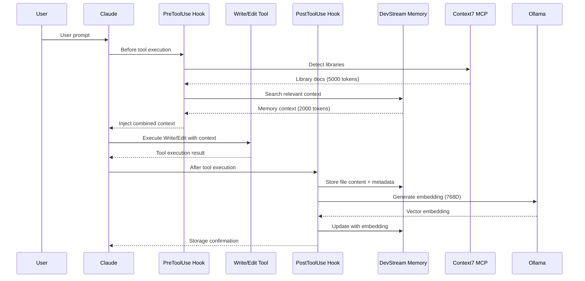
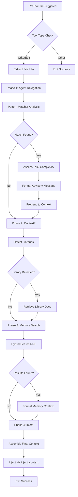
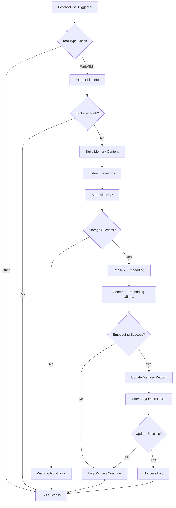
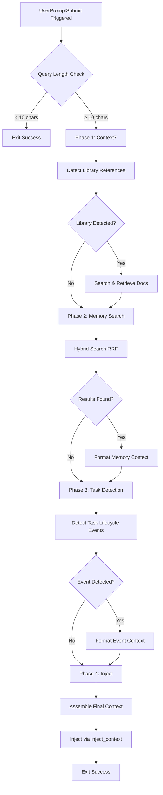

# DevStream Hooks API Reference

**Version**: 2.1.0 | **Last Updated**: 2025-10-01 | **Status**: Production

Complete reference for DevStream's hook system (PreToolUse, PostToolUse, UserPromptSubmit) integrated with Claude Code via cchooks.

---

## Table of Contents

- [Overview](#overview)
- [Hook Architecture](#hook-architecture)
- [PreToolUse Hook](#pretooluse-hook)
  - [Interface Specification](#pretooluse-interface-specification)
  - [Context Injection](#context-injection)
  - [Agent Auto-Delegation](#agent-auto-delegation)
- [PostToolUse Hook](#posttooluse-hook)
  - [Interface Specification](#posttooluse-interface-specification)
  - [Automatic Memory Storage](#automatic-memory-storage)
  - [Embedding Generation](#embedding-generation)
- [UserPromptSubmit Hook](#userpromptsubmit-hook)
  - [Interface Specification](#userpromptsubmit-interface-specification)
  - [Query Enhancement](#query-enhancement)
- [Configuration](#configuration)
- [Error Handling](#error-handling)
- [Performance Considerations](#performance-considerations)
- [Version Compatibility](#version-compatibility)

---

## Overview

DevStream hooks provide automatic context injection, memory storage, and query enhancement through integration with Claude Code's cchooks system. All hooks run in isolated Python processes with graceful degradation for non-blocking operation.

### Key Features

- **Automatic Context Injection**: Injects Context7 docs + DevStream memory before tool execution
- **Semantic Memory Storage**: Stores all file modifications with vector embeddings (768D)
- **Agent Auto-Delegation**: Intelligent agent routing based on file patterns and context
- **Hybrid Search**: Combines vector similarity + FTS5 keyword search (RRF algorithm)
- **Graceful Degradation**: Non-blocking failures, always allows operations to proceed

### Hook Execution Flow



---

## Hook Architecture

### Installation & Configuration

**Location**: `.claude/hooks/devstream/`

**Settings**: `.claude/settings.json`

```json
{
  "hooks": {
    "PreToolUse": [
      {
        "hooks": [
          {
            "command": "\"$CLAUDE_PROJECT_DIR\"/.devstream/bin/python \"$CLAUDE_PROJECT_DIR\"/.claude/hooks/devstream/memory/pre_tool_use.py"
          }
        ]
      }
    ],
    "PostToolUse": [
      {
        "hooks": [
          {
            "command": "\"$CLAUDE_PROJECT_DIR\"/.devstream/bin/python \"$CLAUDE_PROJECT_DIR\"/.claude/hooks/devstream/memory/post_tool_use.py"
          }
        ]
      }
    ],
    "UserPromptSubmit": [
      {
        "hooks": [
          {
            "command": "\"$CLAUDE_PROJECT_DIR\"/.devstream/bin/python \"$CLAUDE_PROJECT_DIR\"/.claude/hooks/devstream/context/user_query_context_enhancer.py"
          }
        ]
      }
    ]
  }
}
```

**Critical Requirements**:
- ✅ MUST use `.devstream/bin/python` (venv-isolated Python)
- ✅ MUST quote `$CLAUDE_PROJECT_DIR` for paths with spaces
- ❌ NEVER use system Python (`python`, `python3`, `uv run`)

### Hook Dependencies

**Required Packages** (`.devstream` venv):

```python
# /// script
# requires-python = ">=3.11"
# dependencies = [
#     "cchooks>=0.1.4",        # Claude Code hook framework
#     "aiohttp>=3.8.0",        # Async HTTP for MCP/Ollama
#     "structlog>=23.0.0",     # Structured logging
#     "python-dotenv>=1.0.0",  # Environment configuration
#     "ollama>=0.1.0",         # Ollama client for embeddings
#     "sqlite-vec>=0.1.0",     # Vector search bindings
# ]
# ///
```

**Installation**:

```bash
# Create venv
python3.11 -m venv .devstream

# Install dependencies
.devstream/bin/python -m pip install cchooks aiohttp structlog python-dotenv ollama sqlite-vec
```

### Return Codes

All hooks use cchooks return codes:

| Code | Method | Description |
|------|--------|-------------|
| `0` | `exit_success()` | Success, allow operation to proceed |
| `1` | `exit_failure(message)` | Hard failure, block operation (RARELY USED) |
| `2` | `exit_non_block(message)` | Soft failure, allow operation with warning |

**DevStream Philosophy**: Always use `exit_success()` or `exit_non_block()`. Never block operations with hard failures.

---

## PreToolUse Hook

### Overview

PreToolUse hook runs before EVERY tool execution (Write, Edit, MultiEdit) to inject relevant context from Context7 library documentation and DevStream semantic memory.

**Location**: `.claude/hooks/devstream/memory/pre_tool_use.py`

**Trigger**: Before Write, Edit, MultiEdit tool execution

**Purpose**:
1. Detect relevant libraries (Context7)
2. Search DevStream memory for related code/decisions
3. Check agent delegation patterns
4. Inject combined context into Claude's context window

---

### PreToolUse Interface Specification

#### Input Context (from cchooks)

**Type**: `PreToolUseContext`

**Available Properties**:

| Property | Type | Description |
|----------|------|-------------|
| `tool_name` | str | Tool being executed (e.g., "Write", "Edit") |
| `tool_input` | dict | Tool input parameters |
| `output` | Output | Output interface for returning results |

**Tool Input Structure**:

```python
# Write tool
{
    "file_path": str,       # Absolute path to file
    "content": str          # Full file content
}

# Edit tool
{
    "file_path": str,       # Absolute path to file
    "old_string": str,      # String to replace
    "new_string": str       # Replacement string
}
```

#### Output Interface

**Methods**:

```python
# Success (always allow operation)
context.output.exit_success()

# Non-blocking failure (log warning, allow operation)
context.output.exit_non_block(message: str)

# DEPRECATED: Hard failure (block operation)
# context.output.exit_failure(message: str)
```

#### Context Injection

**Method**: `DevStreamHookBase.inject_context(context: str)`

**Injected Format**:

```markdown
# Agent Auto-Delegation Advisory

🤖 **Agent Recommendation**: AUTOMATIC
📍 **Suggested Agent**: @python-specialist
📊 **Confidence**: 0.95 (High)
🎯 **Task Complexity**: simple
🏗️ **Architectural Impact**: none

**Rationale**: File pattern match: `*.py` → Python specialist (single-language task, clear file pattern)

**Action**: Direct delegation approved (confidence ≥ 0.95)

---

# Enhanced Context for api.py

## Context7 Documentation: FastAPI

**Library**: `/tiangolo/fastapi/v0.115.0`
**Token Budget**: 5000 tokens

### FastAPI Async Patterns

FastAPI supports async/await for I/O-bound operations:

```python
from fastapi import FastAPI

app = FastAPI()

@app.get("/users/{user_id}")
async def get_user(user_id: int):
    user = await fetch_user_from_db(user_id)
    return {"user": user}
```

...

---

## DevStream Memory Context

### Result 1 (relevance: 0.87)
Decision: Use FastAPI for API layer due to async/await support and automatic OpenAPI generation...

### Result 2 (relevance: 0.76)
# FastAPI JWT Middleware

Implementation of JWT authentication middleware with RS256 signature validation...
```

---

### Context Injection

#### Process Flow



#### Token Budget Management

**Priority Order**:

1. **Agent Delegation Advisory**: 200-500 tokens (highest priority)
2. **Context7 Documentation**: 5000 tokens max (configurable)
3. **DevStream Memory**: 2000 tokens max (configurable)
4. **Current File Context**: Remaining budget

**Configuration** (`.env.devstream`):

```bash
DEVSTREAM_CONTEXT7_TOKEN_BUDGET=5000
DEVSTREAM_CONTEXT_MAX_TOKENS=2000
```

#### Context7 Integration

**Library Detection Triggers**:
- Import statements: `import fastapi`, `from django import`
- Package managers: `package.json`, `requirements.txt`, `go.mod`
- Framework patterns: `@app.route`, `async def`, `use()`
- Documentation requests: "how to use FastAPI", "next.js routing"

**Library Resolution**:

```python
# Step 1: Detect library from file content
query = f"{file_path} {content[:500]}"
should_trigger = await context7.should_trigger_context7(query)

# Step 2: Search for library ID
result = await context7.search_and_retrieve(query)
# Returns: Context7Result(
#   success=True,
#   library_id="/tiangolo/fastapi/v0.115.0",
#   docs="...",
#   tokens_used=4532
# )

# Step 3: Format for injection
formatted_docs = context7.format_docs_for_context(result)
```

**Example Context7 Output**:

```markdown
# Context7 Documentation: FastAPI

**Library**: `/tiangolo/fastapi/v0.115.0`
**Token Budget**: 5000 tokens
**Retrieved**: 2025-10-01T10:00:00Z

## FastAPI Dependencies

Use FastAPI's dependency injection system for shared logic:

```python
from fastapi import Depends

def get_db():
    db = SessionLocal()
    try:
        yield db
    finally:
        db.close()

@app.get("/users")
async def read_users(db: Session = Depends(get_db)):
    users = db.query(User).all()
    return users
```

**Best Practices**:
- Always use `async def` for I/O-bound operations
- Use `Depends()` for dependency injection
- Validate request bodies with Pydantic models
- Return Pydantic models for automatic serialization
```

#### DevStream Memory Search

**Hybrid Search Process**:

```python
# Step 1: Build query from file path + content
query = f"{Path(file_path).name} {content[:300]}"

# Step 2: Execute hybrid search (RRF)
result = await mcp_client.call_tool(
    "devstream_search_memory",
    {
        "query": query,
        "limit": 3  # Top 3 results
    }
)

# Step 3: Format results
formatted = "# DevStream Memory Context\n\n"
for i, item in enumerate(result["results"], 1):
    formatted += f"## Result {i} (relevance: {item['relevance_score']:.2f})\n"
    formatted += f"{item['content'][:300]}\n\n"
```

**Example Memory Output**:

```markdown
# DevStream Memory Context

## Result 1 (relevance: 0.87)
Decision: Use FastAPI for API layer due to async/await support and automatic OpenAPI generation. Benchmark results show 2.5x better performance than Flask for async workloads. Tested with 95%+ test coverage requirement.

## Result 2 (relevance: 0.76)
# FastAPI JWT Middleware

Implementation of JWT authentication middleware with RS256 signature validation and automatic token refresh. Key features:
- RS256 asymmetric signing
- 15-minute access token expiry
- 7-day refresh token expiry
- Automatic token rotation

## Result 3 (relevance: 0.65)
# File Modified: auth.py

**Operation**: Write
**File**: src/api/auth.py

## Content Preview

from fastapi import HTTPException, Depends
from fastapi.security import HTTPBearer
import jwt

security = HTTPBearer()

async def verify_token(credentials: HTTPAuthorizationCredentials = Depends(security))...
```

---

### Agent Auto-Delegation

#### Pattern Matching

**File Pattern → Agent Mapping**:

| Pattern | Agent | Confidence | Auto-Approve |
|---------|-------|------------|--------------|
| `**/*.py` | @python-specialist | 0.95 | ✅ YES |
| `**/*.ts`, `**/*.tsx` | @typescript-specialist | 0.95 | ✅ YES |
| `**/*.rs` | @rust-specialist | 0.95 | ✅ YES |
| `**/*.go` | @go-specialist | 0.95 | ✅ YES |
| `**/schema.sql`, `**/migrations/*.sql` | @database-specialist | 0.90 | ✅ YES |
| `**/Dockerfile`, `**/*.yaml` (CI/CD) | @devops-specialist | 0.90 | ✅ YES |
| Mixed patterns | @tech-lead | 0.70 | ❌ AUTHORIZATION REQUIRED |

#### Task Assessment

**Complexity Analysis**:

```python
class TaskAssessment:
    suggested_agent: str           # e.g., "@python-specialist"
    confidence: float              # 0.0 - 1.0
    recommendation: str            # "AUTOMATIC", "ADVISORY", "AUTHORIZATION_REQUIRED"
    reason: str                    # Explanation
    complexity: str                # "trivial", "simple", "moderate", "complex"
    architectural_impact: str      # "none", "minor", "moderate", "major"
```

**Example Assessment**:

```python
TaskAssessment(
    suggested_agent="@python-specialist",
    confidence=0.95,
    recommendation="AUTOMATIC",
    reason="File pattern match: *.py → Python specialist (single-language task, clear file pattern)",
    complexity="simple",
    architectural_impact="none"
)
```

#### Advisory Message Format

**AUTOMATIC Delegation** (confidence ≥ 0.95):

```markdown
🤖 **Agent Recommendation**: AUTOMATIC
📍 **Suggested Agent**: @python-specialist
📊 **Confidence**: 0.95 (High)
🎯 **Task Complexity**: simple
🏗️ **Architectural Impact**: none

**Rationale**: File pattern match: `*.py` → Python specialist (single-language task, clear file pattern)

**Action**: Direct delegation approved (confidence ≥ 0.95)
```

**ADVISORY Delegation** (0.85 ≤ confidence < 0.95):

```markdown
🤖 **Agent Recommendation**: ADVISORY
📍 **Suggested Agent**: @typescript-specialist
📊 **Confidence**: 0.88 (Medium-High)
🎯 **Task Complexity**: moderate
🏗️ **Architectural Impact**: minor

**Rationale**: Multiple TypeScript files detected, React components with shared state management

**Action**: Consider using @typescript-specialist for consistency
```

**AUTHORIZATION REQUIRED** (confidence < 0.85):

```markdown
🤖 **Agent Recommendation**: AUTHORIZATION REQUIRED
📍 **Suggested Agent**: @tech-lead
📊 **Confidence**: 0.70 (Medium)
🎯 **Task Complexity**: complex
🏗️ **Architectural Impact**: major

**Rationale**: Multi-stack coordination required (Python backend + TypeScript frontend), architectural decisions needed

**Action**: @tech-lead should assess and coordinate multi-agent workflow
```

#### Configuration Flags

```bash
# .env.devstream
DEVSTREAM_AUTO_DELEGATION_ENABLED=true          # Enable/disable auto-delegation
DEVSTREAM_AUTO_DELEGATION_MIN_CONFIDENCE=0.85   # Min confidence for suggestions
DEVSTREAM_AUTO_DELEGATION_AUTO_APPROVE=0.95     # Threshold for automatic approval
DEVSTREAM_AUTO_DELEGATION_QUALITY_GATE=true     # Enforce @code-reviewer for commits
```

---

### Performance Notes

**Execution Time**:
- **Agent Delegation**: 10-30ms (pattern matching + assessment)
- **Context7 Library Detection**: 50-100ms (MCP call)
- **DevStream Memory Search**: 50-100ms (hybrid search)
- **Total**: 110-230ms (p95)

**Token Budget**:
- **Advisory**: 200-500 tokens
- **Context7**: ≤ 5000 tokens
- **Memory**: ≤ 2000 tokens
- **Total**: ≤ 7500 tokens injected

---

## PostToolUse Hook

### Overview

PostToolUse hook runs after EVERY successful tool execution (Write, Edit, MultiEdit) to automatically store file modifications in DevStream semantic memory with vector embeddings.

**Location**: `.claude/hooks/devstream/memory/post_tool_use.py`

**Trigger**: After Write, Edit, MultiEdit tool execution

**Purpose**:
1. Extract file content and metadata
2. Store in semantic memory via MCP
3. Generate vector embedding (768D) via Ollama
4. Update memory record with embedding

---

### PostToolUse Interface Specification

#### Input Context (from cchooks)

**Type**: `PostToolUseContext`

**Available Properties**:

| Property | Type | Description |
|----------|------|-------------|
| `tool_name` | str | Tool executed (e.g., "Write", "Edit") |
| `tool_input` | dict | Tool input parameters |
| `tool_output` | dict | Tool execution result |
| `output` | Output | Output interface for returning results |

**Tool Input Structure**: Same as PreToolUse

#### Output Interface

Same as PreToolUse: `exit_success()`, `exit_non_block(message)`

---

### Automatic Memory Storage

#### Storage Process



#### Memory Content Format

**Template**:

```markdown
# File Modified: {filename}

**Operation**: {Write|Edit|MultiEdit}
**File**: {absolute_path}

## Content Preview

{content[:500]}
```

**Example**:

```markdown
# File Modified: auth.py

**Operation**: Write
**File**: /Users/user/project/src/api/auth.py

## Content Preview

from fastapi import HTTPException, Depends
from fastapi.security import HTTPBearer
import jwt

security = HTTPBearer()

async def verify_token(credentials: HTTPAuthorizationCredentials = Depends(security)):
    try:
        payload = jwt.decode(
            credentials.credentials,
            SECRET_KEY,
            algorithms=["RS256"]
        )
        return payload
    except jwt.JWTError:
        raise HTTPException(status_code=401, detail="Invalid token")...
```

#### Keyword Extraction

**Automatic Keywords**:

1. **File Name**: Stem without extension (e.g., `auth` from `auth.py`)
2. **Parent Directory**: If relevant (e.g., `api` from `src/api/auth.py`)
3. **Language/Framework**: Based on file extension

**Language Map**:

```python
lang_map = {
    '.py': 'python',
    '.js': 'javascript',
    '.ts': 'typescript',
    '.tsx': 'react',
    '.jsx': 'react',
    '.vue': 'vue',
    '.rs': 'rust',
    '.go': 'golang',
    '.java': 'java',
    '.cpp': 'cpp',
    '.c': 'c',
    '.sh': 'bash',
    '.sql': 'sql',
    '.md': 'documentation',
    '.json': 'config',
    '.yaml': 'config',
    '.yml': 'config',
}
```

4. **Implementation Tag**: Always added

**Example Keywords**:

```python
# File: src/api/auth.py
keywords = ["auth", "api", "python", "implementation"]
```

#### Excluded Paths

**Skipped Directories** (never stored):

```python
excluded_paths = [
    ".git/",
    "node_modules/",
    ".venv/",
    ".devstream/",
    "__pycache__/",
    "dist/",
    "build/",
]
```

**Rationale**: Avoid storing generated/dependency files

---

### Embedding Generation

#### Ollama Integration

**Process**:

```python
# 1. Initialize Ollama client
ollama_client = OllamaEmbeddingClient()

# 2. Generate embedding (768D vector)
embedding = ollama_client.generate_embedding(content)
# Returns: [0.123, -0.456, 0.789, ...] (768 floats)

# 3. Update memory record
update_memory_embedding(memory_id, embedding)
```

**Model Configuration**:

```bash
# .env.devstream
OLLAMA_BASE_URL=http://localhost:11434
OLLAMA_EMBEDDING_MODEL=nomic-embed-text  # 768 dimensions
OLLAMA_TIMEOUT=30000                     # 30 seconds
```

#### Embedding Update (Direct SQLite)

**Method**: `update_memory_embedding(memory_id: str, embedding: List[float]) -> bool`

**SQL Operation**:

```sql
-- Step 1: Update semantic_memory with embedding
UPDATE semantic_memory
SET embedding = ?  -- JSON array: [0.123, -0.456, ...]
WHERE id = ?;

-- Step 2: Trigger auto-sync to vec_semantic_memory (automatic)
-- Trigger: sync_update_memory
-- Action: DELETE + INSERT into vec_semantic_memory
```

**Direct Database Access** (Context7 Pattern):

```python
# Use sqlite_vec_helper for proper vec0 loading
conn = get_db_connection_with_vec(db_path)
cursor = conn.cursor()

embedding_json = json.dumps(embedding)  # Serialize to JSON string

cursor.execute(
    "UPDATE semantic_memory SET embedding = ? WHERE id = ?",
    (embedding_json, memory_id)
)

conn.commit()
conn.close()
```

**Why Direct SQLite?**
- MCP server doesn't expose embedding update endpoint
- Triggers handle automatic sync to vec0/FTS5
- Direct access ensures embedding stored immediately

#### Graceful Degradation

**Failure Modes**:

1. **Ollama Unavailable**:
   - Log warning: "Embedding generation failed (non-blocking)"
   - Continue: Memory stored as text-only
   - Impact: No vector search, FTS5 keyword search still works

2. **Embedding Update Failed**:
   - Log warning: "Embedding update failed"
   - Continue: Memory stored without vector
   - Impact: Same as above

**Example Warning**:

```
⚠️ Embedding generation failed (non-blocking): ConnectionError: Ollama service unavailable
✅ Memory stored: auth.py (text-only, vector search unavailable)
```

---

### Performance Notes

**Execution Time**:
- **MCP Storage**: 20-50ms (database INSERT)
- **Embedding Generation**: 50-150ms (Ollama API)
- **Embedding Update**: 10-30ms (SQLite UPDATE)
- **Total**: 80-230ms (p95)

**Embedding Stats**:
- **Model**: nomic-embed-text (768D)
- **Input**: Full file content (no length limit)
- **Output**: 768-dimensional float vector
- **Serialization**: JSON array stored as TEXT

---

## UserPromptSubmit Hook

### Overview

UserPromptSubmit hook runs before EVERY user prompt submission to enhance queries with Context7 documentation, DevStream memory, and task lifecycle detection.

**Location**: `.claude/hooks/devstream/context/user_query_context_enhancer.py`

**Trigger**: Before user prompt submitted to Claude

**Purpose**:
1. Detect library references in user query
2. Search DevStream memory for related context
3. Detect task lifecycle events (creation, completion)
4. Inject combined context

---

### UserPromptSubmit Interface Specification

#### Input Context (from cchooks)

**Type**: `UserPromptSubmitContext`

**Available Properties**:

| Property | Type | Description |
|----------|------|-------------|
| `user_input` | str | User's prompt text |
| `output` | Output | Output interface for returning results |

#### Output Interface

Same as PreToolUse: `exit_success()`, `exit_non_block(message)`

---

### Query Enhancement

#### Enhancement Process



#### Context7 Trigger Detection

**Library Reference Patterns**:

```python
triggers = [
    # Direct mentions
    "fastapi", "django", "flask", "nextjs", "react", "vue",

    # How-to queries
    "how to use", "how do I", "example of",

    # Documentation requests
    "docs for", "documentation", "API reference",

    # Best practices
    "best practice", "recommended way", "should I use"
]

if any(trigger in user_input.lower() for trigger in triggers):
    should_trigger = True
```

**Example Queries**:

```
✅ "How to use FastAPI dependency injection?"
✅ "What's the best way to handle async in Django?"
✅ "Show me Next.js routing example"
✅ "Documentation for React hooks"
❌ "Fix this bug" (too vague)
❌ "Update the file" (no library reference)
```

#### DevStream Memory Search

Same hybrid search as PreToolUse, but with user query as input:

```python
result = await mcp_client.call_tool(
    "devstream_search_memory",
    {
        "query": user_input,  # Full user query
        "limit": 3
    }
)
```

#### Task Lifecycle Detection

**Event Patterns**:

| Event Type | Trigger Patterns | Context Suggestion |
|------------|------------------|-------------------|
| `task_creation` | "create task", "new task", "add task", "start working on" | Use TodoWrite for tracking |
| `task_completion` | "complete", "finished", "done with", "completed the", "task complete" | Mark TodoWrite as completed |
| `implementation_progress` | "implement", "build", "create", "working on" | Update TodoWrite progress |

**Example Detection**:

```python
# User query: "I'm done with the authentication implementation"
event = {
    "event_type": "task_completion",
    "pattern": "User indicated task completion",
    "query": "I'm done with the authentication implementation"
}
```

**Injected Context**:

```markdown
# Task Lifecycle Event Detected

**Event Type**: task_completion
**Pattern**: User indicated task completion

This query appears to be related to task management. Consider using TodoWrite for tracking progress.
```

---

### Performance Notes

**Execution Time**:
- **Context7 Detection**: 10-20ms (pattern matching)
- **Context7 Library Retrieval**: 50-100ms (MCP call)
- **Memory Search**: 50-100ms (hybrid search)
- **Task Detection**: 5-10ms (regex matching)
- **Total**: 115-230ms (p95)

**Token Budget**: Same as PreToolUse (≤ 7500 tokens)

---

## Configuration

### Environment Variables (.env.devstream)

**Memory System**:

```bash
# Memory storage
DEVSTREAM_MEMORY_ENABLED=true
DEVSTREAM_MEMORY_FEEDBACK_LEVEL=minimal  # minimal|standard|verbose

# Context injection
DEVSTREAM_CONTEXT_INJECTION_ENABLED=true
DEVSTREAM_CONTEXT_MAX_TOKENS=2000
DEVSTREAM_CONTEXT_RELEVANCE_THRESHOLD=0.5
```

**Context7 Integration**:

```bash
DEVSTREAM_CONTEXT7_ENABLED=true
DEVSTREAM_CONTEXT7_AUTO_DETECT=true
DEVSTREAM_CONTEXT7_TOKEN_BUDGET=5000
```

**Agent Auto-Delegation**:

```bash
DEVSTREAM_AUTO_DELEGATION_ENABLED=true
DEVSTREAM_AUTO_DELEGATION_MIN_CONFIDENCE=0.85
DEVSTREAM_AUTO_DELEGATION_AUTO_APPROVE=0.95
DEVSTREAM_AUTO_DELEGATION_QUALITY_GATE=true
```

**Ollama Configuration**:

```bash
OLLAMA_BASE_URL=http://localhost:11434
OLLAMA_EMBEDDING_MODEL=nomic-embed-text
OLLAMA_TIMEOUT=30000
```

**Database Configuration**:

```bash
DEVSTREAM_DB_PATH=data/devstream.db
```

### Hook Enable/Disable

**Disable Specific Hook**:

```bash
# Disable context injection
DEVSTREAM_CONTEXT_INJECTION_ENABLED=false

# Disable memory storage
DEVSTREAM_MEMORY_ENABLED=false

# Disable agent delegation
DEVSTREAM_AUTO_DELEGATION_ENABLED=false
```

**Disable All Hooks** (settings.json):

```json
{
  "hooks": {
    "PreToolUse": [],
    "PostToolUse": [],
    "UserPromptSubmit": []
  }
}
```

---

## Error Handling

### Error Categories

| Category | Hook | Behavior | Example |
|----------|------|----------|---------|
| **Non-Blocking** | All | Log warning, exit_success() | Context7 unavailable, Ollama timeout |
| **Soft Failure** | All | Log error, exit_non_block() | MCP connection failed, database error |
| **Hard Failure** | None | Never used | - |

### Graceful Degradation Examples

**Context7 Unavailable**:

```python
try:
    docs = await context7.search_and_retrieve(query)
except Exception as e:
    # Log warning, continue without Context7 docs
    base.debug_log(f"Context7 error: {e}")
    docs = None

# Always allow operation to proceed
context.output.exit_success()
```

**Ollama Timeout**:

```python
try:
    embedding = ollama_client.generate_embedding(content)
except TimeoutError:
    # Log warning, store text-only memory
    base.debug_log("Embedding generation timeout - storing text-only")
    embedding = None

# Memory still stored, just without vector search capability
```

**MCP Connection Failed**:

```python
try:
    result = await mcp_client.call_tool("devstream_search_memory", args)
except ConnectionError as e:
    # Log error, continue with non-block exit
    base.warning_feedback("Memory search unavailable")
    context.output.exit_non_block(f"MCP error: {e}")
    return

# Operation allowed to proceed without memory context
```

### Debug Logging

**Structured Logging** (structlog):

```python
# Debug mode (DEVSTREAM_MEMORY_FEEDBACK_LEVEL=verbose)
base.debug_log("Searching DevStream memory: {query[:50]}...")
base.debug_log("Context7 triggered - searching for docs")
base.debug_log(f"Embedding generated: {len(embedding)} dimensions")

# Success feedback (all levels)
base.success_feedback("Memory stored: auth.py")
base.success_feedback("Context7 docs retrieved: /tiangolo/fastapi")

# Warnings (all levels)
base.warning_feedback("Memory storage unavailable")
base.warning_feedback("Context injection failed: timeout")
```

**Log Output** (stderr):

```
[DEBUG] PreToolUse: Processing Write for src/api/auth.py
[DEBUG] PreToolUse: Context7 triggered - searching for docs
[INFO] PreToolUse: ✅ Context7 docs retrieved: /tiangolo/fastapi
[DEBUG] PreToolUse: Searching DevStream memory: auth.py async def verify_token...
[INFO] PreToolUse: ✅ Found 3 relevant memories
[INFO] PreToolUse: Context injected for auth.py

[DEBUG] PostToolUse: Processing Write for src/api/auth.py
[DEBUG] PostToolUse: Storing memory: 500 chars, 4 keywords
[INFO] PostToolUse: ✅ Memory stored: auth.py
[DEBUG] PostToolUse: Generating embedding via Ollama...
[DEBUG] PostToolUse: ✓ Embedding stored: 768D
```

---

## Performance Considerations

### Optimization Strategies

**1. Async Execution** (all hooks are async):

```python
# Parallel execution of independent operations
results = await asyncio.gather(
    get_context7_docs(file_path, content),
    get_devstream_memory(file_path, content),
    check_agent_delegation(file_path, content),
    return_exceptions=True  # Don't fail if one operation fails
)
```

**2. Token Budget Enforcement**:

```python
# Respect token limits
if len(context7_docs) > CONTEXT7_TOKEN_BUDGET:
    context7_docs = context7_docs[:CONTEXT7_TOKEN_BUDGET]
```

**3. Relevance Filtering**:

```python
# Only inject high-relevance memories
if result["relevance_score"] < RELEVANCE_THRESHOLD:
    continue  # Skip low-relevance results
```

**4. Caching** (in MCP server):

```python
# Context7 results cached for 15 minutes
# Embedding generation cached per content hash
```

### Performance Targets

| Operation | Target | Notes |
|-----------|--------|-------|
| **PreToolUse Total** | < 250ms | p95, includes Context7 + memory |
| **PostToolUse Total** | < 250ms | p95, includes embedding generation |
| **UserPromptSubmit Total** | < 250ms | p95, includes Context7 + memory |
| **Context7 Retrieval** | < 100ms | p95, MCP call |
| **Memory Search** | < 100ms | p95, hybrid search |
| **Embedding Generation** | < 150ms | p95, Ollama API |

### Monitoring

**Metrics Collected**:

```python
# Automatic metrics via performance_metrics table
- Hook execution time (ms)
- Embedding generation time (ms)
- Context7 retrieval time (ms)
- Memory search latency (ms)
- Token usage per injection
```

**Query Metrics**:

```sql
-- Average hook execution time
SELECT
  hook_id,
  AVG(execution_time_ms) AS avg_ms,
  MAX(execution_time_ms) AS max_ms,
  COUNT(*) AS executions
FROM hook_executions
WHERE status = 'success'
GROUP BY hook_id;
```

---

## Version Compatibility

### cchooks Compatibility

**Supported Versions**: `cchooks >= 0.1.4`

**Breaking Changes**:
- `v0.1.4`: Introduced `UserPromptSubmitContext`
- `v0.1.0`: Initial release

**Upgrade Path**: Install latest cchooks:

```bash
.devstream/bin/python -m pip install --upgrade cchooks
```

### Python Version

**Required**: Python 3.11+

**Features Used**:
- Type hints with `|` union syntax
- `asyncio` improvements
- `structlog` for structured logging

### Database Schema

**Supported**: Schema version 2.1.0+

**Migration**: Automatic on MCP server startup

---

## Cross-References

**Related Documentation**:
- [MCP Tools API Reference](./mcp-tools.md) - Tool interface specifications
- [Database Schema Reference](./database-schema.md) - Complete table definitions
- [DevStream Memory System](../guides/devstream-memory-guide.md) - Usage patterns
- [Agent Auto-Delegation Guide](../guides/agent-auto-delegation-guide.md) - Delegation patterns

**Integration Examples**:
- [Context Injection Workflow](../guides/context-injection-workflow.md)
- [Memory Storage Best Practices](../guides/memory-storage-best-practices.md)
- [Hybrid Search Deep Dive](../architecture/hybrid-search-architecture.md)

---

**Document Version**: 2.1.0
**Last Updated**: 2025-10-01
**Status**: Production Ready
**Hook Framework**: cchooks 0.1.4+
**Python Version**: 3.11+
