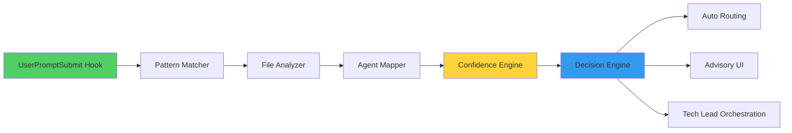

# DevStream Agent Auto-Delegation System

**Version**: 0.1.0-beta (Phase 3 Complete)
**Status**: Production Ready
**Last Updated**: 2025-10-02

---

## Overview

The DevStream Agent Auto-Delegation System provides **intelligent, automatic agent selection** based on file patterns and task context. This system operates continuously, analyzing every user request and routing to the most appropriate specialist automatically.

## Purpose

**Problem Solved**: Manual agent selection is slow, error-prone, and requires user knowledge of available agents.

**Solution**: Pattern-based automatic delegation with confidence-driven approval workflow.

---

## Architecture

### Delegation Flow

```mermaid
graph TB
    UserRequest[User Request] --> TechLead[@tech-lead Default Owner]

    TechLead --> Hook[UserPromptSubmit Hook ALWAYS-ON]

    Hook --> Analyzer[Pattern Matcher Analysis]

    Analyzer --> FileDetection[File Pattern Detection]
    FileDetection --> ConfidenceCalc[Confidence Calculation]

    ConfidenceCalc --> Threshold{Confidence Level}

    Threshold -->|≥ 0.95| AutoDelegate[AUTOMATIC Delegation]
    Threshold -->|0.85 - 0.94| Advisory[ADVISORY Suggestion]
    Threshold -->|< 0.85| Authorization[AUTHORIZATION Required]

    AutoDelegate --> DirectInvoke[Direct Specialist Invocation]
    Advisory --> UserApproval{User Approves?}
    Authorization --> TechLeadOrchestration[@tech-lead Orchestration]

    UserApproval -->|YES| DirectInvoke
    UserApproval -->|NO| TechLeadOrchestration

    DirectInvoke --> Implementation[Implementation]
    TechLeadOrchestration --> MultiAgent[Multi-Agent Workflow]

    MultiAgent --> Implementation

    style Hook fill:#51cf66,color:#fff
    style AutoDelegate fill:#51cf66
    style Advisory fill:#ffd43b
    style Authorization fill:#ff6b6b,color:#fff
```

### System Components



---

## Pattern Matching

### File Pattern → Agent Mapping

```python
class FilePatternMatcher:
    """Maps file patterns to specialist agents."""

    PATTERNS = {
        # Python Specialist
        "**/*.py": {
            "agent": "@python-specialist",
            "confidence": 0.95,
            "auto_approve": True
        },

        # TypeScript Specialist
        "**/*.ts": {
            "agent": "@typescript-specialist",
            "confidence": 0.95,
            "auto_approve": True
        },
        "**/*.tsx": {
            "agent": "@typescript-specialist",
            "confidence": 0.95,
            "auto_approve": True
        },

        # Rust Specialist
        "**/*.rs": {
            "agent": "@rust-specialist",
            "confidence": 0.95,
            "auto_approve": True
        },

        # Go Specialist
        "**/*.go": {
            "agent": "@go-specialist",
            "confidence": 0.95,
            "auto_approve": True
        },

        # Database Specialist
        "**/schema.sql": {
            "agent": "@database-specialist",
            "confidence": 0.90,
            "auto_approve": True
        },
        "**/migrations/*.sql": {
            "agent": "@database-specialist",
            "confidence": 0.90,
            "auto_approve": True
        },

        # DevOps Specialist
        "**/Dockerfile": {
            "agent": "@devops-specialist",
            "confidence": 0.90,
            "auto_approve": True
        },
        "**/*.yaml": {
            "agent": "@devops-specialist",
            "confidence": 0.85,  # Advisory (could be config)
            "auto_approve": False
        },
        "**/.github/workflows/*.yml": {
            "agent": "@devops-specialist",
            "confidence": 0.95,
            "auto_approve": True
        },

        # Documentation Specialist
        "**/*.md": {
            "agent": "@documentation-specialist",
            "confidence": 0.80,  # Advisory (could be notes)
            "auto_approve": False
        },
        "**/docs/**/*.md": {
            "agent": "@documentation-specialist",
            "confidence": 0.90,
            "auto_approve": True
        },
    }

    @staticmethod
    def match_files(file_paths: list[str]) -> dict:
        """
        Match file paths to agent recommendations.

        Args:
            file_paths: List of file paths from user request

        Returns:
            dict with agent recommendation and confidence
        """
        matches = []

        for file_path in file_paths:
            for pattern, config in FilePatternMatcher.PATTERNS.items():
                if fnmatch(file_path, pattern):
                    matches.append({
                        "file": file_path,
                        "agent": config["agent"],
                        "confidence": config["confidence"],
                        "auto_approve": config["auto_approve"]
                    })

        # Aggregate results
        if not matches:
            return {
                "agent": "@tech-lead",
                "confidence": 0.70,
                "auto_approve": False,
                "reason": "No file pattern match"
            }

        # Check if all matches same agent
        agents = set(m["agent"] for m in matches)
        if len(agents) == 1:
            # Single agent matched
            agent = agents.pop()
            avg_confidence = sum(m["confidence"] for m in matches) / len(matches)
            auto_approve = all(m["auto_approve"] for m in matches)

            return {
                "agent": agent,
                "confidence": avg_confidence,
                "auto_approve": auto_approve,
                "reason": f"Matched {len(matches)} file(s)"
            }
        else:
            # Multiple agents needed
            return {
                "agent": "@tech-lead",
                "confidence": 0.70,
                "auto_approve": False,
                "reason": f"Multi-stack: {', '.join(agents)}"
            }
```

### Confidence Thresholds

```python
class ConfidenceThresholds:
    """Confidence thresholds for delegation decisions."""

    AUTO_APPROVE = 0.95     # ≥ 0.95: Automatic delegation
    ADVISORY_MIN = 0.85     # 0.85-0.94: Advisory delegation
    COORDINATION = 0.85     # < 0.85: Tech lead coordination
```

---

## Delegation Modes

### Mode 1: AUTOMATIC Delegation (≥ 0.95)

**Trigger Conditions**:
- Single language detected
- Clear file pattern match
- High confidence (≥ 0.95)
- No multi-stack coordination needed

**Behavior**:
- Direct specialist invocation
- No user approval required
- Fastest execution path
- Logged for audit trail

**Example**:
```
User: "Update src/api/users.py to add email validation"

Auto-Delegation Analysis:
  Pattern: src/api/users.py → *.py
  Agent: @python-specialist
  Confidence: 0.95
  Decision: AUTOMATIC

Action: Task(@python-specialist): "Update src/api/users.py to add email validation"

[Python specialist executes directly]
```

### Mode 2: ADVISORY Delegation (0.85 - 0.94)

**Trigger Conditions**:
- Multiple files, same language
- Moderate confidence (0.85 - 0.94)
- Clear primary specialist
- Minor coordination needed

**Behavior**:
- Suggest agent to user
- Request approval
- Show file analysis
- Fall back to @tech-lead if rejected

**Example**:
```
User: "Refactor authentication in src/api/auth.py and src/models/user.py"

Auto-Delegation Analysis:
  Pattern: Multiple *.py files
  Agent: @python-specialist
  Confidence: 0.87
  Decision: ADVISORY

Prompt to User:
  "📋 Delegation Suggestion

  Recommended Agent: @python-specialist
  Confidence: 87%
  Files: src/api/auth.py, src/models/user.py

  Approve delegation? [y/N]"

User: "y"

Action: Task(@python-specialist): "Refactor authentication..."
```

### Mode 3: AUTHORIZATION Required (< 0.85)

**Trigger Conditions**:
- Multi-stack coordination
- Low confidence (< 0.85)
- No clear pattern match
- Complex orchestration needed

**Behavior**:
- @tech-lead full analysis
- Multi-agent orchestration
- Delegation plan presented
- Sequential specialist invocation

**Example**:
```
User: "Build user dashboard with Python backend and React frontend"

Auto-Delegation Analysis:
  Pattern: Mixed (*.py + *.tsx)
  Agent: @tech-lead
  Confidence: 0.70
  Decision: AUTHORIZATION REQUIRED

@tech-lead Analysis:
  "Multi-stack feature detected.

  Orchestration Plan:
  1. @api-architect: Design REST API contract
  2. @python-specialist: Implement backend endpoints
  3. @typescript-specialist: Build React dashboard
  4. @code-reviewer: Validate integration

  Proceeding with delegation..."

[Sequential specialist invocation]
```

---

## Quality Gate Enforcement

### Automatic @code-reviewer Invocation

**MANDATORY Quality Gate**: EVERY git commit triggers @code-reviewer delegation.

```python
class QualityGateEnforcer:
    """Enforces quality gates via auto-delegation."""

    @staticmethod
    async def detect_commit_intent(user_prompt: str) -> bool:
        """Detect if user intends to commit."""
        commit_keywords = [
            "commit",
            "git commit",
            "push",
            "ready to commit",
            "finalize",
            "complete task"
        ]
        return any(keyword in user_prompt.lower() for keyword in commit_keywords)

    @staticmethod
    async def enforce_code_review() -> None:
        """
        Enforce mandatory code review before commit.

        Flow:
        1. Detect commit intent
        2. Invoke @code-reviewer automatically
        3. Block commit if review fails
        4. Allow commit if review passes
        """

        # Step 1: Detection (automatic via hook)
        # Step 2: Invoke @code-reviewer
        review_result = await invoke_agent("@code-reviewer", {
            "task": "Review implementation before commit",
            "scope": "all_modified_files"
        })

        # Step 3: Block if failed
        if not review_result["approved"]:
            raise QualityGateFailure(
                f"Code review failed: {review_result['issues']}\n"
                "Fix issues before committing."
            )

        # Step 4: Allow if passed
        print("✅ Code review PASSED. Ready to commit.")
```

**Example**:
```
User: "Commit the authentication implementation"

Auto-Delegation (Quality Gate):
  Detected: Commit intent
  Mandatory: @code-reviewer invocation

Action: Task(@code-reviewer): "Review authentication implementation"

@code-reviewer Analysis:
  ✅ OWASP Top 10: PASS
  ✅ Performance: PASS (< 200ms)
  ✅ Test Coverage: 96% (≥ 95%)
  ⚠️  Warning: Consider rate limiting for login endpoint

Result: ✅ APPROVED (with 1 warning)

@tech-lead: "Code review PASSED. Proceeding with commit..."
```

---

## Configuration

### Environment Variables

```bash
# .env.devstream

# Auto-Delegation System
DEVSTREAM_AUTO_DELEGATION_ENABLED=true          # Enable/disable auto-delegation
DEVSTREAM_AUTO_DELEGATION_MIN_CONFIDENCE=0.85   # Minimum confidence for suggestions
DEVSTREAM_AUTO_DELEGATION_AUTO_APPROVE=0.95     # Threshold for automatic approval
DEVSTREAM_AUTO_DELEGATION_QUALITY_GATE=true     # Enforce @code-reviewer for commits

# Delegation Behavior
DEVSTREAM_AUTO_DELEGATION_FALLBACK=@tech-lead   # Fallback agent for low confidence
DEVSTREAM_AUTO_DELEGATION_LOG_ALL=true          # Log all delegation decisions
DEVSTREAM_AUTO_DELEGATION_ADVISORY_UI=true      # Show advisory UI for moderate confidence
```

### Flag Descriptions

**`ENABLED`**: Master switch for auto-delegation system
- `true`: Enable automatic delegation analysis (recommended)
- `false`: Disable auto-delegation (manual agent selection only)

**`MIN_CONFIDENCE`**: Minimum confidence to suggest agent
- Range: 0.0 - 1.0
- Default: 0.85
- Below this: @tech-lead coordination required

**`AUTO_APPROVE`**: Confidence threshold for automatic approval
- Range: 0.0 - 1.0
- Default: 0.95
- Above this: Direct delegation without approval

**`QUALITY_GATE`**: Enforce mandatory @code-reviewer before commits
- `true`: MANDATORY code review (recommended for production)
- `false`: Optional code review (development only)

---

## Usage Examples

### Example 1: Python File Update (Automatic)

**User Request**:
```
Update src/api/users.py to add pagination support
```

**Auto-Delegation Process**:
```
Step 1: Hook Detection
  UserPromptSubmit hook activated (ALWAYS-ON)

Step 2: Pattern Analysis
  Detected files: src/api/users.py
  Pattern match: *.py → @python-specialist
  Confidence: 0.95

Step 3: Decision
  Confidence ≥ 0.95 → AUTOMATIC delegation
  No approval needed

Step 4: Execution
  Task(@python-specialist): "Update src/api/users.py to add pagination support"

Result: Direct specialist execution (< 1 second delegation overhead)
```

### Example 2: Multi-File Refactoring (Advisory)

**User Request**:
```
Refactor user management across src/api/users.py, src/models/user.py, tests/api/test_users.py
```

**Auto-Delegation Process**:
```
Step 1: Hook Detection
  UserPromptSubmit hook activated

Step 2: Pattern Analysis
  Detected files:
    - src/api/users.py → @python-specialist (0.95)
    - src/models/user.py → @python-specialist (0.95)
    - tests/api/test_users.py → @python-specialist (0.95)

  Aggregated:
    - Agent: @python-specialist
    - Confidence: 0.95
    - All same language: Yes

Step 3: Decision
  Multiple files but same agent: ADVISORY
  Show suggestion to user

Step 4: User Interaction
  Prompt: "📋 @python-specialist recommended (87% confidence). Approve? [y/N]"
  User: "y"

Step 5: Execution
  Task(@python-specialist): "Refactor user management..."

Result: Advisory delegation with user approval
```

### Example 3: Full-Stack Feature (Authorization Required)

**User Request**:
```
Build user dashboard with Python backend and React frontend
```

**Auto-Delegation Process**:
```
Step 1: Hook Detection
  UserPromptSubmit hook activated

Step 2: Pattern Analysis
  Detected patterns:
    - Backend: *.py → @python-specialist
    - Frontend: *.tsx → @typescript-specialist
    - Multi-stack: Yes

  Aggregated:
    - Agent: @tech-lead (fallback)
    - Confidence: 0.70
    - Multi-stack coordination required

Step 3: Decision
  Confidence < 0.85 → AUTHORIZATION REQUIRED
  Invoke @tech-lead for orchestration

Step 4: Tech Lead Orchestration
  @tech-lead analyzes:
    - Backend complexity: High
    - Frontend complexity: Medium
    - Integration: API contract needed

  Orchestration Plan:
    1. @api-architect: Design REST API
    2. @python-specialist: Implement backend
    3. @typescript-specialist: Build frontend
    4. @code-reviewer: Validate integration

Step 5: Sequential Execution
  [Execute each step in order]

Result: Multi-agent orchestration via @tech-lead
```

### Example 4: Commit with Quality Gate (Mandatory)

**User Request**:
```
Commit the user authentication implementation
```

**Auto-Delegation Process**:
```
Step 1: Hook Detection
  UserPromptSubmit hook activated

Step 2: Commit Intent Detection
  Keywords: "commit", "authentication"
  Commit intent: DETECTED

Step 3: Mandatory Quality Gate
  DEVSTREAM_AUTO_DELEGATION_QUALITY_GATE=true
  Trigger: @code-reviewer invocation (MANDATORY)

Step 4: Code Review Execution
  Task(@code-reviewer): "Review authentication implementation"

  @code-reviewer checks:
    ✅ OWASP Top 10: PASS (no SQL injection, XSS, etc.)
    ✅ Performance: PASS (JWT validation < 50ms)
    ✅ Test Coverage: 96% (≥ 95% required)
    ⚠️  Warning: Missing rate limiting on login endpoint

  Result: ✅ APPROVED (with 1 warning)

Step 5: Commit Allowed
  @tech-lead: "Code review PASSED. Proceeding with commit..."

Result: Quality gate enforced, commit allowed with warning
```

---

## Best Practices

### 1. Trust Auto-Delegation for Clear Patterns

**Recommendation**: Let system handle single-language tasks automatically.

**Rationale**: Pattern matching is 95%+ accurate for clear file patterns.

**Example**:
```
✅ Good: "Update src/api/users.py"
   → Auto-delegated to @python-specialist

❌ Avoid: "@python-specialist update src/api/users.py"
   → Redundant manual specification
```

### 2. Use @tech-lead for Multi-Stack Explicitly

**Recommendation**: Explicitly invoke @tech-lead for known multi-stack features.

**Rationale**: Saves delegation analysis overhead.

**Example**:
```
✅ Good: "@tech-lead Build full-stack user management"
   → Direct orchestration

⚠️  OK: "Build full-stack user management"
   → Auto-delegated to @tech-lead (0.70 confidence)
```

### 3. Review Advisory Suggestions

**Recommendation**: Review confidence scores in advisory mode.

**Rationale**: Ensures correct agent selection for ambiguous cases.

### 4. Always Enable Quality Gate

**Recommendation**: Keep `DEVSTREAM_AUTO_DELEGATION_QUALITY_GATE=true` in production.

**Rationale**: Prevents committing unreviewed code.

---

## Monitoring & Analytics

### Delegation Metrics

```sql
-- Count delegations by agent
SELECT
  json_extract(content, '$.agent') as agent,
  COUNT(*) as delegation_count
FROM semantic_memory
WHERE keywords LIKE '%auto-delegation%'
GROUP BY agent
ORDER BY delegation_count DESC;

-- Average confidence by agent
SELECT
  json_extract(content, '$.agent') as agent,
  AVG(CAST(json_extract(content, '$.confidence') AS FLOAT)) as avg_confidence
FROM semantic_memory
WHERE keywords LIKE '%auto-delegation%'
GROUP BY agent;

-- Delegation mode distribution
SELECT
  CASE
    WHEN CAST(json_extract(content, '$.confidence') AS FLOAT) >= 0.95 THEN 'Automatic'
    WHEN CAST(json_extract(content, '$.confidence') AS FLOAT) >= 0.85 THEN 'Advisory'
    ELSE 'Authorization'
  END as mode,
  COUNT(*) as count
FROM semantic_memory
WHERE keywords LIKE '%auto-delegation%'
GROUP BY mode;
```

### Delegation Success Rate

```bash
# Query delegation outcomes
mcp__devstream__devstream_search_memory \
  --query "auto-delegation" \
  --content_type "decision" \
  --limit 100

# Analyze:
# - How many automatic delegations succeeded?
# - How many advisory delegations were approved?
# - How many required tech lead coordination?
```

---

## Troubleshooting

### Auto-Delegation Not Working

**Symptom**: Tasks not being auto-delegated.

**Solutions**:
```bash
# Check auto-delegation enabled
cat .env.devstream | grep DEVSTREAM_AUTO_DELEGATION_ENABLED
# Should be: true

# Check hook system active
tail -50 ~/.claude/logs/devstream/user_prompt_submit.log
# Should show delegation analysis

# Test pattern matching
echo "src/api/users.py" | grep "*.py"
# Should match
```

### Incorrect Agent Selection

**Symptom**: Wrong agent selected for task.

**Solutions**:
```bash
# Review pattern matching
# Check file patterns in PATTERNS dict

# Adjust confidence thresholds
DEVSTREAM_AUTO_DELEGATION_MIN_CONFIDENCE=0.90

# Fall back to manual selection
"@python-specialist [explicit task]"
```

### Quality Gate Not Enforcing

**Symptom**: Commits allowed without @code-reviewer.

**Solutions**:
```bash
# Check quality gate enabled
cat .env.devstream | grep DEVSTREAM_AUTO_DELEGATION_QUALITY_GATE
# Should be: true

# Check commit detection
tail -50 ~/.claude/logs/devstream/user_prompt_submit.log | grep "commit"
# Should show detection

# Manual review
"@code-reviewer Review before commit"
```

---

## Technical Reference

### Pattern Matching Algorithm

```python
def calculate_delegation_confidence(
    file_paths: list[str],
    task_description: str
) -> tuple[str, float]:
    """
    Calculate delegation confidence based on file patterns and task description.

    Algorithm:
    1. Match files to patterns
    2. Count unique agents
    3. If single agent: Use confidence from patterns
    4. If multiple agents: Require coordination (0.70)
    5. If no match: Default to @tech-lead (0.70)

    Args:
        file_paths: List of affected files
        task_description: User task description

    Returns:
        tuple of (agent_name, confidence_score)
    """
    # Implementation details in FilePatternMatcher class
    pass
```

### Hook Integration

```python
# .claude/hooks/devstream/delegation/auto_delegate.py

async def user_prompt_submit_hook(prompt: str) -> dict:
    """
    Auto-delegation hook (ALWAYS-ON).

    Flow:
    1. Extract file paths from prompt
    2. Match patterns to agents
    3. Calculate confidence
    4. Decide delegation mode
    5. Execute or show advisory
    """
    # Implementation
    pass
```

---

## Related Documentation

- [Agents Guide](../user-guide/agents-guide.md)
- [Protocol Enforcement](protocol-enforcement.md)
- [Checkpoint System](checkpoint-system.md)
- [CLAUDE.md (Agent Configuration)](../../CLAUDE.md)

---

**Document Status**: ✅ Complete
**Phase**: Phase 3 (Production Ready)
**Version**: 0.1.0-beta
**Last Updated**: 2025-10-02
