# DevStream Protocol Enforcement System

**Version**: 0.1.0-beta
**Status**: Production Ready
**Last Updated**: 2025-10-02

---

## Overview

The DevStream Protocol Enforcement System ensures **mandatory compliance** with the 7-step workflow for all non-trivial tasks. This document explains the enforcement architecture, trigger criteria, and implementation details.

## Purpose

**Problem Solved**: Developers skip critical steps (research, planning, approval) leading to poor quality, security vulnerabilities, and technical debt.

**Solution**: Automatic detection and enforcement of DevStream protocol with mandatory user confirmation.

---

## Architecture

### Enforcement Flow

```mermaid
graph TB
    UserRequest[User Request] --> Analysis[Complexity Analysis]

    Analysis --> Criteria{Meets Trigger Criteria?}

    Criteria -->|NO| Direct[Direct Execution]
    Criteria -->|YES| Gate[🔒 ENFORCEMENT GATE]

    Gate --> Prompt[Display Protocol Options]
    Prompt --> UserChoice{User Choice}

    UserChoice -->|Protocol| SevenStep[Execute 7-Step Workflow]
    UserChoice -->|Override| LogOverride[Log Override Decision]
    UserChoice -->|Cancel| Abort[Abort Execution]

    SevenStep --> QualityGates[Quality Gates Enabled]
    LogOverride --> DisableGates[Quality Gates Disabled]

    QualityGates --> Execute[Implementation]
    DisableGates --> Execute

    Execute --> Result[Task Complete]

    style Gate fill:#ff6b6b,color:#fff
    style QualityGates fill:#51cf66
    style DisableGates fill:#ffd43b
```



### System Components


---

## Trigger Criteria

### What Tasks Require Protocol?

The enforcement gate triggers when **ANY** of these conditions are met:

```python
class ProtocolTriggerCriteria:
    """Criteria for protocol enforcement."""

    TRIGGERS = {
        "duration": 15,        # Minutes (estimated task duration)
        "complexity": 0.7,     # Complexity score (0.0-1.0)
        "code_required": True, # Requires Write/Edit tools
        "multi_file": 2,       # Number of files affected
        "architectural": True, # Involves architecture decisions
        "research_needed": True, # Requires Context7 research
    }

    @staticmethod
    def should_enforce(task_analysis: dict) -> bool:
        """
        Determine if protocol enforcement is required.

        Args:
            task_analysis: Analysis of user request

        Returns:
            True if enforcement required, False otherwise
        """
        return any([
            task_analysis["estimated_duration_min"] > 15,
            task_analysis["complexity_score"] > 0.7,
            task_analysis["requires_code_implementation"],
            len(task_analysis["affected_files"]) >= 2,
            task_analysis["involves_architecture"],
            task_analysis["requires_research"],
        ])
```

### Trigger Examples

#### ✅ Enforcement Triggered

**Example 1: Code Implementation**
```
User: "Implement JWT authentication for the API"

Analysis:
- Estimated duration: 60 minutes ✓
- Code required: Yes (Write/Edit) ✓
- Files affected: 3 (auth.py, models.py, tests/) ✓
- Architecture: Yes (security decision) ✓
- Research needed: Yes (JWT best practices) ✓

Result: 🔒 ENFORCEMENT GATE
```

**Example 2: Multi-File Refactoring**
```
User: "Refactor user management to use async patterns"

Analysis:
- Estimated duration: 45 minutes ✓
- Code required: Yes (Edit) ✓
- Files affected: 5 (users.py, db.py, tests/) ✓
- Architecture: No
- Research needed: Yes (async patterns) ✓

Result: 🔒 ENFORCEMENT GATE
```

**Example 3: Architecture Decision**
```
User: "Design database schema for multi-tenant application"

Analysis:
- Estimated duration: 30 minutes ✓
- Code required: Yes (SQL) ✓
- Files affected: 1 (schema.sql)
- Architecture: Yes (multi-tenancy) ✓
- Research needed: Yes (multi-tenant patterns) ✓

Result: 🔒 ENFORCEMENT GATE
```

#### ❌ Enforcement NOT Triggered

**Example 1: Quick Fix**
```
User: "Fix typo in README.md"

Analysis:
- Estimated duration: 2 minutes
- Code required: No
- Files affected: 1
- Architecture: No
- Research needed: No

Result: ✓ Direct execution (no enforcement)
```

**Example 2: Simple Query**
```
User: "Show me the current task list"

Analysis:
- Estimated duration: 0 minutes (query only)
- Code required: No
- Files affected: 0
- Architecture: No
- Research needed: No

Result: ✓ Direct execution (no enforcement)
```

**Example 3: Documentation Update**
```
User: "Add example to API documentation"

Analysis:
- Estimated duration: 10 minutes
- Code required: Yes (Write docs)
- Files affected: 1
- Architecture: No
- Research needed: No

Result: ✓ Direct execution (below threshold)
```

---

## Enforcement Gate UI

### Gate Prompt

When enforcement triggers, the user sees:

```
⚠️ DevStream Protocol Required

This task requires following the DevStream 7-step workflow:
DISCUSSION → ANALYSIS → RESEARCH → PLANNING → APPROVAL → IMPLEMENTATION → VERIFICATION

Task Analysis:
━━━━━━━━━━━━━━━━━━━━━━━━━━━━━━━━━━━━━━━━━━━━━━━━━━━━━━
Estimated Duration: 60 minutes
Code Required: Yes (Write/Edit tools)
Files Affected: 3 (auth.py, models.py, tests/)
Architecture Decision: Yes
Research Needed: Yes (JWT best practices)
━━━━━━━━━━━━━━━━━━━━━━━━━━━━━━━━━━━━━━━━━━━━━━━━━━━━━━

OPTIONS:
✅ [RECOMMENDED] Follow DevStream Protocol
   - Context7 research (JWT best practices)
   - @code-reviewer validation (OWASP Top 10)
   - 95%+ test coverage requirement
   - Approval workflow
   - Comprehensive documentation

⚠️  [OVERRIDE] Skip Protocol (Quick Fix)
   - NO Context7 research
   - NO @code-reviewer validation
   - NO test coverage requirement
   - NO approval workflow
   - NO documentation enforcement

   Risks of Override:
   - ❌ Outdated/incorrect patterns (no Context7)
   - ❌ Security vulnerabilities (no OWASP checks)
   - ❌ Low test coverage (< 95%)
   - ❌ Undocumented decisions
   - ❌ Technical debt accumulation

❌ [CANCEL] Abort Task

Choose: [1] Protocol  [2] Override  [3] Cancel
```

### User Response Handling

```python
async def handle_enforcement_gate(user_choice: int) -> EnforcementResult:
    """
    Handle user response to enforcement gate.

    Args:
        user_choice: 1 (Protocol), 2 (Override), 3 (Cancel)

    Returns:
        EnforcementResult with decision and configuration
    """

    if user_choice == 1:  # Protocol
        return EnforcementResult(
            decision="protocol",
            quality_gates_enabled=True,
            context7_enabled=True,
            code_reviewer_required=True,
            test_coverage_threshold=0.95,
            approval_required=True,
            documentation_required=True
        )

    elif user_choice == 2:  # Override
        # Log override decision
        await log_override_decision(
            reason="User override",
            risks_acknowledged=True,
            quality_gates_disabled=True
        )

        return EnforcementResult(
            decision="override",
            quality_gates_enabled=False,
            context7_enabled=False,
            code_reviewer_required=False,
            test_coverage_threshold=0.0,
            approval_required=False,
            documentation_required=False
        )

    else:  # Cancel
        return EnforcementResult(
            decision="cancel",
            quality_gates_enabled=False
        )
```

---

## Protocol Execution

### 7-Step Workflow

When user chooses **Protocol**, the system enforces all 7 steps:

```mermaid
graph TB
    Start[Protocol Chosen] --> Step1[1. DISCUSSION]

    Step1 --> Validate1{Discussion Complete?}
    Validate1 -->|NO| Block1[❌ Block Progression]
    Validate1 -->|YES| Step2[2. ANALYSIS]

    Step2 --> Validate2{Analysis Complete?}
    Validate2 -->|NO| Block2[❌ Block Progression]
    Validate2 -->|YES| Step3[3. RESEARCH]

    Step3 --> Validate3{Context7 Research Done?}
    Validate3 -->|NO| Block3[❌ Block Progression]
    Validate3 -->|YES| Step4[4. PLANNING]

    Step4 --> Validate4{TodoWrite Created?}
    Validate4 -->|NO| Block4[❌ Block Progression]
    Validate4 -->|YES| Step5[5. APPROVAL]

    Step5 --> Validate5{Explicit Approval Given?}
    Validate5 -->|NO| Block5[❌ Block Progression]
    Validate5 -->|YES| Step6[6. IMPLEMENTATION]

    Step6 --> Validate6{All Todos Complete?}
    Validate6 -->|NO| Block6[❌ Block Progression]
    Validate6 -->|YES| Step7[7. VERIFICATION]

    Step7 --> Validate7{Tests Pass? Coverage ≥ 95%?}
    Validate7 -->|NO| Block7[❌ Block Progression]
    Validate7 -->|YES| Complete[✅ Task Complete]

    style Validate1 fill:#ffd43b
    style Validate2 fill:#ffd43b
    style Validate3 fill:#ffd43b
    style Validate4 fill:#ffd43b
    style Validate5 fill:#ffd43b
    style Validate6 fill:#ffd43b
    style Validate7 fill:#ffd43b
    style Complete fill:#51cf66
```



### Step Validation

Each step has **validation criteria** enforced by hooks:

```python
class StepValidator:
    """Validates 7-step workflow completion."""

    @staticmethod
    async def validate_step1_discussion() -> bool:
        """Validate DISCUSSION step."""
        # Check memory for discussion record
        discussions = await search_memory(
            query="discussion decision",
            content_type="decision",
            limit=1
        )
        return len(discussions) > 0

    @staticmethod
    async def validate_step3_research() -> bool:
        """Validate RESEARCH step."""
        # Check Context7 was invoked
        context7_logs = check_context7_usage()
        return len(context7_logs) > 0

    @staticmethod
    async def validate_step4_planning() -> bool:
        """Validate PLANNING step."""
        # Check TodoWrite exists
        todos = get_active_todos()
        return len(todos) > 0

    @staticmethod
    async def validate_step5_approval() -> bool:
        """Validate APPROVAL step."""
        # Check memory for approval record
        approvals = await search_memory(
            query="approval proceed",
            content_type="decision",
            limit=1
        )
        return len(approvals) > 0

    @staticmethod
    async def validate_step7_verification() -> bool:
        """Validate VERIFICATION step."""
        # Check test coverage
        coverage = get_test_coverage()
        return coverage >= 0.95
```

---

## Override Tracking

### Override Audit Trail

**EVERY override is logged** for accountability and learning:

```python
@dataclass
class OverrideRecord:
    """Record of protocol override."""

    id: str                         # Unique override ID
    timestamp: datetime             # When override occurred
    user_justification: str         # Why override was chosen
    task_description: str           # What task was overridden
    risks_acknowledged: bool        # User acknowledged risks
    disabled_gates: list[str]       # Which gates were disabled
    outcome: str                    # Success/failure result
    lessons_learned: str            # Post-mortem insights

# Storage
async def log_override(override: OverrideRecord) -> None:
    """Log override decision to DevStream memory."""
    await store_memory(
        content=f"Protocol Override: {override.task_description}\n"
                f"Justification: {override.user_justification}\n"
                f"Disabled Gates: {', '.join(override.disabled_gates)}\n"
                f"Risks: {override.risks_acknowledged}\n"
                f"Outcome: {override.outcome}",
        content_type="decision",
        keywords=["protocol-override", "risk", "bypass"]
    )
```

### Querying Overrides

```bash
# Search for all protocol overrides
mcp__devstream__devstream_search_memory \
  --query "protocol override" \
  --content_type "decision" \
  --limit 20

# Example result:
{
  "content": "Protocol Override: Implement JWT authentication\n
              Justification: Hotfix for security incident\n
              Disabled Gates: code-reviewer, test-coverage\n
              Risks: true\n
              Outcome: SUCCESS - Fixed vulnerability in 30 minutes",
  "content_type": "decision",
  "created_at": "2025-10-02T10:30:00Z",
  "keywords": ["protocol-override", "risk", "bypass", "jwt", "security"]
}
```

### Override Analytics

```sql
-- Count overrides by reason
SELECT
  json_extract(content, '$.Justification') as reason,
  COUNT(*) as count
FROM semantic_memory
WHERE keywords LIKE '%protocol-override%'
GROUP BY reason
ORDER BY count DESC;

-- Override success rate
SELECT
  CASE
    WHEN content LIKE '%Outcome: SUCCESS%' THEN 'Success'
    WHEN content LIKE '%Outcome: FAILURE%' THEN 'Failure'
    ELSE 'Unknown'
  END as outcome,
  COUNT(*) as count,
  ROUND(COUNT(*) * 100.0 / (SELECT COUNT(*) FROM semantic_memory WHERE keywords LIKE '%protocol-override%'), 2) as percentage
FROM semantic_memory
WHERE keywords LIKE '%protocol-override%'
GROUP BY outcome;
```

---

## Configuration

### Environment Variables

```bash
# .env.devstream

# Protocol Enforcement
DEVSTREAM_PROTOCOL_ENFORCEMENT_ENABLED=true    # Enable/disable enforcement
DEVSTREAM_PROTOCOL_MIN_DURATION=15             # Min duration (minutes) to trigger
DEVSTREAM_PROTOCOL_MIN_COMPLEXITY=0.7          # Min complexity score to trigger
DEVSTREAM_PROTOCOL_REQUIRE_RESEARCH=true       # Require Context7 research
DEVSTREAM_PROTOCOL_REQUIRE_APPROVAL=true       # Require explicit approval
DEVSTREAM_PROTOCOL_TEST_COVERAGE_MIN=0.95      # Minimum test coverage

# Override Tracking
DEVSTREAM_PROTOCOL_OVERRIDE_LOGGING=true       # Log all overrides
DEVSTREAM_PROTOCOL_OVERRIDE_ANALYTICS=true     # Enable override analytics
```

### Disabling Enforcement (NOT RECOMMENDED)

```bash
# Disable enforcement completely (development only)
DEVSTREAM_PROTOCOL_ENFORCEMENT_ENABLED=false
```

**⚠️ WARNING**: Disabling enforcement removes quality gates and increases risk of:
- Security vulnerabilities
- Technical debt
- Undocumented decisions
- Low test coverage

---

## Best Practices

### 1. Use Protocol for Production Code

**Recommendation**: ALWAYS choose Protocol for production code.

**Rationale**: Quality gates prevent security vulnerabilities and technical debt.

### 2. Override Only for Hotfixes

**Valid Override Scenarios**:
- Critical security hotfix (under time pressure)
- Emergency production bug fix
- Temporary workaround (with follow-up task)

**Invalid Override Scenarios**:
- "Too lazy to write tests"
- "Don't want to do research"
- "Just want to get it done quickly"

### 3. Document Override Justification

**Good Justification**:
```
Override Reason: Critical security vulnerability in authentication.
Production down. Need immediate fix.
Follow-up task created: TASK-123 (full protocol implementation).
```

**Bad Justification**:
```
Override Reason: Don't feel like following protocol.
```

### 4. Review Override Outcomes

**Recommendation**: Periodically review override audit trail.

```bash
# Monthly override review
mcp__devstream__devstream_search_memory \
  --query "protocol override" \
  --content_type "decision" \
  --limit 50

# Analyze outcomes
# - How many overrides succeeded?
# - How many caused issues later?
# - What can we learn?
```

---

## Troubleshooting

### Enforcement Not Triggering

**Symptom**: Tasks that should trigger enforcement are executing directly.

**Solutions**:
```bash
# Check enforcement enabled
cat .env.devstream | grep DEVSTREAM_PROTOCOL_ENFORCEMENT_ENABLED
# Should be: true

# Check hook system working
tail -50 ~/.claude/logs/devstream/user_prompt_submit.log
# Should show enforcement analysis

# Check trigger thresholds
cat .env.devstream | grep DEVSTREAM_PROTOCOL_MIN_DURATION
# Should be: 15 (or your custom value)
```

### False Positives (Enforcement on Simple Tasks)

**Symptom**: Enforcement triggered for trivial tasks.

**Solutions**:
```bash
# Increase duration threshold
DEVSTREAM_PROTOCOL_MIN_DURATION=30  # Minutes

# Increase complexity threshold
DEVSTREAM_PROTOCOL_MIN_COMPLEXITY=0.8  # 0.0-1.0

# Restart Claude Code to apply changes
```

### Override Not Logging

**Symptom**: Overrides not appearing in memory.

**Solutions**:
```bash
# Check override logging enabled
cat .env.devstream | grep DEVSTREAM_PROTOCOL_OVERRIDE_LOGGING
# Should be: true

# Check memory system working
mcp__devstream__devstream_search_memory \
  --query "test" \
  --limit 1
# Should return results

# Check database
sqlite3 data/devstream.db "SELECT COUNT(*) FROM semantic_memory WHERE keywords LIKE '%protocol-override%';"
# Should return number > 0
```

---

## Technical Reference

### Enforcement Hook Integration

The enforcement system integrates with **UserPromptSubmit hook**:

```python
# .claude/hooks/devstream/protocol/enforcement_gate.py

async def user_prompt_submit_hook(prompt: str) -> dict:
    """
    Analyze user prompt for protocol enforcement.

    Flow:
    1. Analyze prompt complexity
    2. Check trigger criteria
    3. If triggered: Show enforcement gate
    4. Handle user response
    5. Configure quality gates
    6. Return modified prompt with instructions
    """

    # Step 1: Analyze
    analysis = await analyze_prompt_complexity(prompt)

    # Step 2: Check criteria
    if not should_enforce(analysis):
        return {"prompt": prompt}  # No enforcement

    # Step 3: Show gate
    user_choice = await show_enforcement_gate(analysis)

    # Step 4: Handle response
    if user_choice == "protocol":
        config = enable_quality_gates()
        instructions = generate_protocol_instructions()
        return {
            "prompt": f"{prompt}\n\n{instructions}",
            "config": config
        }

    elif user_choice == "override":
        await log_override_decision(prompt, analysis)
        return {"prompt": prompt}  # No modifications

    else:  # cancel
        return {"prompt": "", "abort": True}
```

### Quality Gate Configuration

```python
@dataclass
class QualityGateConfig:
    """Configuration for quality gates."""

    context7_enabled: bool = True       # Context7 research required
    code_reviewer_required: bool = True # @code-reviewer before commit
    test_coverage_min: float = 0.95     # 95%+ coverage
    approval_required: bool = True      # Explicit approval needed
    documentation_required: bool = True # Docs must be updated
    todowrite_required: bool = True     # TodoWrite planning required

def enable_quality_gates() -> QualityGateConfig:
    """Enable all quality gates for protocol execution."""
    return QualityGateConfig(
        context7_enabled=True,
        code_reviewer_required=True,
        test_coverage_min=0.95,
        approval_required=True,
        documentation_required=True,
        todowrite_required=True
    )

def disable_quality_gates() -> QualityGateConfig:
    """Disable quality gates for override."""
    return QualityGateConfig(
        context7_enabled=False,
        code_reviewer_required=False,
        test_coverage_min=0.0,
        approval_required=False,
        documentation_required=False,
        todowrite_required=False
    )
```

---

## Related Documentation

- [Checkpoint System](checkpoint-system.md)
- [Agent Auto-Delegation](agent-auto-delegation.md)
- [Memory System](memory_and_context_system.md)
- [CLAUDE.md (Project Rules)](../../CLAUDE.md)

---

**Document Status**: ✅ Complete
**Phase**: Phase 1 (Production Ready)
**Version**: 0.1.0-beta
**Last Updated**: 2025-10-02
