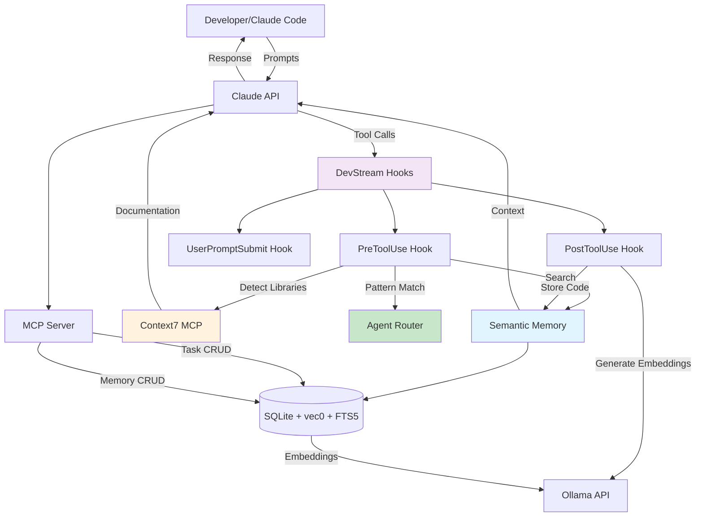
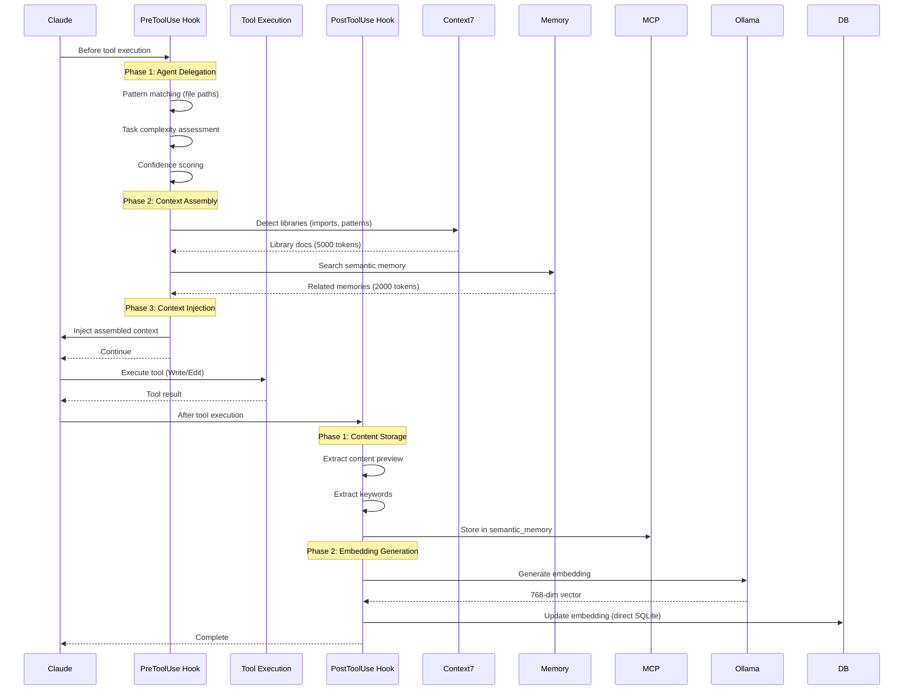
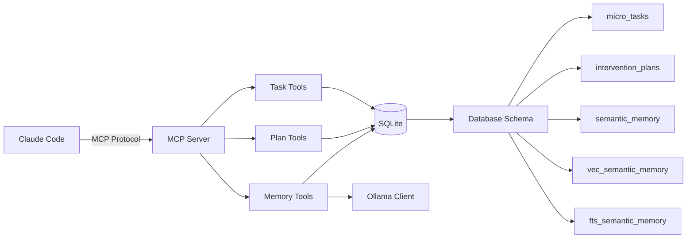
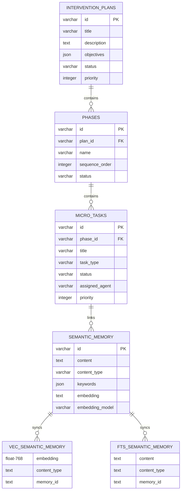

# DevStream System Architecture

**Target Audience**: Contributors, maintainers, architects
**Level**: Advanced
**Type**: Explanatory + Reference

## Overview

DevStream is a development workflow automation system that combines task lifecycle management, semantic memory with vector search, and intelligent context injection for AI-assisted development. It operates as a bridge between Claude Code and your development workflow.

### System Components



## Core Architecture

### Technology Stack

| Component | Technology | Version | Purpose |
|-----------|-----------|---------|---------|
| **Runtime** | Python | 3.11+ | Hook system execution |
| **MCP Server** | Node.js + TypeScript | 18+ | Model Context Protocol server |
| **Database** | SQLite 3 | 3.45+ | Data persistence |
| **Vector Search** | sqlite-vec (vec0) | 0.1.6+ | Semantic similarity search |
| **Full-Text Search** | FTS5 | Built-in | Keyword search |
| **Embeddings** | Ollama | Latest | nomic-embed-text model |
| **Hook Framework** | cchooks | 0.1.4+ | Claude Code hook integration |
| **HTTP Client** | aiohttp | 3.8+ | Async HTTP for MCP/Context7 |
| **Logging** | structlog | 23.0+ | Structured logging |

### Design Principles

1. **Graceful Degradation**: All components fail gracefully without blocking development workflow
2. **Non-Blocking Operations**: Hook failures never prevent tool execution
3. **Hybrid Search**: Combine semantic (vector) and keyword (FTS5) search using RRF algorithm
4. **Automatic Context Injection**: Context assembled and injected transparently
5. **Isolated Components**: Each system (hooks, MCP, agents) operates independently

## Hook System Architecture

### Hook Lifecycle



### Hook Components

#### PreToolUse Hook (`pre_tool_use.py`)

**Purpose**: Intelligent context injection before Write/Edit operations

**Flow**:
1. **Agent Auto-Delegation** (Phase 1)
   - Pattern matching on file paths (`.py` → `@python-specialist`)
   - Task complexity assessment (single-file vs multi-stack)
   - Confidence scoring (≥0.95 = auto-approve)
   - Advisory message generation

2. **Context7 Integration** (Phase 2)
   - Library detection from imports (`from fastapi import FastAPI`)
   - Documentation retrieval via MCP (`mcp__context7__get-library-docs`)
   - Token budget enforcement (max 5000 tokens)

3. **Semantic Memory Search** (Phase 3)
   - Hybrid search (RRF algorithm)
   - Relevance threshold filtering (≥0.5)
   - Token budget enforcement (max 2000 tokens)

4. **Context Assembly** (Phase 4)
   - Combine agent advisory + Context7 + memory
   - Format for Claude context injection
   - Inject via `cchooks` API

**Key Classes**:
```python
class PreToolUseHook:
    def __init__(self):
        self.base = DevStreamHookBase("pre_tool_use")
        self.mcp_client = get_mcp_client()
        self.context7 = Context7Client(self.mcp_client)
        self.pattern_matcher = PatternMatcher()  # Agent delegation
        self.agent_router = AgentRouter()

    async def process(self, context: PreToolUseContext) -> None:
        # Phase 1: Agent delegation
        assessment = await self.check_agent_delegation(...)

        # Phase 2: Context assembly
        enhanced_context = await self.assemble_context(...)

        # Phase 3: Context injection
        self.base.inject_context(final_context)
```

#### PostToolUse Hook (`post_tool_use.py`)

**Purpose**: Automatic memory storage with embeddings after Write/Edit operations

**Flow**:
1. **Content Extraction**
   - Extract file path, content, operation type
   - Generate content preview (max 500 chars)
   - Extract keywords from file path + extension

2. **Memory Storage** (via MCP)
   - Format memory content with metadata
   - Store via `mcp__devstream__devstream_store_memory`
   - Receive `memory_id` for embedding update

3. **Embedding Generation** (inline)
   - Generate embedding via Ollama (nomic-embed-text)
   - 768-dimensional float vector
   - Direct SQLite UPDATE (bypasses MCP for performance)

4. **Trigger-Based Sync**
   - Database trigger syncs to `vec_semantic_memory`
   - Database trigger syncs to `fts_semantic_memory`

**Key Classes**:
```python
class PostToolUseHook:
    def __init__(self):
        self.base = DevStreamHookBase("post_tool_use")
        self.mcp_client = get_mcp_client()
        self.ollama_client = OllamaEmbeddingClient()

    async def store_in_memory(self, file_path, content, operation):
        # Phase 1: Store via MCP
        result = await self.base.safe_mcp_call(
            self.mcp_client,
            "devstream_store_memory",
            {...}
        )
        memory_id = result.get('memory_id')

        # Phase 2: Generate and store embedding
        embedding = self.ollama_client.generate_embedding(content)
        self.update_memory_embedding(memory_id, embedding)
```

### Hook Configuration

**Location**: `.claude/settings.json`

```json
{
  "hooks": {
    "PreToolUse": [{
      "hooks": [{
        "command": "\"$CLAUDE_PROJECT_DIR\"/.devstream/bin/python \"$CLAUDE_PROJECT_DIR\"/.claude/hooks/devstream/memory/pre_tool_use.py"
      }]
    }],
    "PostToolUse": [{
      "hooks": [{
        "command": "\"$CLAUDE_PROJECT_DIR\"/.devstream/bin/python \"$CLAUDE_PROJECT_DIR\"/.claude/hooks/devstream/memory/post_tool_use.py"
      }]
    }]
  }
}
```

**Critical**: Hooks MUST use `.devstream/bin/python` (venv interpreter) for dependency isolation.

## MCP Server Architecture

### Server Components



### MCP Server (`mcp-devstream-server/`)

**Purpose**: Model Context Protocol server for Claude Code integration

**Architecture**:
- **Protocol**: MCP (Model Context Protocol)
- **Transport**: stdio (stdin/stdout)
- **Runtime**: Node.js 18+ with TypeScript
- **Database**: better-sqlite3 with sqlite-vec extension

**Key Files**:
```
mcp-devstream-server/
├── src/
│   ├── index.ts              # Main server class
│   ├── database.ts           # Database connection + queries
│   ├── ollama-client.ts      # Ollama embedding client
│   ├── tools/
│   │   ├── tasks.ts          # Task CRUD operations
│   │   ├── plans.ts          # Plan CRUD operations
│   │   └── memory.ts         # Memory CRUD + hybrid search
│   └── types.ts              # TypeScript type definitions
├── start-production.js       # Production launcher
└── smoke-test.js             # Smoke tests
```

**Server Initialization**:
```typescript
class DevStreamMcpServer {
  constructor(dbPath: string) {
    this.server = new Server({
      name: 'devstream-mcp-server',
      version: '1.0.0',
    }, {
      capabilities: { tools: {} }
    });

    this.database = new DevStreamDatabase(dbPath);
    this.taskTools = new TaskTools(this.database);
    this.planTools = new PlanTools(this.database);
    this.memoryTools = new MemoryTools(this.database);
  }

  async start() {
    await this.database.initialize();  // Load vec0 extension
    await initializeOllamaClient();    // Initialize Ollama

    const transport = new StdioServerTransport();
    await this.server.connect(transport);
  }
}
```

### MCP Tools

#### Task Management Tools

| Tool | Purpose | Parameters |
|------|---------|------------|
| `devstream_list_tasks` | List tasks with filtering | `status`, `project`, `priority` |
| `devstream_create_task` | Create new task | `title`, `description`, `task_type`, `priority`, `phase_name` |
| `devstream_update_task` | Update task status | `task_id`, `status`, `notes` |

#### Memory Tools

| Tool | Purpose | Parameters |
|------|---------|------------|
| `devstream_store_memory` | Store content in memory | `content`, `content_type`, `keywords` |
| `devstream_search_memory` | Hybrid search (RRF) | `query`, `content_type`, `limit` |

**Hybrid Search Implementation**:
```typescript
async searchMemory(args: any) {
  const { query, content_type, limit = 10 } = args;

  // Generate query embedding
  const embedding = await generateEmbedding(query);

  // Vector search (semantic)
  const vecResults = this.db.prepare(`
    SELECT memory_id, distance
    FROM vec_semantic_memory
    WHERE embedding MATCH ?
      AND k = ?
      AND content_type = ?
  `).all(embedding, limit * 2, content_type);

  // FTS5 search (keyword)
  const ftsResults = this.db.prepare(`
    SELECT memory_id, rank
    FROM fts_semantic_memory
    WHERE fts_semantic_memory MATCH ?
      AND content_type = ?
    LIMIT ?
  `).all(query, content_type, limit * 2);

  // Reciprocal Rank Fusion (RRF)
  const combined = this.reciprocalRankFusion(vecResults, ftsResults, k=60);

  return { results: combined.slice(0, limit) };
}
```

## Database Architecture

### Schema Design



### Vector Search Table (vec0)

**Virtual Table**:
```sql
CREATE VIRTUAL TABLE vec_semantic_memory USING vec0(
    embedding float[768],                 -- 768-dimensional vector
    content_type TEXT PARTITION KEY,      -- Enables partition filtering
    +memory_id TEXT,                      -- Link to semantic_memory.id
    +content_preview TEXT                 -- First 200 chars
);
```

**Key Features**:
- **Partition Key**: `content_type` enables filtered searches
- **Auxiliary Columns**: `+memory_id` and `+content_preview` stored without indexing
- **Distance Metric**: L2 (Euclidean distance) by default
- **Performance**: < 100ms for 100K vectors (95th percentile)

**Search Query**:
```sql
SELECT memory_id, distance
FROM vec_semantic_memory
WHERE embedding MATCH ?                  -- Query vector
  AND k = 10                             -- Top 10 results
  AND content_type = 'code'              -- Filter by type
ORDER BY distance;
```

### Full-Text Search Table (FTS5)

**Virtual Table**:
```sql
CREATE VIRTUAL TABLE fts_semantic_memory USING fts5(
    content,                              -- Full-text indexed content
    content_type UNINDEXED,               -- Filter by content type
    memory_id UNINDEXED,                  -- Link to semantic_memory.id
    created_at UNINDEXED,                 -- Timestamp for sorting
    tokenize='unicode61 remove_diacritics 2'
);
```

**Search Query**:
```sql
SELECT memory_id, rank
FROM fts_semantic_memory
WHERE fts_semantic_memory MATCH 'fastapi AND async'
ORDER BY rank;
```

### Trigger-Based Synchronization

**Insert Trigger**:
```sql
CREATE TRIGGER sync_insert_memory
  AFTER INSERT ON semantic_memory
  WHEN NEW.embedding IS NOT NULL
  BEGIN
    INSERT INTO vec_semantic_memory(embedding, content_type, memory_id, content_preview)
    VALUES (NEW.embedding, NEW.content_type, NEW.id, substr(NEW.content, 1, 200));

    INSERT INTO fts_semantic_memory(rowid, content, content_type, memory_id, created_at)
    VALUES (NEW.rowid, NEW.content, NEW.content_type, NEW.id, NEW.created_at);
  END;
```

**Update/Delete Triggers**: Similar logic for UPDATE and DELETE operations.

## Agent Auto-Delegation System

### Pattern Matcher

**Purpose**: Match file patterns to specialized agents

**Algorithm**:
```python
class PatternMatcher:
    PATTERNS = {
        '**/*.py': {'agent': '@python-specialist', 'confidence': 0.95},
        '**/*.ts': {'agent': '@typescript-specialist', 'confidence': 0.95},
        '**/*.tsx': {'agent': '@typescript-specialist', 'confidence': 0.95},
        '**/*.rs': {'agent': '@rust-specialist', 'confidence': 0.95},
        '**/*.go': {'agent': '@go-specialist', 'confidence': 0.95},
        '**/schema.sql': {'agent': '@database-specialist', 'confidence': 0.90},
        '**/Dockerfile': {'agent': '@devops-specialist', 'confidence': 0.90},
    }

    def match_patterns(self, file_path, content, user_query, tool_name):
        matches = []
        for pattern, config in self.PATTERNS.items():
            if fnmatch.fnmatch(file_path, pattern):
                matches.append({
                    'agent': config['agent'],
                    'confidence': config['confidence'],
                    'pattern': pattern
                })

        # Return highest confidence match
        return max(matches, key=lambda x: x['confidence']) if matches else None
```

### Agent Router

**Purpose**: Assess task complexity and recommend delegation strategy

**Delegation Thresholds**:
- **≥ 0.95**: AUTOMATIC delegation (single file, clear pattern)
- **0.85 - 0.94**: ADVISORY delegation (suggest agent, request approval)
- **< 0.85**: AUTHORIZATION REQUIRED (@tech-lead coordination)

**Assessment Algorithm**:
```python
class AgentRouter:
    async def assess_task_complexity(self, pattern_match, context):
        # Factors influencing confidence:
        # 1. Number of affected files (single vs multiple)
        # 2. Language homogeneity (single vs mixed)
        # 3. Architectural scope (local vs system-wide)
        # 4. Historical success rate for agent

        if len(context['affected_files']) == 1:
            return TaskAssessment(
                suggested_agent=pattern_match['agent'],
                confidence=pattern_match['confidence'],
                recommendation='AUTOMATIC',
                complexity='low',
                reason='Single file, clear pattern match'
            )
        else:
            # Multi-file task requires coordination
            return TaskAssessment(
                suggested_agent='@tech-lead',
                confidence=0.70,
                recommendation='AUTHORIZATION_REQUIRED',
                complexity='high',
                reason='Multi-stack coordination required'
            )
```

## Performance Characteristics

### Hook System Performance

| Operation | Latency (p95) | Notes |
|-----------|---------------|-------|
| PreToolUse hook | < 500ms | Includes Context7 + memory search |
| PostToolUse hook | < 1000ms | Includes embedding generation |
| Context7 retrieval | < 300ms | 5000 tokens max |
| Memory search (hybrid) | < 100ms | RRF with 10 results |
| Embedding generation | < 500ms | Ollama nomic-embed-text |

### Database Performance

| Operation | Latency (p95) | Scale |
|-----------|---------------|-------|
| Vector search (10 results) | < 50ms | 100K vectors |
| FTS5 search (10 results) | < 20ms | 100K documents |
| Hybrid search (RRF) | < 100ms | Combined |
| Embedding update | < 10ms | Direct SQLite |

## Configuration Management

### Environment Variables (`.env.devstream`)

```bash
# Memory System
DEVSTREAM_MEMORY_ENABLED=true
DEVSTREAM_MEMORY_FEEDBACK_LEVEL=minimal

# Context7 Integration
DEVSTREAM_CONTEXT7_ENABLED=true
DEVSTREAM_CONTEXT7_AUTO_DETECT=true
DEVSTREAM_CONTEXT7_TOKEN_BUDGET=5000

# Context Injection
DEVSTREAM_CONTEXT_INJECTION_ENABLED=true
DEVSTREAM_CONTEXT_MAX_TOKENS=2000
DEVSTREAM_CONTEXT_RELEVANCE_THRESHOLD=0.5

# Agent Auto-Delegation
DEVSTREAM_AUTO_DELEGATION_ENABLED=true
DEVSTREAM_AUTO_DELEGATION_MIN_CONFIDENCE=0.85
DEVSTREAM_AUTO_DELEGATION_AUTO_APPROVE=0.95
DEVSTREAM_AUTO_DELEGATION_QUALITY_GATE=true

# Database
DEVSTREAM_DB_PATH=data/devstream.db

# Logging
DEVSTREAM_LOG_LEVEL=INFO
DEVSTREAM_LOG_PATH=~/.claude/logs/devstream/
```

## Security Considerations

1. **Embedding Storage**: Embeddings stored as TEXT (JSON serialized) for SQLite compatibility
2. **MCP Transport**: stdio-based (no network exposure)
3. **Database Access**: File-based SQLite (local access only)
4. **Hook Execution**: Isolated venv with pinned dependencies
5. **Ollama API**: Local-only by default (no external API calls)

## Scalability Limits

| Resource | Limit | Mitigation |
|----------|-------|------------|
| Vector count | ~1M | Periodic archival of old memories |
| Embedding dimension | 768 | Fixed by nomic-embed-text model |
| Context injection tokens | 7000 | Token budget enforcement |
| Hook execution time | 2 minutes | Timeout configuration |
| MCP server memory | 8GB heap | Explicit GC in production launcher |

## Future Architecture Enhancements

1. **Distributed Vector Search**: Consider Qdrant/Milvus for > 1M vectors
2. **Multi-Model Embeddings**: Support multiple embedding models
3. **Streaming Context Injection**: Incremental context delivery
4. **Agent Learning**: Track delegation success rates for optimization
5. **Cross-Session Memory**: Share context across Claude sessions

---

**Document Version**: 1.0.0
**Last Updated**: 2025-10-01
**Status**: Production Documentation
