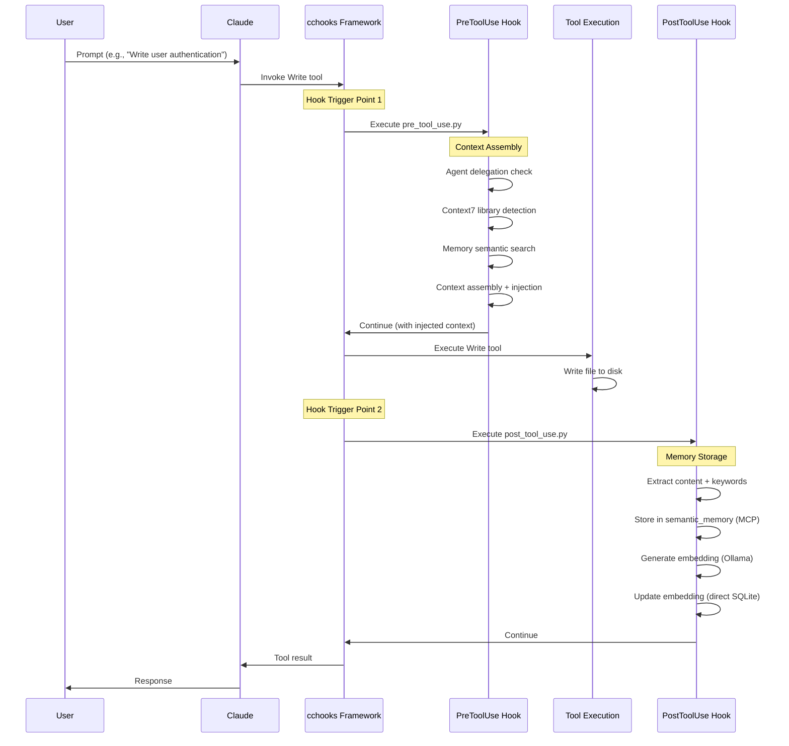

# Hook System Deep Dive

**Target Audience**: Hook developers, advanced contributors
**Level**: Advanced
**Type**: Explanatory + Reference

## Hook System Overview

DevStream's hook system is built on **cchooks**, Claude Code's official hook framework. Hooks intercept tool executions (Write, Edit, Bash, etc.) to inject context and store artifacts automatically.

### Hook Lifecycle



### Hook Types

DevStream implements 3 hook types:

| Hook Type | Trigger | Purpose | Example Use Case |
|-----------|---------|---------|------------------|
| **PreToolUse** | Before tool execution | Context injection, validation | Inject Context7 docs, agent advisory |
| **PostToolUse** | After tool execution | Artifact storage, logging | Store code in memory, generate embeddings |
| **UserPromptSubmit** | User submits prompt | Query enhancement, validation | Detect library mentions, enhance context |

## Creating Custom Hooks

### Hook Template

**File**: `.claude/hooks/custom/my_hook.py`

```python
#!/usr/bin/env -S uv run --script
# /// script
# requires-python = ">=3.11"
# dependencies = [
#     "cchooks>=0.1.4",
#     "structlog>=23.0.0",
#     "python-dotenv>=1.0.0",
# ]
# ///

"""
Custom Hook Template

Purpose: [Describe what this hook does]
Trigger: [PreToolUse/PostToolUse/UserPromptSubmit]
"""

import sys
import asyncio
from pathlib import Path
from typing import Optional

# Add DevStream utilities to path
sys.path.insert(0, str(Path(__file__).parent.parent / 'hooks' / 'devstream' / 'utils'))

from cchooks import safe_create_context, PreToolUseContext  # or PostToolUseContext
from devstream_base import DevStreamHookBase


class MyCustomHook:
    """
    Custom hook for [specific purpose].

    This hook [detailed description of functionality].
    """

    def __init__(self):
        self.base = DevStreamHookBase("my_custom_hook")

    async def process(self, context: PreToolUseContext) -> None:
        """
        Main hook processing logic.

        Args:
            context: Hook context from cchooks
        """
        # Check if hook should run
        if not self.base.should_run():
            self.base.debug_log("Hook disabled via config")
            context.output.exit_success()
            return

        # Extract tool information
        tool_name = context.tool_name
        tool_input = context.tool_input

        self.base.debug_log(f"Processing {tool_name}")

        try:
            # YOUR CUSTOM LOGIC HERE
            # Example: Validate file path
            file_path = tool_input.get("file_path", "")
            if not file_path:
                self.base.warning_feedback("No file path provided")
                context.output.exit_success()
                return

            # Example: Inject context
            custom_context = f"# Custom Context\n\nFile: {file_path}"
            self.base.inject_context(custom_context)

            # Always allow operation to proceed (graceful degradation)
            context.output.exit_success()

        except Exception as e:
            # Non-blocking error - log and continue
            self.base.warning_feedback(f"Hook error: {str(e)[:50]}")
            context.output.exit_success()


def main():
    """Main entry point for custom hook."""
    # Create context using cchooks
    ctx = safe_create_context()

    # Verify context type
    if not isinstance(ctx, PreToolUseContext):
        print(f"Error: Expected PreToolUseContext, got {type(ctx)}", file=sys.stderr)
        sys.exit(1)

    # Create and run hook
    hook = MyCustomHook()

    try:
        asyncio.run(hook.process(ctx))
    except Exception as e:
        # Graceful failure - non-blocking
        print(f"⚠️  Custom Hook: Error", file=sys.stderr)
        ctx.output.exit_non_block(f"Hook error: {str(e)[:100]}")


if __name__ == "__main__":
    main()
```

### Hook Registration

**File**: `.claude/settings.json`

```json
{
  "hooks": {
    "PreToolUse": [
      {
        "hooks": [
          {
            "command": "\"$CLAUDE_PROJECT_DIR\"/.devstream/bin/python \"$CLAUDE_PROJECT_DIR\"/.claude/hooks/custom/my_hook.py"
          }
        ]
      }
    ]
  }
}
```

**Key Points**:
- Use absolute paths via `$CLAUDE_PROJECT_DIR` variable
- Use `.devstream/bin/python` for dependency isolation
- Multiple hooks can be registered for same trigger (execute sequentially)

## Hook Development Patterns

### Pattern 1: Context Injection

**Use Case**: Add information to Claude's context before tool execution

```python
async def inject_custom_context(self, context: PreToolUseContext) -> None:
    """Inject custom context before Write/Edit."""
    tool_input = context.tool_input
    file_path = tool_input.get("file_path", "")

    # Build custom context
    custom_context = f"""# Custom Context for {Path(file_path).name}

## Project Guidelines
- Use type hints for all functions
- Write docstrings in Google style
- Follow SOLID principles

## Related Files
- Similar implementation: /src/api/related.py
"""

    # Inject context
    self.base.inject_context(custom_context)
    self.base.success_feedback("Context injected")
```

### Pattern 2: Content Storage

**Use Case**: Store artifacts after tool execution

```python
async def store_artifact(self, context: PostToolUseContext) -> None:
    """Store generated content in external system."""
    tool_input = context.tool_input
    file_path = tool_input.get("file_path", "")
    content = tool_input.get("content", "")

    # Store in external system
    artifact_id = await self.external_api.store({
        "file_path": file_path,
        "content": content,
        "timestamp": datetime.now().isoformat()
    })

    self.base.success_feedback(f"Artifact stored: {artifact_id}")
```

### Pattern 3: Validation

**Use Case**: Validate tool input before execution

```python
async def validate_input(self, context: PreToolUseContext) -> None:
    """Validate tool input before execution."""
    tool_name = context.tool_name
    tool_input = context.tool_input

    # Validation logic
    if tool_name == "Write":
        file_path = tool_input.get("file_path", "")

        # Block dangerous operations
        if "/etc/" in file_path or "/sys/" in file_path:
            self.base.warning_feedback("Blocked: System file modification")
            context.output.exit_block("Cannot modify system files")
            return

    # Allow operation
    context.output.exit_success()
```

### Pattern 4: Logging and Metrics

**Use Case**: Track tool usage and performance

```python
async def log_metrics(self, context: PostToolUseContext) -> None:
    """Log tool usage metrics."""
    tool_name = context.tool_name
    tool_input = context.tool_input

    # Extract metrics
    file_path = tool_input.get("file_path", "")
    content_length = len(tool_input.get("content", ""))

    # Log to metrics system
    await self.metrics_client.log({
        "event": "tool_execution",
        "tool": tool_name,
        "file": file_path,
        "size_bytes": content_length,
        "timestamp": datetime.now().isoformat()
    })

    self.base.debug_log(f"Metrics logged: {tool_name}")
```

## Advanced Hook Techniques

### Technique 1: Conditional Execution

**Use Case**: Execute hook logic only for specific conditions

```python
async def process(self, context: PreToolUseContext) -> None:
    """Process hook with conditional execution."""
    tool_name = context.tool_name
    tool_input = context.tool_input

    # Only process Python files
    file_path = tool_input.get("file_path", "")
    if not file_path.endswith(".py"):
        context.output.exit_success()
        return

    # Only process Write/Edit operations
    if tool_name not in ["Write", "Edit"]:
        context.output.exit_success()
        return

    # Execute hook logic
    await self.inject_python_context(file_path)
    context.output.exit_success()
```

### Technique 2: Async Operations with Timeout

**Use Case**: Prevent hook from blocking indefinitely

```python
import asyncio

async def process_with_timeout(self, context: PreToolUseContext) -> None:
    """Process hook with timeout."""
    try:
        # Execute with 5-second timeout
        await asyncio.wait_for(
            self.expensive_operation(),
            timeout=5.0
        )
        context.output.exit_success()

    except asyncio.TimeoutError:
        self.base.warning_feedback("Hook timeout - continuing")
        context.output.exit_success()  # Graceful degradation
```

### Technique 3: Parallel External Calls

**Use Case**: Call multiple external APIs concurrently

```python
import asyncio

async def fetch_context_parallel(self, query: str) -> str:
    """Fetch context from multiple sources in parallel."""
    # Launch parallel tasks
    tasks = [
        self.context7.search(query),
        self.devstream_memory.search(query),
        self.external_docs.search(query)
    ]

    # Wait for all (with timeout)
    results = await asyncio.gather(*tasks, return_exceptions=True)

    # Filter successful results
    valid_results = [r for r in results if not isinstance(r, Exception)]

    # Combine results
    combined = "\n\n---\n\n".join(valid_results)
    return combined
```

### Technique 4: Caching

**Use Case**: Cache expensive computations across hook executions

```python
from functools import lru_cache
import hashlib

class CachedHook:
    def __init__(self):
        self.base = DevStreamHookBase("cached_hook")
        self._cache = {}

    def _cache_key(self, content: str) -> str:
        """Generate cache key from content."""
        return hashlib.sha256(content.encode()).hexdigest()

    async def get_analysis(self, content: str) -> str:
        """Get analysis with caching."""
        cache_key = self._cache_key(content)

        # Check cache
        if cache_key in self._cache:
            self.base.debug_log("Cache hit")
            return self._cache[cache_key]

        # Compute and cache
        self.base.debug_log("Cache miss - computing")
        result = await self.expensive_analysis(content)
        self._cache[cache_key] = result

        return result
```

## Hook Testing

### Testing PreToolUse Hooks

```python
import pytest
from unittest.mock import Mock, AsyncMock, patch
from cchooks import PreToolUseContext

@pytest.fixture
def mock_context():
    """Create mock PreToolUseContext."""
    context = Mock(spec=PreToolUseContext)
    context.tool_name = "Write"
    context.tool_input = {
        "file_path": "/test.py",
        "content": "print('hello')"
    }
    context.output = Mock()
    context.output.exit_success = Mock()
    context.output.exit_block = Mock()
    context.output.exit_non_block = Mock()
    return context

@pytest.mark.asyncio
async def test_hook_context_injection(mock_context):
    """Test context injection in PreToolUse hook."""
    hook = MyCustomHook()

    await hook.process(mock_context)

    # Verify success exit
    mock_context.output.exit_success.assert_called_once()

    # Verify context injected (check logs or side effects)
    # ... additional assertions ...
```

### Testing PostToolUse Hooks

```python
import pytest
from unittest.mock import Mock, AsyncMock
from cchooks import PostToolUseContext

@pytest.fixture
def mock_post_context():
    """Create mock PostToolUseContext."""
    context = Mock(spec=PostToolUseContext)
    context.tool_name = "Write"
    context.tool_input = {
        "file_path": "/test.py",
        "content": "print('hello')"
    }
    context.output = Mock()
    context.output.exit_success = Mock()
    return context

@pytest.mark.asyncio
async def test_hook_storage(mock_post_context):
    """Test content storage in PostToolUse hook."""
    hook = MyCustomHook()
    hook.storage_client = AsyncMock()

    await hook.process(mock_post_context)

    # Verify storage called
    hook.storage_client.store.assert_called_once()

    # Verify success exit
    mock_post_context.output.exit_success.assert_called_once()
```

## Hook Debugging

### Debug Logging

```python
class MyHook:
    def __init__(self):
        self.base = DevStreamHookBase("my_hook")

    async def process(self, context):
        # Debug logging (only visible if DEVSTREAM_LOG_LEVEL=DEBUG)
        self.base.debug_log("Hook started")
        self.base.debug_log(f"Tool: {context.tool_name}")
        self.base.debug_log(f"Input: {context.tool_input}")

        # User feedback (visible to user)
        self.base.success_feedback("Operation successful")
        self.base.warning_feedback("Non-critical issue")
        self.base.error_feedback("Critical error")
```

### Inspect Hook Input

```bash
# Capture stdin input to hook
cat > /tmp/hook_input.json << 'EOF'
{
  "tool_name": "Write",
  "tool_input": {
    "file_path": "/test.py",
    "content": "print('hello')"
  }
}
EOF

# Run hook with captured input
cat /tmp/hook_input.json | .devstream/bin/python .claude/hooks/devstream/memory/pre_tool_use.py

# Check logs
tail -f ~/.claude/logs/devstream/pre_tool_use.log
```

### Breakpoint Debugging

```python
async def process(self, context: PreToolUseContext) -> None:
    """Process with breakpoint for debugging."""
    import pdb; pdb.set_trace()  # Debugger will pause here

    tool_name = context.tool_name
    # ... rest of logic ...
```

### Performance Profiling

```bash
# Profile hook execution with py-spy
py-spy record -o hook_profile.svg -- .devstream/bin/python .claude/hooks/devstream/memory/pre_tool_use.py < /tmp/hook_input.json

# View flamegraph
open hook_profile.svg
```

## Hook Configuration

### Environment Variables

Hooks read configuration from `.env.devstream`:

```python
import os
from pathlib import Path
from dotenv import load_dotenv

class ConfiguredHook:
    def __init__(self):
        # Load environment variables
        env_path = Path(__file__).parent.parent.parent.parent.parent / '.env.devstream'
        load_dotenv(env_path)

        # Read configuration
        self.enabled = os.getenv("MY_HOOK_ENABLED", "true").lower() == "true"
        self.api_endpoint = os.getenv("MY_HOOK_API_ENDPOINT", "http://localhost:8000")
        self.timeout = int(os.getenv("MY_HOOK_TIMEOUT", "30"))
        self.log_level = os.getenv("MY_HOOK_LOG_LEVEL", "INFO")

    async def process(self, context):
        if not self.enabled:
            context.output.exit_success()
            return

        # Use configuration
        async with httpx.AsyncClient(timeout=self.timeout) as client:
            response = await client.post(self.api_endpoint, json={...})
```

### Feature Flags

```python
class FeatureFlaggedHook:
    def __init__(self):
        self.features = {
            "context_injection": os.getenv("HOOK_FEATURE_CONTEXT_INJECTION", "true") == "true",
            "memory_storage": os.getenv("HOOK_FEATURE_MEMORY_STORAGE", "true") == "true",
            "agent_delegation": os.getenv("HOOK_FEATURE_AGENT_DELEGATION", "false") == "true"
        }

    async def process(self, context):
        if self.features["context_injection"]:
            await self.inject_context(context)

        if self.features["memory_storage"]:
            await self.store_memory(context)

        if self.features["agent_delegation"]:
            await self.delegate_to_agent(context)

        context.output.exit_success()
```

## Hook Best Practices

### 1. Graceful Degradation

**Always allow operation to proceed, even on error**:

```python
async def process(self, context):
    try:
        # Hook logic
        await self.risky_operation()
    except Exception as e:
        # Log error but don't block operation
        self.base.warning_feedback(f"Hook error: {str(e)[:50]}")

    # ALWAYS exit success (never block)
    context.output.exit_success()
```

### 2. Performance Budgets

**Hooks should be fast (< 1s for PreToolUse, < 2s for PostToolUse)**:

```python
import asyncio

async def process(self, context):
    try:
        # Enforce performance budget
        await asyncio.wait_for(
            self.hook_logic(context),
            timeout=1.0  # 1 second budget
        )
    except asyncio.TimeoutError:
        self.base.warning_feedback("Hook timeout")

    context.output.exit_success()
```

### 3. Idempotency

**Hooks should be safe to re-run**:

```python
async def store_memory(self, content: str, file_path: str) -> None:
    """Store memory idempotently."""
    # Generate deterministic ID
    content_hash = hashlib.sha256(f"{file_path}{content}".encode()).hexdigest()
    memory_id = f"MEM-{content_hash[:12]}"

    # Check if already stored
    existing = await self.db.get_memory(memory_id)
    if existing:
        self.base.debug_log("Memory already stored")
        return

    # Store new memory
    await self.db.store_memory(memory_id, content, file_path)
```

### 4. Structured Logging

**Use structlog for structured logging**:

```python
import structlog

class StructuredHook:
    def __init__(self):
        self.logger = structlog.get_logger()

    async def process(self, context):
        # Structured log entry
        self.logger.info(
            "hook_execution",
            hook_name="my_hook",
            tool_name=context.tool_name,
            file_path=context.tool_input.get("file_path"),
            timestamp=datetime.now().isoformat()
        )
```

### 5. Error Context

**Provide actionable error messages**:

```python
async def process(self, context):
    try:
        result = await self.external_api.call()
    except httpx.ConnectError:
        # Good: Specific error with action
        self.base.warning_feedback("API unavailable - check connection")
    except httpx.TimeoutError:
        # Good: Specific error with action
        self.base.warning_feedback("API timeout - increase timeout setting")
    except Exception as e:
        # Fallback: Generic error
        self.base.warning_feedback(f"Unexpected error: {str(e)[:50]}")

    context.output.exit_success()
```

## Hook Lifecycle Management

### Hook Installation

```bash
# 1. Copy hook file
cp my_hook.py .claude/hooks/custom/

# 2. Make executable
chmod +x .claude/hooks/custom/my_hook.py

# 3. Register in settings.json
# Edit .claude/settings.json to add hook

# 4. Verify installation
.devstream/bin/python .claude/hooks/custom/my_hook.py --help

# 5. Test hook execution
echo '{"tool_name": "Write", "tool_input": {"file_path": "/test.py"}}' | \
  .devstream/bin/python .claude/hooks/custom/my_hook.py
```

### Hook Versioning

**File**: `.claude/hooks/custom/my_hook.py`

```python
"""
My Custom Hook

Version: 1.2.0
Date: 2025-10-01
Author: DevStream Team

Changelog:
  1.2.0 (2025-10-01)
    - Added async timeout
    - Improved error handling
  1.1.0 (2025-09-15)
    - Added caching
  1.0.0 (2025-09-01)
    - Initial release
"""

__version__ = "1.2.0"
```

### Hook Migration

When migrating to new hook version:

```python
class MigratableHook:
    def __init__(self):
        self.version = self.load_version()

    def load_version(self) -> str:
        """Load hook version from metadata."""
        version_file = Path(__file__).parent / ".hook_version"
        if version_file.exists():
            return version_file.read_text().strip()
        return "1.0.0"

    async def migrate(self, from_version: str, to_version: str) -> None:
        """Migrate hook data between versions."""
        if from_version == "1.0.0" and to_version == "1.1.0":
            # Migration logic
            await self.migrate_1_0_to_1_1()

    async def migrate_1_0_to_1_1(self) -> None:
        """Migrate from 1.0.0 to 1.1.0."""
        # Example: Update database schema
        # Example: Migrate configuration format
        pass
```

---

**Document Version**: 1.0.0
**Last Updated**: 2025-10-01
**cchooks Version**: 0.1.4+
