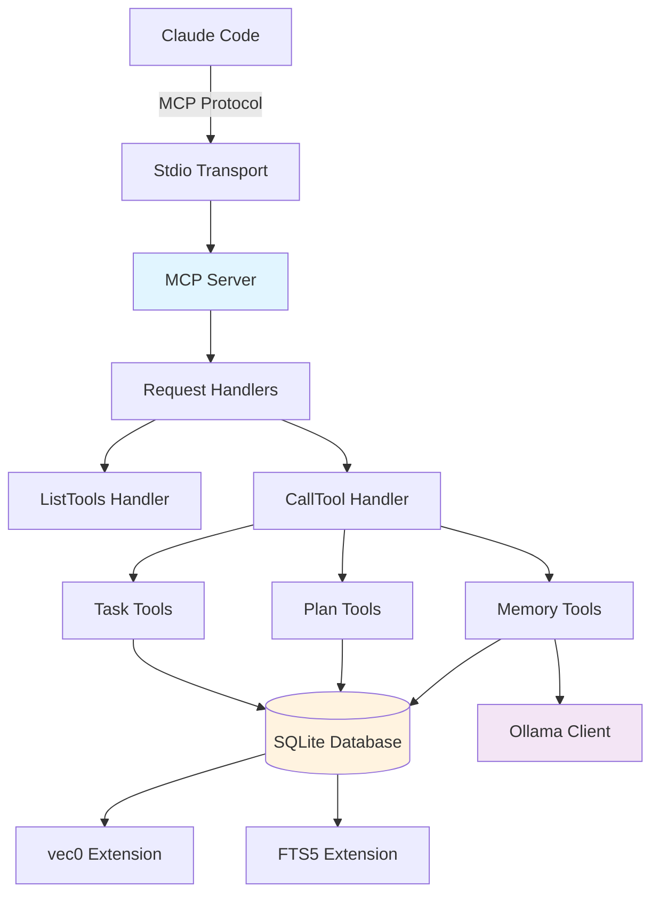

# MCP Server Development Guide

**Target Audience**: MCP server developers, contributors
**Level**: Advanced
**Type**: Reference + How-To

## MCP Server Architecture

DevStream's MCP (Model Context Protocol) server provides natural language integration between Claude Code and the DevStream system. It exposes tools for task management, memory operations, and intervention planning.

### Architecture Overview



## Project Structure

```
mcp-devstream-server/
├── src/
│   ├── index.ts              # Main server class + entry point
│   ├── database.ts           # Database connection + queries
│   ├── ollama-client.ts      # Ollama embedding client
│   ├── tools/
│   │   ├── tasks.ts          # Task CRUD operations
│   │   ├── plans.ts          # Plan CRUD operations
│   │   └── memory.ts         # Memory CRUD + hybrid search
│   └── types.ts              # TypeScript type definitions
├── dist/                     # Compiled JavaScript output
├── start-production.js       # Production launcher with memory optimization
├── smoke-test.js             # Smoke tests for production validation
├── package.json              # Node.js dependencies
├── tsconfig.json             # TypeScript configuration
└── README.md                 # MCP server documentation
```

## Core Components

### 1. Main Server Class

**File**: `src/index.ts`

```typescript
import { Server } from '@modelcontextprotocol/sdk/server/index.js';
import { StdioServerTransport } from '@modelcontextprotocol/sdk/server/stdio.js';
import { CallToolRequestSchema, ListToolsRequestSchema } from '@modelcontextprotocol/sdk/types.js';

class DevStreamMcpServer {
  private server: Server;
  private database: DevStreamDatabase;
  private taskTools: TaskTools;
  private planTools: PlanTools;
  private memoryTools: MemoryTools;

  constructor(dbPath: string) {
    // Initialize MCP server with capabilities
    this.server = new Server(
      {
        name: 'devstream-mcp-server',
        version: '1.0.0',
      },
      {
        capabilities: {
          tools: {},  // Tool capabilities
        },
      }
    );

    // Initialize database and tool handlers
    this.database = new DevStreamDatabase(dbPath);
    this.taskTools = new TaskTools(this.database);
    this.planTools = new PlanTools(this.database);
    this.memoryTools = new MemoryTools(this.database);

    this.setupHandlers();
  }

  private setupHandlers(): void {
    // Register ListTools handler
    this.server.setRequestHandler(ListToolsRequestSchema, async () => {
      return {
        tools: [
          // Task tools
          { name: 'devstream_list_tasks', description: '...', inputSchema: {...} },
          { name: 'devstream_create_task', description: '...', inputSchema: {...} },
          { name: 'devstream_update_task', description: '...', inputSchema: {...} },

          // Memory tools
          { name: 'devstream_store_memory', description: '...', inputSchema: {...} },
          { name: 'devstream_search_memory', description: '...', inputSchema: {...} },

          // Plan tools
          { name: 'devstream_list_plans', description: '...', inputSchema: {...} },
        ]
      };
    });

    // Register CallTool handler
    this.server.setRequestHandler(CallToolRequestSchema, async (request) => {
      const { name, arguments: args } = request.params;

      switch (name) {
        case 'devstream_list_tasks':
          return await this.taskTools.listTasks(args);
        case 'devstream_create_task':
          return await this.taskTools.createTask(args);
        case 'devstream_store_memory':
          return await this.memoryTools.storeMemory(args);
        case 'devstream_search_memory':
          return await this.memoryTools.searchMemory(args);
        // ... other tools ...
        default:
          throw new Error(`Unknown tool: ${name}`);
      }
    });
  }

  async start(): Promise<void> {
    // Initialize database (load vec0 extension)
    await this.database.initialize();

    // Initialize Ollama client
    await initializeOllamaClient();

    // Connect stdio transport
    const transport = new StdioServerTransport();
    await this.server.connect(transport);

    console.error('✅ DevStream MCP Server started');
  }

  async close(): Promise<void> {
    await this.database.close();
  }
}
```

### 2. Database Layer

**File**: `src/database.ts`

```typescript
import Database from 'better-sqlite3';

export class DevStreamDatabase {
  private db: Database.Database;
  private dbPath: string;

  constructor(dbPath: string) {
    this.dbPath = dbPath;
  }

  async initialize(): Promise<void> {
    // Open database
    this.db = new Database(this.dbPath);

    // Load vec0 extension for vector search
    try {
      this.db.loadExtension('vec0');
      console.error('✅ vec0 extension loaded');
    } catch (error) {
      console.error('⚠️ vec0 extension not available - text-only fallback');
    }

    // Enable WAL mode for better concurrency
    this.db.pragma('journal_mode = WAL');

    // Optimize for performance
    this.db.pragma('synchronous = NORMAL');
    this.db.pragma('cache_size = -64000');  // 64MB cache
  }

  // Task queries
  listTasks(status?: string, project?: string, priority?: number) {
    let query = 'SELECT * FROM micro_tasks WHERE 1=1';
    const params: any[] = [];

    if (status) {
      query += ' AND status = ?';
      params.push(status);
    }

    if (project) {
      query += ' AND plan_id IN (SELECT id FROM intervention_plans WHERE title LIKE ?)';
      params.push(`%${project}%`);
    }

    if (priority) {
      query += ' AND priority >= ?';
      params.push(priority);
    }

    query += ' ORDER BY priority DESC, created_at DESC';

    return this.db.prepare(query).all(...params);
  }

  createTask(task: TaskInput) {
    const stmt = this.db.prepare(`
      INSERT INTO micro_tasks (id, phase_id, title, description, task_type, priority, status, created_at)
      VALUES (?, ?, ?, ?, ?, ?, 'pending', CURRENT_TIMESTAMP)
    `);

    const taskId = `TASK-${Date.now()}`;
    stmt.run(taskId, task.phase_id, task.title, task.description, task.task_type, task.priority);

    return taskId;
  }

  // Memory queries
  storeMemory(memory: MemoryInput) {
    const stmt = this.db.prepare(`
      INSERT INTO semantic_memory (id, content, content_type, keywords, created_at)
      VALUES (?, ?, ?, ?, CURRENT_TIMESTAMP)
    `);

    const memoryId = `MEM-${Date.now()}`;
    const keywordsJson = JSON.stringify(memory.keywords || []);

    stmt.run(memoryId, memory.content, memory.content_type, keywordsJson);

    return memoryId;
  }

  hybridSearch(query: string, embedding: number[], contentType?: string, limit: number = 10) {
    // Vector search (semantic)
    const vecResults = this.vectorSearch(embedding, contentType, limit * 2);

    // FTS5 search (keyword)
    const ftsResults = this.fts5Search(query, contentType, limit * 2);

    // Reciprocal Rank Fusion (RRF)
    return this.reciprocalRankFusion(vecResults, ftsResults, limit);
  }

  private vectorSearch(embedding: number[], contentType?: string, limit: number) {
    let query = `
      SELECT memory_id, distance
      FROM vec_semantic_memory
      WHERE embedding MATCH ?
        AND k = ?
    `;

    const params: any[] = [JSON.stringify(embedding), limit];

    if (contentType) {
      query += ' AND content_type = ?';
      params.push(contentType);
    }

    query += ' ORDER BY distance';

    return this.db.prepare(query).all(...params);
  }

  private fts5Search(query: string, contentType?: string, limit: number) {
    let sql = `
      SELECT memory_id, rank
      FROM fts_semantic_memory
      WHERE fts_semantic_memory MATCH ?
    `;

    const params: any[] = [query];

    if (contentType) {
      sql += ' AND content_type = ?';
      params.push(contentType);
    }

    sql += ` ORDER BY rank LIMIT ?`;
    params.push(limit);

    return this.db.prepare(sql).all(...params);
  }

  private reciprocalRankFusion(
    vecResults: any[],
    ftsResults: any[],
    limit: number,
    k: number = 60
  ) {
    // RRF formula: score = Σ(1 / (k + rank))
    const scores = new Map<string, { score: number; vecRank?: number; ftsRank?: number }>();

    // Score vector results
    vecResults.forEach((row, index) => {
      const memoryId = row.memory_id;
      const score = 1 / (k + index + 1);

      scores.set(memoryId, {
        score: score * 0.6,  // 60% weight for semantic
        vecRank: index + 1
      });
    });

    // Score FTS results
    ftsResults.forEach((row, index) => {
      const memoryId = row.memory_id;
      const ftsScore = 1 / (k + index + 1) * 0.4;  // 40% weight for keyword

      if (scores.has(memoryId)) {
        const existing = scores.get(memoryId)!;
        existing.score += ftsScore;
        existing.ftsRank = index + 1;
      } else {
        scores.set(memoryId, {
          score: ftsScore,
          ftsRank: index + 1
        });
      }
    });

    // Sort by combined score
    const ranked = Array.from(scores.entries())
      .map(([memoryId, data]) => ({ memory_id: memoryId, ...data }))
      .sort((a, b) => b.score - a.score)
      .slice(0, limit);

    // Join with semantic_memory for full data
    const memoryIds = ranked.map(r => r.memory_id);
    const memories = this.db.prepare(`
      SELECT * FROM semantic_memory WHERE id IN (${memoryIds.map(() => '?').join(',')})
    `).all(...memoryIds);

    return ranked.map(r => {
      const memory = memories.find(m => m.id === r.memory_id);
      return {
        ...memory,
        relevance_score: r.score
      };
    });
  }

  async close(): Promise<void> {
    this.db.close();
  }
}
```

### 3. Tool Handlers

**File**: `src/tools/memory.ts`

```typescript
import { DevStreamDatabase } from '../database.js';
import { generateEmbedding } from '../ollama-client.js';

export class MemoryTools {
  constructor(private db: DevStreamDatabase) {}

  async storeMemory(args: any) {
    const { content, content_type, keywords } = args;

    // Validate input
    if (!content || !content_type) {
      return {
        content: [
          {
            type: 'text',
            text: 'Error: content and content_type are required'
          }
        ]
      };
    }

    try {
      // Store in database
      const memoryId = this.db.storeMemory({
        content,
        content_type,
        keywords: keywords || []
      });

      // Generate embedding (async, non-blocking)
      try {
        const embedding = await generateEmbedding(content);
        if (embedding) {
          // Update embedding in database
          this.db.updateEmbedding(memoryId, embedding);
        }
      } catch (embedError) {
        console.error('Embedding generation failed (non-blocking):', embedError);
      }

      return {
        content: [
          {
            type: 'text',
            text: JSON.stringify({
              success: true,
              memory_id: memoryId,
              message: 'Memory stored successfully'
            })
          }
        ]
      };

    } catch (error) {
      return {
        content: [
          {
            type: 'text',
            text: `Error storing memory: ${error instanceof Error ? error.message : 'Unknown error'}`
          }
        ]
      };
    }
  }

  async searchMemory(args: any) {
    const { query, content_type, limit = 10 } = args;

    // Validate input
    if (!query) {
      return {
        content: [
          {
            type: 'text',
            text: 'Error: query is required'
          }
        ]
      };
    }

    try {
      // Generate query embedding
      const embedding = await generateEmbedding(query);

      // Hybrid search (RRF)
      const results = this.db.hybridSearch(query, embedding, content_type, limit);

      return {
        content: [
          {
            type: 'text',
            text: JSON.stringify({
              success: true,
              results: results,
              count: results.length
            })
          }
        ]
      };

    } catch (error) {
      // Fallback to text-only search if embedding fails
      console.error('Hybrid search failed, falling back to FTS5:', error);

      try {
        const ftsResults = this.db.fts5Search(query, content_type, limit);

        return {
          content: [
            {
              type: 'text',
              text: JSON.stringify({
                success: true,
                results: ftsResults,
                count: ftsResults.length,
                fallback: true
              })
            }
          ]
        };
      } catch (ftsError) {
        return {
          content: [
            {
              type: 'text',
              text: `Error searching memory: ${ftsError instanceof Error ? ftsError.message : 'Unknown error'}`
            }
          ]
        };
      }
    }
  }
}
```

### 4. Ollama Client

**File**: `src/ollama-client.ts`

```typescript
import http from 'http';

let ollamaHost: string = 'localhost';
let ollamaPort: number = 11434;
let ollamaModel: string = 'nomic-embed-text';

export async function initializeOllamaClient(): Promise<void> {
  // Read configuration from environment
  ollamaHost = process.env.OLLAMA_HOST || 'localhost';
  ollamaPort = parseInt(process.env.OLLAMA_PORT || '11434');
  ollamaModel = process.env.OLLAMA_MODEL || 'nomic-embed-text';

  // Verify Ollama is available
  try {
    await checkOllamaHealth();
    console.error(`✅ Ollama client initialized: ${ollamaHost}:${ollamaPort}`);
  } catch (error) {
    console.error('⚠️ Ollama not available - embedding generation will be skipped');
  }
}

export async function generateEmbedding(text: string): Promise<number[]> {
  return new Promise((resolve, reject) => {
    const postData = JSON.stringify({
      model: ollamaModel,
      prompt: text
    });

    const options = {
      hostname: ollamaHost,
      port: ollamaPort,
      path: '/api/embeddings',
      method: 'POST',
      headers: {
        'Content-Type': 'application/json',
        'Content-Length': Buffer.byteLength(postData)
      },
      timeout: 30000  // 30 second timeout
    };

    const req = http.request(options, (res) => {
      let data = '';

      res.on('data', (chunk) => {
        data += chunk;
      });

      res.on('end', () => {
        try {
          const json = JSON.parse(data);
          if (json.embedding) {
            resolve(json.embedding);
          } else {
            reject(new Error('No embedding in response'));
          }
        } catch (error) {
          reject(error);
        }
      });
    });

    req.on('error', (error) => {
      reject(error);
    });

    req.on('timeout', () => {
      req.destroy();
      reject(new Error('Ollama request timeout'));
    });

    req.write(postData);
    req.end();
  });
}

async function checkOllamaHealth(): Promise<void> {
  return new Promise((resolve, reject) => {
    const req = http.request(
      {
        hostname: ollamaHost,
        port: ollamaPort,
        path: '/api/tags',
        method: 'GET',
        timeout: 5000
      },
      (res) => {
        if (res.statusCode === 200) {
          resolve();
        } else {
          reject(new Error(`Ollama health check failed: ${res.statusCode}`));
        }
      }
    );

    req.on('error', reject);
    req.on('timeout', () => {
      req.destroy();
      reject(new Error('Ollama health check timeout'));
    });

    req.end();
  });
}
```

## Building and Testing

### Development Build

```bash
cd mcp-devstream-server

# Install dependencies
npm install

# Build TypeScript → JavaScript
npm run build

# Verify output
ls -la dist/  # Should contain index.js, database.js, etc.

# Run in development mode (auto-rebuild on changes)
npm run dev
```

### Production Build

```bash
# Build with optimizations
npm run build

# Test production build
node dist/index.js data/devstream.db
```

### Running Tests

```bash
# Run all tests
npm test

# Run specific test
npm test -- test_hybrid_search.js

# Run with coverage
npm run test:coverage

# View coverage report
open coverage/index.html
```

## Adding New Tools

### Step 1: Define Tool Schema

**File**: `src/index.ts` (in `setupHandlers`)

```typescript
{
  name: 'devstream_my_new_tool',
  description: 'Clear description of what this tool does',
  inputSchema: {
    type: 'object',
    properties: {
      param1: {
        type: 'string',
        description: 'Description of parameter 1'
      },
      param2: {
        type: 'number',
        minimum: 1,
        maximum: 100,
        description: 'Description of parameter 2 (1-100)'
      }
    },
    required: ['param1'],
    additionalProperties: false
  }
}
```

### Step 2: Implement Tool Handler

**File**: `src/tools/my_tools.ts`

```typescript
import { DevStreamDatabase } from '../database.js';

export class MyTools {
  constructor(private db: DevStreamDatabase) {}

  async myNewTool(args: any) {
    const { param1, param2 = 10 } = args;

    // Validate input
    if (!param1) {
      return {
        content: [
          {
            type: 'text',
            text: 'Error: param1 is required'
          }
        ]
      };
    }

    try {
      // Tool logic
      const result = await this.doSomething(param1, param2);

      return {
        content: [
          {
            type: 'text',
            text: JSON.stringify({
              success: true,
              result: result
            })
          }
        ]
      };

    } catch (error) {
      return {
        content: [
          {
            type: 'text',
            text: `Error: ${error instanceof Error ? error.message : 'Unknown error'}`
          }
        ]
      };
    }
  }

  private async doSomething(param1: string, param2: number): Promise<any> {
    // Implementation
    return { data: 'result' };
  }
}
```

### Step 3: Register Tool Handler

**File**: `src/index.ts`

```typescript
import { MyTools } from './tools/my_tools.js';

class DevStreamMcpServer {
  private myTools: MyTools;

  constructor(dbPath: string) {
    // ... existing initialization ...
    this.myTools = new MyTools(this.database);
  }

  private setupHandlers(): void {
    // ... existing handlers ...

    // Register CallTool handler
    this.server.setRequestHandler(CallToolRequestSchema, async (request) => {
      const { name, arguments: args } = request.params;

      switch (name) {
        // ... existing cases ...
        case 'devstream_my_new_tool':
          return await this.myTools.myNewTool(args);
        default:
          throw new Error(`Unknown tool: ${name}`);
      }
    });
  }
}
```

### Step 4: Add Database Queries (if needed)

**File**: `src/database.ts`

```typescript
export class DevStreamDatabase {
  // ... existing methods ...

  myNewQuery(param: string) {
    const stmt = this.db.prepare(`
      SELECT * FROM my_table WHERE column = ?
    `);

    return stmt.all(param);
  }
}
```

### Step 5: Test New Tool

**File**: `tests/test_my_new_tool.js`

```javascript
const { DevStreamMcpServer } = require('../dist/index.js');

describe('My New Tool', () => {
  it('should execute successfully', async () => {
    const server = new DevStreamMcpServer(':memory:');
    await server.start();

    // Test tool execution
    const result = await server.myTools.myNewTool({
      param1: 'test',
      param2: 20
    });

    expect(result.content[0].text).toContain('success');
  });
});
```

## Performance Optimization

### Memory Management

**File**: `start-production.js`

```javascript
#!/usr/bin/env node

// Memory optimization for production
process.env.NODE_OPTIONS = '--max-old-space-size=8192 --expose-gc';

// Periodic garbage collection
setInterval(() => {
  if (global.gc) {
    global.gc();
    console.error('✅ Manual GC executed');
  }
}, 300000);  // Every 5 minutes

// Import and start server
import('./dist/index.js').then(module => {
  // Server initialization
});
```

### Database Optimization

```typescript
async initialize(): Promise<void> {
  this.db = new Database(this.dbPath);

  // Performance optimizations
  this.db.pragma('journal_mode = WAL');       // Write-Ahead Logging
  this.db.pragma('synchronous = NORMAL');     // Faster commits
  this.db.pragma('cache_size = -64000');      // 64MB cache
  this.db.pragma('temp_store = MEMORY');      // In-memory temp tables
  this.db.pragma('mmap_size = 30000000000');  // Memory-mapped I/O
}
```

### Query Optimization

```typescript
// Bad: N+1 query problem
for (const taskId of taskIds) {
  const task = this.db.getTask(taskId);
  // ... process task ...
}

// Good: Batch query
const tasks = this.db.prepare(`
  SELECT * FROM micro_tasks WHERE id IN (${taskIds.map(() => '?').join(',')})
`).all(...taskIds);

for (const task of tasks) {
  // ... process task ...
}
```

## Debugging

### Enable Debug Logging

```typescript
// Add to database.ts
if (process.env.DEBUG === 'true') {
  this.db.exec('PRAGMA vdbe_trace = ON');  // Trace SQL execution
}
```

### Inspect MCP Protocol

```bash
# Log all MCP messages
export MCP_DEBUG=true
node dist/index.js data/devstream.db 2> mcp-debug.log

# View protocol messages
tail -f mcp-debug.log
```

### Profile Performance

```bash
# Profile with Node.js profiler
node --prof dist/index.js data/devstream.db

# Process profiling data
node --prof-process isolate-*.log > profile.txt

# View profile
cat profile.txt
```

## Deployment

### Production Checklist

- ✅ Environment variables configured (`.env.production`)
- ✅ Database path valid and writable
- ✅ vec0 extension available
- ✅ Ollama service running (optional)
- ✅ Memory limits configured (8GB heap)
- ✅ Logging configured
- ✅ Smoke tests pass

### Health Checks

```bash
# Run smoke tests
npm run smoke-test

# Expected output:
# ✅ Database connection
# ✅ vec0 extension loaded
# ✅ Task creation
# ✅ Memory storage
# ✅ Hybrid search
# ✅ All tests passed
```

---

**Document Version**: 1.0.0
**Last Updated**: 2025-10-01
**MCP SDK Version**: @modelcontextprotocol/sdk@0.5.0
