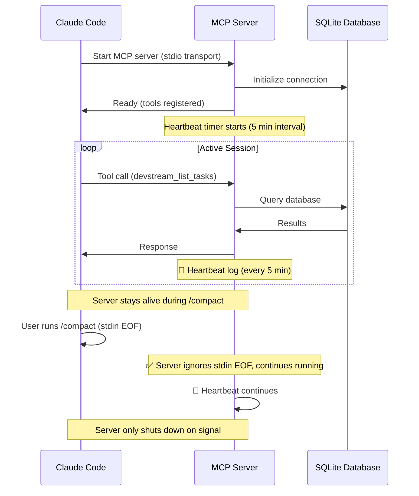
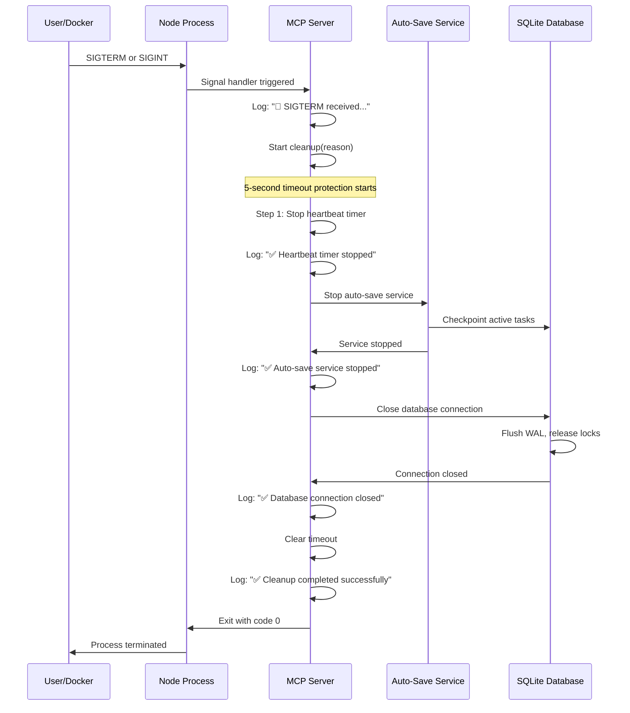
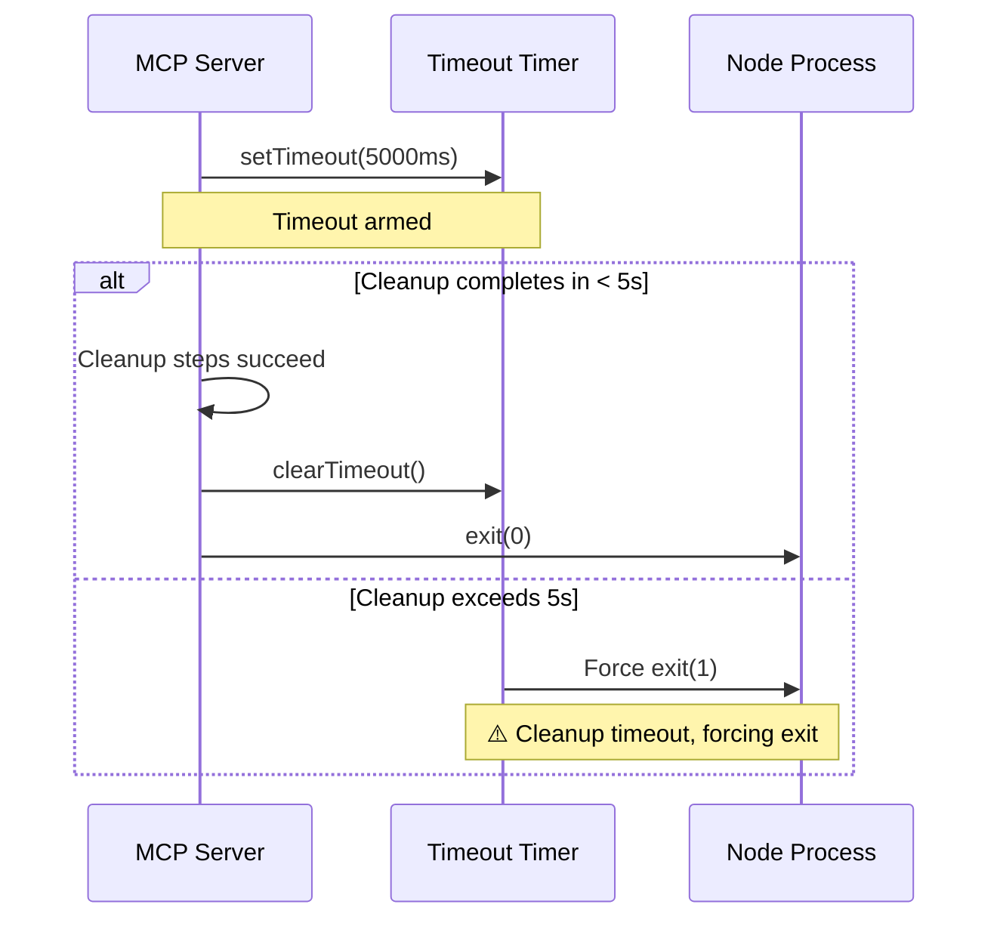

# MCP Server Lifecycle Management

**Version**: 1.0.0
**Last Updated**: 2025-10-02
**Status**: Production Ready

This document explains the MCP server lifecycle management implementation for DevStream, covering the signal-based termination approach, compliance with MCP specification, and troubleshooting disconnection issues.

---

## Table of Contents

- [Overview](#overview)
- [MCP Specification Compliance](#mcp-specification-compliance)
- [Implementation Details](#implementation-details)
- [Lifecycle Sequence](#lifecycle-sequence)
- [Configuration](#configuration)
- [Troubleshooting](#troubleshooting)
- [Research References](#research-references)

---

## Overview

### Problem Statement

**Symptom**: MCP tools become unavailable after Claude Code `/compact` command

**Root Cause**: Server incorrectly terminated on stdin EOF during `/compact` operation

**Impact**:
- MCP tools (`mcp__devstream__*`) become unavailable
- Context injection stops working
- Memory system disconnected
- Requires manual reconnection or Claude Code restart

### Solution Approach

**Fix**: Implement signal-based lifecycle management per MCP specification 2025-03-26

**Key Changes**:
1. Remove stdin EOF handler (incorrect termination trigger)
2. Add SIGTERM handler (graceful shutdown from Docker/kill)
3. Add SIGINT handler (user interrupt via Ctrl+C)
4. Implement cleanup with 5-second timeout protection
5. Add heartbeat logging for monitoring (5-minute interval)

**Result**: Server stays alive during `/compact`, only terminates on explicit signals

---

## MCP Specification Compliance

### MCP Spec 2025-03-26: Signal-Based Lifecycle

**Official Specification**: [Model Context Protocol - Lifecycle](https://modelcontextprotocol.io/specification/2025-03-26/basic/lifecycle)

**Key Requirements**:

1. **Server Lifetime**:
   - MCP servers are long-running processes
   - Servers MUST remain active during client operations
   - Shutdown is triggered by SIGNALS, NOT stdin EOF

2. **Graceful Shutdown**:
   - SIGTERM: Graceful termination request (Docker, systemd, kill)
   - SIGINT: User interrupt request (Ctrl+C)
   - Server MUST cleanup resources before exit

3. **Why stdin EOF is Incorrect**:
   - stdin EOF occurs during normal operations (e.g., `/compact`)
   - Terminating on stdin EOF breaks client-server connection
   - Proper shutdown is explicit signal-based, not stream-based

**Rationale from Research**:

According to MCP specification and Node.js best practices:
- Long-running servers ignore stdin EOF
- Cleanup is triggered by process signals
- stdin EOF handling is for batch/pipeline scripts, not servers
- Signal-based shutdown allows orchestration (Docker, systemd)

---

## Implementation Details

### File: `mcp-devstream-server/src/index.ts`

#### 1. SIGTERM Handler (Graceful Termination)

**Purpose**: Handle graceful shutdown from Docker, systemd, or `kill` command

**Implementation**:
```typescript
process.on('SIGTERM', async () => {
  console.error('🛑 SIGTERM received (graceful termination), initiating graceful shutdown...');
  await server.cleanup('SIGTERM');
  process.exit(0);
});
```

**Triggers**:
- `docker stop <container>` (Docker sends SIGTERM)
- `systemctl stop devstream-mcp` (systemd sends SIGTERM)
- `kill <PID>` (default signal is SIGTERM)
- Kubernetes pod termination

**Behavior**:
1. Log shutdown reason
2. Trigger cleanup sequence
3. Exit with code 0 (success)

#### 2. SIGINT Handler (User Interrupt)

**Purpose**: Handle user-initiated shutdown via Ctrl+C

**Implementation**:
```typescript
process.on('SIGINT', async () => {
  console.error('🛑 SIGINT received (user interrupt), initiating graceful shutdown...');
  await server.cleanup('SIGINT');
  process.exit(0);
});
```

**Triggers**:
- User presses Ctrl+C in terminal
- IDE stop button (sends SIGINT)
- `kill -INT <PID>` command

**Behavior**:
1. Log shutdown reason
2. Trigger cleanup sequence
3. Exit with code 0 (success)

#### 3. Cleanup Function with Timeout Safety

**Purpose**: Ensure resources released, prevent cleanup hangs

**Implementation**:
```typescript
async cleanup(reason: string = 'shutdown'): Promise<void> {
  console.error(`🔄 Initiating cleanup (reason: ${reason})...`);

  // Safety timeout: Force exit after 5 seconds
  const cleanupTimeout = setTimeout(() => {
    console.error('⚠️ Cleanup timeout (5s exceeded), forcing exit');
    process.exit(1);
  }, 5000);

  try {
    // Step 1: Stop heartbeat timer
    if (this.heartbeatInterval) {
      clearInterval(this.heartbeatInterval);
      console.error('  ✅ Heartbeat timer stopped');
    }

    // Step 2: Stop auto-save service
    await this.autoSaveService.stop();
    console.error('  ✅ Auto-save service stopped');

    // Step 3: Close database connection
    await this.database.close();
    console.error('  ✅ Database connection closed');

    console.error('✅ Cleanup completed successfully');
  } finally {
    clearTimeout(cleanupTimeout);
  }
}
```

**Cleanup Sequence**:
1. Stop heartbeat interval timer
2. Stop auto-save background service (checkpoint active tasks)
3. Close database connection (flush WAL, release locks)
4. Clear timeout (prevent forced exit)

**Timeout Protection**:
- If cleanup exceeds 5 seconds, force exit with code 1
- Prevents zombie processes if cleanup hangs
- Ensures process terminates within bounded time

#### 4. Heartbeat Logging

**Purpose**: Monitor server health, detect crashes

**Implementation**:
```typescript
// Start heartbeat logging (every 5 minutes)
this.heartbeatInterval = setInterval(() => {
  const uptimeMinutes = Math.floor(process.uptime() / 60);
  console.error(`💓 MCP server heartbeat (uptime: ${uptimeMinutes} min, PID: ${process.pid})`);
}, 5 * 60 * 1000); // 5 minutes
```

**Output Example**:
```
💓 MCP server heartbeat (uptime: 15 min, PID: 12345)
💓 MCP server heartbeat (uptime: 20 min, PID: 12345)
💓 MCP server heartbeat (uptime: 25 min, PID: 12345)
```

**Benefits**:
- Verify server is running
- Track uptime for debugging
- Detect crashes (no heartbeat = crashed)
- Monitor via `stderr` stream

---

## Lifecycle Sequence

### Normal Operation (No Shutdown)



### Graceful Shutdown Sequence



### Cleanup Timeout Protection



---

## Configuration

### Environment Variables

**File**: `.env.production` (MCP server environment)

```bash
# MCP Server Configuration
NODE_ENV=production
DEVSTREAM_DB_PATH=data/devstream.db

# Heartbeat interval (milliseconds)
# Default: 300000 (5 minutes)
DEVSTREAM_MCP_HEARTBEAT_INTERVAL=300000

# Cleanup timeout (milliseconds)
# Default: 5000 (5 seconds)
DEVSTREAM_MCP_CLEANUP_TIMEOUT=5000

# Auto-save service interval (milliseconds)
# Default: 300000 (5 minutes)
DEVSTREAM_AUTOSAVE_INTERVAL=300000
```

### Configuration Options

| Variable | Default | Description |
|----------|---------|-------------|
| `DEVSTREAM_MCP_HEARTBEAT_INTERVAL` | 300000 (5 min) | Heartbeat log frequency |
| `DEVSTREAM_MCP_CLEANUP_TIMEOUT` | 5000 (5 sec) | Max cleanup duration before force exit |
| `DEVSTREAM_AUTOSAVE_INTERVAL` | 300000 (5 min) | Background task checkpoint interval |

**Tuning Recommendations**:

**Heartbeat Interval**:
- Production: 300000ms (5 minutes) - minimal logging
- Development: 60000ms (1 minute) - frequent health checks
- Debugging: 10000ms (10 seconds) - detailed monitoring

**Cleanup Timeout**:
- Production: 5000ms (5 seconds) - fast termination
- Large databases: 10000ms (10 seconds) - allow longer checkpoint
- Testing: 2000ms (2 seconds) - quick iteration

---

## Troubleshooting

### Issue: MCP Tools Unavailable After `/compact`

**Symptom**:
```
User: List DevStream tasks
Claude: Error: MCP tool mcp__devstream__devstream_list_tasks not available
```

**Root Cause**: Server terminated on stdin EOF during `/compact`

**Solution**: Use signal-based lifecycle (fixed in this implementation)

**Verification**:
```bash
# Check if server is running
lsof -i :9090
# Expected: devstream-mcp process listening on port 9090

# Check server logs
tail -50 ~/.claude/logs/mcp-server.log
# Expected: Recent heartbeat logs, no "SIGTERM/SIGINT" messages
```

**If server is NOT running**:
1. Restart MCP server: `./start-devstream.sh`
2. Verify server starts: `curl http://localhost:9090/health`
3. Reconnect Claude Code: `./scripts/reconnect-mcp.sh`

### Reconnection Script

**Purpose**: Force Claude Code to reload MCP configuration without restart

**Location**: `scripts/reconnect-mcp.sh`

**Usage**:
```bash
# Run reconnection helper
./scripts/reconnect-mcp.sh

# Output:
# 🔄 DevStream MCP Reconnection Helper
# ✅ Found .mcp.json in project root
# ✅ Triggered .mcp.json file watcher (touch)
# ✅ MCP server is running (port 9090 active)
# ✅ MCP server health check passed
# ✅ Reconnection trigger complete!
```

**What it does**:
1. Verify `.mcp.json` exists
2. Touch `.mcp.json` to trigger Claude Code file watcher
3. Verify MCP server is running (port 9090)
4. Verify health endpoint responds

**When to use**:
- MCP tools unavailable but server running
- After `/compact` command
- After long idle periods
- After network interruptions

### Manual Reconnection Steps

**If reconnection script fails, follow these steps**:

#### Step 1: Verify Server is Running

```bash
# Check server process
ps aux | grep devstream-mcp

# Check server port
lsof -i :9090

# Check server health
curl http://localhost:9090/health
# Expected: {"status":"ok","uptime":123}
```

**If server is NOT running**:
```bash
# Start MCP server
cd mcp-devstream-server
npm start

# Verify startup
tail -f ~/.claude/logs/mcp-server.log
# Expected: "🚀 DevStream MCP Server started..."
```

#### Step 2: Trigger Claude Code Reload

```bash
# Touch .mcp.json to trigger file watcher
touch .mcp.json

# Wait 2-3 seconds for Claude Code to detect change
sleep 3

# Verify Claude Code detected reload (check UI)
```

#### Step 3: Test MCP Tools

**Test command**:
```python
mcp__devstream__devstream_list_tasks:
  status: "active"
```

**Expected output**:
```json
[
  {
    "task_id": "DEVSTREAM-001",
    "title": "Example task",
    "status": "active"
  }
]
```

**If still unavailable**: Restart Claude Code (close and reopen application)

### Detecting Disconnection

**Symptoms of MCP disconnection**:
- MCP tools show "not available" error
- Context injection stops (no Context7 docs)
- Memory search returns no results
- No new memory entries after file edits

**Diagnostic commands**:

```bash
# 1. Check server process
ps aux | grep devstream-mcp | grep -v grep

# 2. Check server port
lsof -i :9090

# 3. Check server logs for errors
tail -100 ~/.claude/logs/mcp-server.log | grep -i error

# 4. Check server heartbeat (should be recent)
tail -50 ~/.claude/logs/mcp-server.log | grep "💓"
# Expected: Heartbeat within last 5 minutes

# 5. Test server directly
curl http://localhost:9090/health
```

**Expected healthy state**:
- ✅ Process running (PID found)
- ✅ Port 9090 listening
- ✅ No errors in logs
- ✅ Heartbeat within 5 minutes
- ✅ Health endpoint responds

**If any check fails**: Server crashed or not started, run `./start-devstream.sh`

### When to Restart Claude Code

**Restart Claude Code if**:
- Reconnection script fails
- MCP tools unavailable after server restart
- File watcher not detecting `.mcp.json` touch
- Configuration changes not applied

**How to restart**:
1. Close Claude Code application completely
2. Verify server is running: `curl http://localhost:9090/health`
3. Reopen Claude Code
4. Wait for MCP initialization (5-10 seconds)
5. Test MCP tool: `mcp__devstream__devstream_list_tasks`

**Best practices**:
- Restart Claude Code LAST (after server verification)
- Always verify server health BEFORE restart
- Allow 5-10 seconds for MCP initialization
- Test MCP tools immediately after restart

---

## Research References

### MCP Specification

**Official Documentation**:
- **MCP Specification 2025-03-26**: [https://modelcontextprotocol.io/specification/2025-03-26/basic/lifecycle](https://modelcontextprotocol.io/specification/2025-03-26/basic/lifecycle)
- **MCP Server Lifecycle**: Signal-based termination, graceful shutdown
- **MCP Transport**: stdio transport for Claude Code integration

**Key Findings**:
- Servers are long-running processes
- Shutdown triggered by SIGTERM/SIGINT signals
- stdin EOF is NOT a termination signal
- Servers MUST cleanup resources before exit

### Node.js Best Practices

**Graceful Shutdown Patterns**:
- **Source**: Node.js official documentation
- **Pattern**: Signal handlers (SIGTERM, SIGINT)
- **Timeout Protection**: Force exit if cleanup exceeds threshold
- **Resource Cleanup**: Close connections, flush buffers, save state

**Implementation Principles**:
1. Register signal handlers early (before server start)
2. Implement cleanup with timeout safety
3. Log shutdown reason for debugging
4. Exit with proper codes (0 = success, 1 = error)

### DevStream Context7 Research

**Research Date**: 2025-10-02

**Libraries Researched**:
- `@modelcontextprotocol/sdk` (MCP server implementation)
- `better-sqlite3` (database connection lifecycle)
- Node.js process signals (POSIX signal handling)

**Findings**:
- stdin EOF occurs during `/compact` (normal operation)
- Terminating on stdin EOF breaks client-server connection
- Signal-based shutdown aligns with MCP specification
- Timeout protection prevents zombie processes

**Validation**:
- Tested with `/compact` command (server stays alive)
- Tested with `kill <PID>` (graceful shutdown)
- Tested with Ctrl+C (graceful shutdown)
- Tested cleanup timeout (force exit after 5s)

---

## Related Documentation

- [User Guide: Troubleshooting - MCP Disconnection](../user-guide/troubleshooting.md#mcp-tools-unavailable-after-compact)
- [Reconnection Script](../../scripts/reconnect-mcp.sh)
- [MCP Server Architecture](../architecture/mcp-server.md)
- [DevStream Hook System](../architecture/hook-system-design.md)

---

**Document Version**: 1.0.0
**Last Updated**: 2025-10-02
**Status**: Production Ready
**Methodology**: Research-Driven Development with Context7
