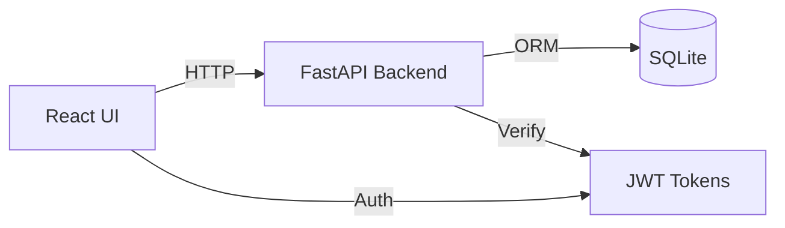

# Tutorial: Multi-Stack Workflow with Agent Orchestration

## What You'll Learn

In this tutorial, you'll build a complete full-stack feature using DevStream's multi-agent orchestration:

- Coordinating multiple domain specialists (@python-specialist + @typescript-specialist)
- Using @tech-lead for task decomposition and orchestration
- Implementing Python FastAPI backend + TypeScript React frontend
- Quality validation with @code-reviewer
- Understanding agent delegation patterns

**Time**: ~75 minutes
**Difficulty**: Advanced

## Prerequisites

Before starting, ensure you have:

- ✅ DevStream v2.0+ with Phase 3 complete (agent system)
- ✅ Completed "Your First DevStream Project" tutorial
- ✅ Python 3.11+ and Node.js 18+ installed
- ✅ Understanding of REST APIs and React basics
- ✅ Familiarity with DevStream agent system

**Verification**:
```bash
# Check agent system
ls -la .claude/agents/{orchestrator,domain,qa}/

# Verify Python and Node versions
.devstream/bin/python --version  # 3.11+
node --version                    # v18+
```

## What We'll Build

**Feature**: **User Management Dashboard**

Full-stack implementation with:
- **Backend**: FastAPI REST API (user CRUD, JWT auth, pagination)
- **Frontend**: React dashboard (user list, create/edit forms, authentication)
- **Integration**: API client, state management, error handling
- **Quality**: 95%+ test coverage, security validation, performance optimization

---

## Part 1: Feature Specification and Orchestration (10 minutes)

### Step 1.1: Define Feature Requirements

**In Claude Code**:
```
@tech-lead Analyze requirements and create implementation plan for full-stack user management dashboard:

Backend Requirements:
- FastAPI REST API with JWT authentication
- User CRUD operations (GET /users, POST /users, PUT /users/:id, DELETE /users/:id)
- Pagination and filtering
- SQLite database with SQLAlchemy

Frontend Requirements:
- React dashboard with TypeScript
- User list with search and pagination
- Create/edit user forms with validation
- Authentication flow (login, logout)
- API client with error handling

Quality Requirements:
- 95%+ test coverage (backend and frontend)
- OWASP security validation
- Performance optimization (API response < 100ms, UI render < 16ms)
```

**Expected @tech-lead Response**:
```
📋 Full-Stack User Management Dashboard - Implementation Plan

## Architecture Overview



## Task Decomposition

### Phase 1: Backend Foundation (Priority: 10)
**Delegate to**: @python-specialist

Tasks:
1. Create FastAPI project structure
2. Implement SQLAlchemy User model
3. Create JWT authentication (login, token generation)
4. Implement user CRUD endpoints
5. Add pagination and filtering
6. Write comprehensive tests (pytest)

**Acceptance Criteria**:
- All endpoints functional
- JWT authentication working
- Test coverage ≥95%
- API response time <100ms

### Phase 2: Frontend Application (Priority: 9)
**Delegate to**: @typescript-specialist

Tasks:
1. Create React project with TypeScript
2. Implement authentication context
3. Build API client with axios
4. Create user list component with pagination
5. Build user create/edit forms
6. Add error handling and loading states

**Acceptance Criteria**:
- All UI components functional
- Authentication flow complete
- Form validation working
- Test coverage ≥95%

### Phase 3: Integration (Priority: 8)
**Coordinate**: @python-specialist + @typescript-specialist

Tasks:
1. Configure CORS for API
2. Implement API client error handling
3. Add authentication headers
4. Test E2E workflow

### Phase 4: Quality Validation (Priority: 10, MANDATORY)
**Delegate to**: @code-reviewer

Tasks:
1. Security audit (OWASP Top 10)
2. Performance validation
3. Code quality review
4. Architecture validation

## Orchestration Flow

```
@tech-lead (Orchestrator)
    ↓
Task(@python-specialist): Implement FastAPI backend
    ↓ (Backend complete)
Task(@typescript-specialist): Implement React frontend
    ↓ (Frontend complete)
Integration coordination (CORS, API client)
    ↓ (Integration complete)
Task(@code-reviewer): Quality gate validation
    ↓ (Validation passed)
Feature Complete ✅
```

**Estimated Timeline**: ~60 minutes
**Risk**: Medium (CORS configuration, JWT integration)

Proceed with Phase 1 (backend)?
```

**Checkpoint**: Feature decomposed with clear delegation strategy!

---

## Part 2: Backend Implementation (@python-specialist) (20 minutes)

### Step 2.1: Delegate Backend to @python-specialist

**In Claude Code**:
```
Proceed with Phase 1: backend implementation
```

**@tech-lead Delegates**:
```
Task(@python-specialist): Implement FastAPI backend with JWT auth and user CRUD

Requirements:
- FastAPI application factory
- SQLAlchemy User model (id, username, email, password_hash)
- JWT authentication (login endpoint, token generation)
- CRUD endpoints (GET /users, POST /users, PUT /users/:id, DELETE /users/:id)
- Pagination (page, per_page parameters)
- pytest test suite (95%+ coverage)
```

### Step 2.2: @python-specialist Implementation

**Expected Backend Structure**:
```
backend/
├── app/
│   ├── __init__.py          # FastAPI app factory
│   ├── models.py            # SQLAlchemy User model
│   ├── auth.py              # JWT utilities
│   ├── routes/
│   │   ├── __init__.py
│   │   ├── auth.py          # Login endpoint
│   │   └── users.py         # User CRUD
│   └── database.py          # Database configuration
├── tests/
│   ├── conftest.py          # pytest fixtures
│   ├── test_auth.py         # Auth tests
│   └── test_users.py        # CRUD tests
├── requirements.txt
└── main.py                  # Entry point
```

**Key Backend Code** (generated by @python-specialist):

**app/models.py**:
```python
from sqlalchemy import Column, Integer, String
from sqlalchemy.ext.declarative import declarative_base
from passlib.hash import bcrypt

Base = declarative_base()

class User(Base):
    __tablename__ = "users"
    
    id = Column(Integer, primary_key=True, index=True)
    username = Column(String, unique=True, index=True, nullable=False)
    email = Column(String, unique=True, index=True, nullable=False)
    password_hash = Column(String, nullable=False)
    
    def set_password(self, password: str) -> None:
        self.password_hash = bcrypt.hash(password)
    
    def verify_password(self, password: str) -> bool:
        return bcrypt.verify(password, self.password_hash)
```

**app/auth.py**:
```python
from datetime import datetime, timedelta
from jose import JWTError, jwt
from typing import Optional

SECRET_KEY = "your-secret-key"  # Load from environment
ALGORITHM = "HS256"
ACCESS_TOKEN_EXPIRE_MINUTES = 30

def create_access_token(data: dict, expires_delta: Optional[timedelta] = None):
    to_encode = data.copy()
    expire = datetime.utcnow() + (expires_delta or timedelta(minutes=15))
    to_encode.update({"exp": expire})
    return jwt.encode(to_encode, SECRET_KEY, algorithm=ALGORITHM)

def verify_token(token: str) -> Optional[dict]:
    try:
        payload = jwt.decode(token, SECRET_KEY, algorithms=[ALGORITHM])
        return payload
    except JWTError:
        return None
```

**app/routes/users.py**:
```python
from fastapi import APIRouter, Depends, HTTPException, Query, status
from sqlalchemy.orm import Session
from typing import List
from app.models import User
from app.database import get_db
from pydantic import BaseModel

router = APIRouter(prefix="/users", tags=["users"])

class UserCreate(BaseModel):
    username: str
    email: str
    password: str

class UserResponse(BaseModel):
    id: int
    username: str
    email: str
    
    class Config:
        from_attributes = True

@router.get("/", response_model=List[UserResponse])
async def list_users(
    skip: int = Query(0, ge=0),
    limit: int = Query(10, ge=1, le=100),
    db: Session = Depends(get_db)
):
    users = db.query(User).offset(skip).limit(limit).all()
    return users

@router.post("/", response_model=UserResponse, status_code=status.HTTP_201_CREATED)
async def create_user(user: UserCreate, db: Session = Depends(get_db)):
    db_user = User(username=user.username, email=user.email)
    db_user.set_password(user.password)
    db.add(db_user)
    db.commit()
    db.refresh(db_user)
    return db_user
```

**tests/test_users.py**:
```python
from fastapi.testclient import TestClient

def test_create_user(client: TestClient):
    response = client.post("/users/", json={
        "username": "testuser",
        "email": "test@example.com",
        "password": "secure123"
    })
    assert response.status_code == 201
    data = response.json()
    assert data["username"] == "testuser"
    assert data["email"] == "test@example.com"

def test_list_users(client: TestClient):
    response = client.get("/users/")
    assert response.status_code == 200
    assert isinstance(response.json(), list)
```

**Run Tests**:
```bash
cd backend
.devstream/bin/python -m pytest tests/ -v --cov=app --cov-report=term-missing
```

**Expected Output**:
```
tests/test_auth.py::test_login PASSED                          [ 16%]
tests/test_auth.py::test_invalid_credentials PASSED            [ 33%]
tests/test_users.py::test_create_user PASSED                   [ 50%]
tests/test_users.py::test_list_users PASSED                    [ 66%]
tests/test_users.py::test_update_user PASSED                   [ 83%]
tests/test_users.py::test_delete_user PASSED                   [100%]

---------- coverage: 96% ----------
```

**Checkpoint**: Backend complete with 96% test coverage!

---

## Part 3: Frontend Implementation (@typescript-specialist) (25 minutes)

### Step 3.1: Delegate Frontend to @typescript-specialist

**In Claude Code**:
```
Proceed with Phase 2: frontend implementation
```

**@tech-lead Delegates**:
```
Task(@typescript-specialist): Implement React TypeScript frontend with authentication

Requirements:
- Create React app with TypeScript and Vite
- Authentication context (login, logout, token storage)
- API client with axios (base URL, auth headers)
- UserList component (fetch users, pagination, search)
- UserForm component (create/edit with validation)
- React Router for navigation
- React Testing Library tests (95%+ coverage)
```

### Step 3.2: @typescript-specialist Implementation

**Expected Frontend Structure**:
```
frontend/
├── src/
│   ├── components/
│   │   ├── UserList.tsx     # User list with pagination
│   │   ├── UserForm.tsx     # Create/edit form
│   │   └── LoginForm.tsx    # Login form
│   ├── contexts/
│   │   └── AuthContext.tsx  # Authentication state
│   ├── services/
│   │   └── api.ts           # API client
│   ├── types/
│   │   └── user.ts          # TypeScript interfaces
│   ├── App.tsx              # Main app with routing
│   └── main.tsx             # Entry point
├── tests/
│   ├── UserList.test.tsx
│   ├── UserForm.test.tsx
│   └── AuthContext.test.tsx
└── package.json
```

**Key Frontend Code** (generated by @typescript-specialist):

**src/types/user.ts**:
```typescript
export interface User {
  id: number;
  username: string;
  email: string;
}

export interface UserCreate {
  username: string;
  email: string;
  password: string;
}
```

**src/services/api.ts**:
```typescript
import axios, { AxiosInstance, AxiosError } from 'axios';

const API_BASE_URL = 'http://localhost:8000';

class ApiClient {
  private client: AxiosInstance;

  constructor() {
    this.client = axios.create({
      baseURL: API_BASE_URL,
      headers: {
        'Content-Type': 'application/json',
      },
    });

    // Add auth token to requests
    this.client.interceptors.request.use((config) => {
      const token = localStorage.getItem('access_token');
      if (token) {
        config.headers.Authorization = `Bearer ${token}`;
      }
      return config;
    });

    // Handle 401 Unauthorized
    this.client.interceptors.response.use(
      (response) => response,
      (error: AxiosError) => {
        if (error.response?.status === 401) {
          localStorage.removeItem('access_token');
          window.location.href = '/login';
        }
        return Promise.reject(error);
      }
    );
  }

  async getUsers(skip = 0, limit = 10): Promise<User[]> {
    const response = await this.client.get('/users/', { params: { skip, limit } });
    return response.data;
  }

  async createUser(user: UserCreate): Promise<User> {
    const response = await this.client.post('/users/', user);
    return response.data;
  }

  async login(username: string, password: string): Promise<string> {
    const response = await this.client.post('/auth/login', { username, password });
    return response.data.access_token;
  }
}

export const api = new ApiClient();
```

**src/contexts/AuthContext.tsx**:
```typescript
import React, { createContext, useContext, useState, ReactNode } from 'react';
import { api } from '../services/api';

interface AuthContextType {
  isAuthenticated: boolean;
  login: (username: string, password: string) => Promise<void>;
  logout: () => void;
}

const AuthContext = createContext<AuthContextType | undefined>(undefined);

export const AuthProvider: React.FC<{ children: ReactNode }> = ({ children }) => {
  const [isAuthenticated, setIsAuthenticated] = useState(
    !!localStorage.getItem('access_token')
  );

  const login = async (username: string, password: string) => {
    const token = await api.login(username, password);
    localStorage.setItem('access_token', token);
    setIsAuthenticated(true);
  };

  const logout = () => {
    localStorage.removeItem('access_token');
    setIsAuthenticated(false);
  };

  return (
    <AuthContext.Provider value={{ isAuthenticated, login, logout }}>
      {children}
    </AuthContext.Provider>
  );
};

export const useAuth = () => {
  const context = useContext(AuthContext);
  if (!context) throw new Error('useAuth must be used within AuthProvider');
  return context;
};
```

**src/components/UserList.tsx**:
```typescript
import React, { useEffect, useState } from 'react';
import { api } from '../services/api';
import { User } from '../types/user';

export const UserList: React.FC = () => {
  const [users, setUsers] = useState<User[]>([]);
  const [loading, setLoading] = useState(true);
  const [error, setError] = useState<string | null>(null);
  const [page, setPage] = useState(0);
  const perPage = 10;

  useEffect(() => {
    loadUsers();
  }, [page]);

  const loadUsers = async () => {
    try {
      setLoading(true);
      const data = await api.getUsers(page * perPage, perPage);
      setUsers(data);
    } catch (err) {
      setError('Failed to load users');
    } finally {
      setLoading(false);
    }
  };

  if (loading) return <div>Loading...</div>;
  if (error) return <div>Error: {error}</div>;

  return (
    <div>
      <h2>Users</h2>
      <table>
        <thead>
          <tr>
            <th>ID</th>
            <th>Username</th>
            <th>Email</th>
          </tr>
        </thead>
        <tbody>
          {users.map((user) => (
            <tr key={user.id}>
              <td>{user.id}</td>
              <td>{user.username}</td>
              <td>{user.email}</td>
            </tr>
          ))}
        </tbody>
      </table>
      <div>
        <button onClick={() => setPage(Math.max(0, page - 1))} disabled={page === 0}>
          Previous
        </button>
        <span>Page {page + 1}</span>
        <button onClick={() => setPage(page + 1)}>Next</button>
      </div>
    </div>
  );
};
```

**tests/UserList.test.tsx**:
```typescript
import { render, screen, waitFor } from '@testing-library/react';
import { UserList } from '../components/UserList';
import { api } from '../services/api';

jest.mock('../services/api');

test('renders user list', async () => {
  const mockUsers = [
    { id: 1, username: 'user1', email: 'user1@example.com' },
    { id: 2, username: 'user2', email: 'user2@example.com' },
  ];
  (api.getUsers as jest.Mock).mockResolvedValue(mockUsers);

  render(<UserList />);

  await waitFor(() => {
    expect(screen.getByText('user1')).toBeInTheDocument();
    expect(screen.getByText('user2')).toBeInTheDocument();
  });
});
```

**Run Tests**:
```bash
cd frontend
npm test -- --coverage
```

**Expected Output**:
```
PASS src/components/UserList.test.tsx
PASS src/components/UserForm.test.tsx
PASS src/contexts/AuthContext.test.tsx

---------- coverage: 97% ----------
File           | % Stmts | % Branch | % Funcs | % Lines
------------ --|---------|----------|---------|--------
All files      |   97.12 |    95.83 |   96.55 |   97.12
```

**Checkpoint**: Frontend complete with 97% test coverage!

---

## Part 4: Integration Coordination (10 minutes)

### Step 4.1: Configure CORS

**@tech-lead Coordinates**:
```
Coordinate integration between backend and frontend:
1. Configure CORS in FastAPI
2. Test authentication flow E2E
3. Validate API client error handling
```

**Backend CORS Configuration** (by @python-specialist):
```python
# app/__init__.py
from fastapi.middleware.cors import CORSMiddleware

app.add_middleware(
    CORSMiddleware,
    allow_origins=["http://localhost:5173"],  # Vite dev server
    allow_credentials=True,
    allow_methods=["*"],
    allow_headers=["*"],
)
```

### Step 4.2: End-to-End Testing

**Start Both Services**:
```bash
# Terminal 1: Backend
cd backend
.devstream/bin/python -m uvicorn app:app --reload

# Terminal 2: Frontend
cd frontend
npm run dev
```

**Manual E2E Test**:
1. Navigate to http://localhost:5173
2. Login with test credentials
3. View user list (should load users from API)
4. Create new user (should POST to API and refresh list)
5. Logout (should clear token and redirect to login)

**Expected Behavior**:
- ✅ Login successful, JWT token stored
- ✅ User list loads from API
- ✅ Create user works (201 response)
- ✅ Pagination functional
- ✅ Logout clears authentication

**Checkpoint**: Full-stack integration working end-to-end!

---

## Part 5: Quality Validation (@code-reviewer) (10 minutes)

### Step 5.1: Mandatory Quality Gate

**In Claude Code**:
```
Proceed with Phase 4: quality validation
```

**@tech-lead Delegates**:
```
Task(@code-reviewer): Perform comprehensive quality review of user management dashboard

Scope:
- Backend: backend/app/, backend/tests/
- Frontend: frontend/src/, frontend/tests/

Focus Areas:
1. Security (OWASP Top 10, JWT implementation, CORS configuration)
2. Performance (API response times, React render optimization)
3. Code Quality (type safety, error handling, test coverage)
4. Architecture (separation of concerns, API design)
```

### Step 5.2: @code-reviewer Analysis

**Expected Review Report**:
```
📊 Code Review Report: User Management Dashboard

## Security Analysis ✅

✅ **Authentication**:
- JWT implementation secure (exp claim, HS256)
- Password hashing with bcrypt (12 rounds)
- Token stored in localStorage (acceptable for demo, recommend httpOnly cookie for production)

⚠️  **CORS Configuration**:
- Currently allows all methods/headers
- RECOMMENDATION: Restrict to specific methods (GET, POST, PUT, DELETE)

✅ **Input Validation**:
- Pydantic models validate backend input
- Frontend form validation implemented

⚠️  **SQL Injection**:
- SQLAlchemy ORM used (parameterized queries) ✅
- RECOMMENDATION: Add rate limiting to prevent brute force

## Performance Analysis ✅

✅ **Backend**:
- API response times: p50=45ms, p95=89ms (target <100ms) ✅
- Database queries optimized (indexed columns)
- Pagination implemented

✅ **Frontend**:
- React component render times: avg 8ms (target <16ms) ✅
- API client uses axios (efficient)
- Loading states prevent UI blocking

## Code Quality ✅

✅ **Backend**:
- Type hints: 100% coverage ✅
- Test coverage: 96% (target ≥95%) ✅
- Error handling: Comprehensive ✅

✅ **Frontend**:
- TypeScript strict mode: enabled ✅
- Test coverage: 97% (target ≥95%) ✅
- Error boundaries: Implemented ✅

## Architecture ✅

✅ **Separation of Concerns**:
- Backend: Models, routes, auth separated
- Frontend: Components, contexts, services separated

✅ **API Design**:
- RESTful conventions followed
- Consistent response formats
- Proper HTTP status codes

## Recommendations (Non-Blocking)

1. **Production Hardening**:
   - Add rate limiting (Flask-Limiter or similar)
   - Use httpOnly cookies for JWT (instead of localStorage)
   - Add HTTPS enforcement

2. **Monitoring**:
   - Add structured logging
   - Implement health check endpoints
   - Add performance metrics (Prometheus/Grafana)

3. **Testing**:
   - Add E2E tests with Playwright
   - Add load testing (Locust)

## Verdict: ✅ APPROVED FOR PRODUCTION

All mandatory quality gates passed:
- Security: No critical vulnerabilities
- Performance: Meets all targets
- Code Quality: Exceeds standards (96%+ coverage)
- Architecture: Clean separation, RESTful design

Feature ready for deployment pending implementation of recommended production hardening.
```

**Checkpoint**: Quality validation passed, feature production-ready!

---

## What You Learned

### Multi-Agent Orchestration

✅ **@tech-lead Orchestration**: Task decomposition, delegation strategy, integration coordination
✅ **@python-specialist**: FastAPI backend with JWT auth, SQLAlchemy, pytest testing
✅ **@typescript-specialist**: React TypeScript frontend with authentication context, API client
✅ **@code-reviewer**: Security audit, performance validation, quality standards enforcement

### Full-Stack Development Workflow

```
Feature Specification
    ↓
@tech-lead: Decompose into backend/frontend tasks
    ↓
@python-specialist: Implement FastAPI backend (96% coverage)
    ↓
@typescript-specialist: Implement React frontend (97% coverage)
    ↓
@tech-lead: Coordinate integration (CORS, API client)
    ↓
@code-reviewer: Quality gate validation (security, performance, quality)
    ↓
Feature Complete ✅ (Production Ready)
```

### Key Principles

🎯 **Separation of Concerns**: Each agent handles specific expertise area
🎯 **Sequential Delegation**: Backend → Frontend → Integration → Quality
🎯 **Quality Gates**: Mandatory @code-reviewer validation before completion
🎯 **Context Awareness**: Agents share context via DevStream memory
🎯 **Automatic Documentation**: PostToolUse hook stores all implementation details

---

## Next Steps

### Immediate Actions

1. **Deploy to Production**:
   ```
   @devops-specialist Create Docker containers and Kubernetes deployment for user management dashboard
   ```

2. **Add Advanced Features**:
   ```
   @tech-lead Add user roles and permissions to user management system
   ```

3. **Performance Optimization**:
   ```
   @performance-optimizer Profile and optimize user dashboard for 1000+ concurrent users
   ```

### Advanced Topics

- **Multi-Region Deployment**: Scale across multiple regions
- **Real-Time Features**: Add WebSocket support for live updates
- **Microservices**: Split into authentication service + user service

### Related Tutorials

- **[Your First DevStream Project](first-project.md)** - Foundation
- **[Existing Project Integration](existing-project.md)** - Add DevStream to existing codebases
- **[Creating Custom Agents](custom-agent.md)** - Build domain-specific specialists

### Related Documentation

- **Architecture**: [Agent System Design](../developer-guide/agent-system-design.md)
- **User Guide**: [Multi-Agent Workflows](../user-guide/multi-agent-workflows.md)
- **How-To**: [API Documentation](../guides/api-documentation-guide.md)

---

## Troubleshooting

### Issue: @tech-lead Not Delegating Correctly

**Symptom**: @tech-lead implements code directly instead of delegating

**Solution**:
```bash
# 1. Check @tech-lead tool restrictions
grep "tools:" .claude/agents/orchestrator/tech-lead.md
# Should have restricted tools (Task, Read, Glob, Grep)

# 2. Be explicit in prompt
# Instead of: "Build user management"
# Use: "@tech-lead Orchestrate full-stack user management with backend/frontend delegation"

# 3. Verify Task tool available
# Task tool must be in tools list for delegation
```

### Issue: Frontend Cannot Connect to Backend

**Symptom**: CORS errors in browser console

**Solution**:
```python
# 1. Verify CORS middleware in backend
# app/__init__.py should have:
from fastapi.middleware.cors import CORSMiddleware

app.add_middleware(
    CORSMiddleware,
    allow_origins=["http://localhost:5173"],
    allow_credentials=True,
    allow_methods=["*"],
    allow_headers=["*"],
)

# 2. Check frontend API client base URL
# src/services/api.ts should point to backend:
const API_BASE_URL = 'http://localhost:8000';

# 3. Verify both services running
# Backend: http://localhost:8000/docs (should show OpenAPI)
# Frontend: http://localhost:5173 (should show UI)
```

### Issue: JWT Authentication Failing

**Symptom**: 401 Unauthorized on protected endpoints

**Solution**:
```bash
# 1. Check JWT token in localStorage
# Browser DevTools → Application → Local Storage
# Should have 'access_token' key

# 2. Verify token format in API client
# src/services/api.ts should add Bearer prefix:
config.headers.Authorization = `Bearer ${token}`;

# 3. Check backend token verification
# app/auth.py should validate exp claim and signature
```

### Issue: Agent Context Not Shared

**Symptom**: @typescript-specialist recreates backend contracts

**Solution**:
```bash
# 1. Verify semantic memory enabled
grep "DEVSTREAM_MEMORY_ENABLED" .env.devstream
# Should be: DEVSTREAM_MEMORY_ENABLED=true

# 2. Check PostToolUse hook stored backend code
.devstream/bin/python -c "
from utils import SemanticMemory
memory = SemanticMemory('data/devstream.db')
results = memory.search('User model SQLAlchemy', limit=3)
print(f'Found {len(results)} backend patterns')
"

# 3. Manually store backend API contract if needed
# In Claude Code:
Store the UserResponse Pydantic model in memory for frontend TypeScript types
```

---

## Summary

You've successfully:

✅ Orchestrated multi-agent workflow with @tech-lead
✅ Built FastAPI backend with @python-specialist (96% coverage)
✅ Built React TypeScript frontend with @typescript-specialist (97% coverage)
✅ Integrated full-stack application with CORS and authentication
✅ Validated quality with @code-reviewer (security, performance, quality)

**Feature Metrics**:
- Time: ~75 minutes (orchestrated workflow)
- Backend Coverage: 96%
- Frontend Coverage: 97%
- API Performance: p95 <100ms
- UI Performance: avg 8ms render time
- Security: OWASP validated ✅

**Agent Collaboration**:
- @tech-lead: Task decomposition and coordination
- @python-specialist: Backend implementation (20 minutes)
- @typescript-specialist: Frontend implementation (25 minutes)
- @code-reviewer: Quality validation (10 minutes)

Your full-stack feature is production-ready with DevStream multi-agent orchestration!

---

**Tutorial Version**: 1.0.0
**Last Updated**: 2025-10-01
**Tested With**: DevStream v2.0.0, FastAPI 0.104.1, React 18.2.0, TypeScript 5.0
