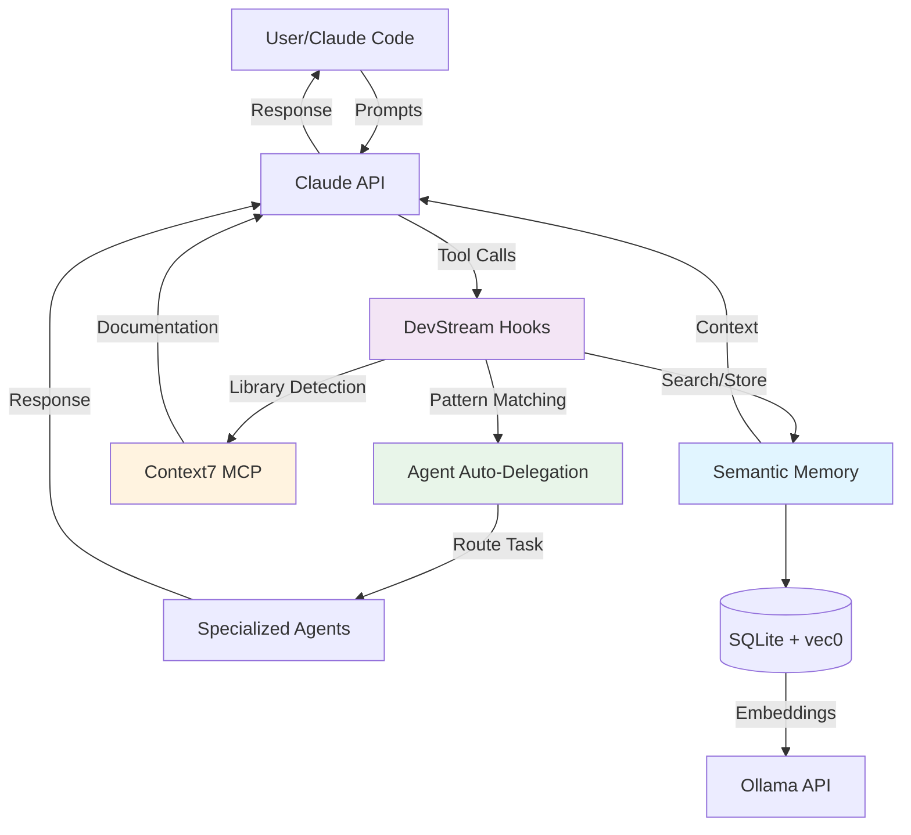
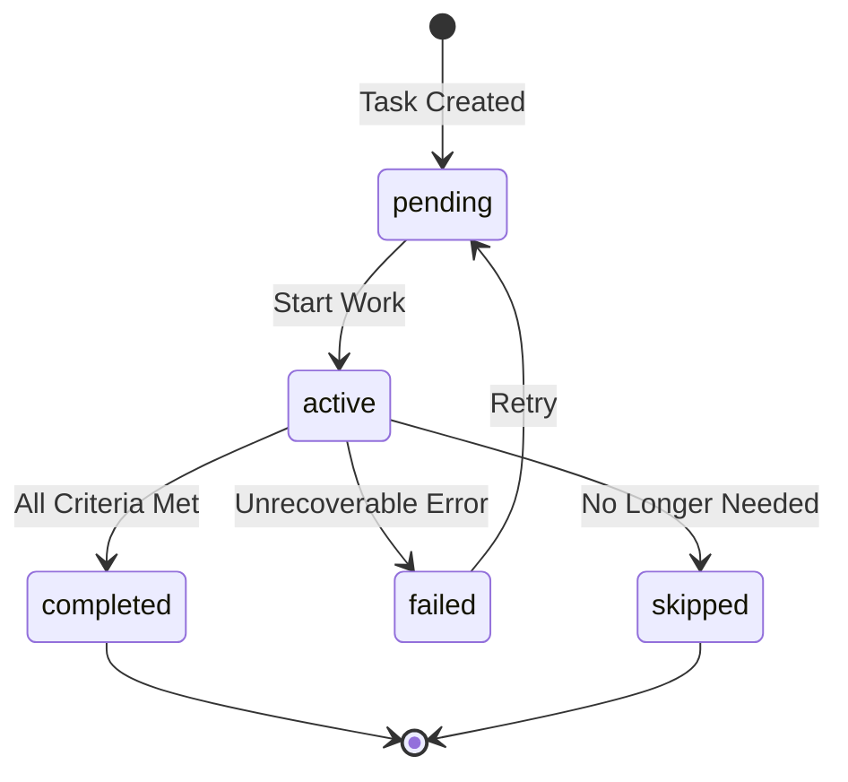
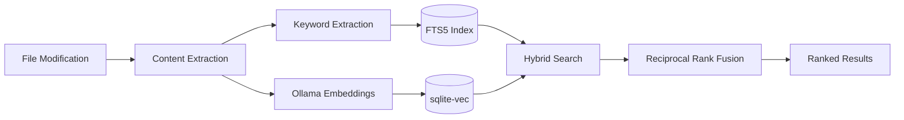
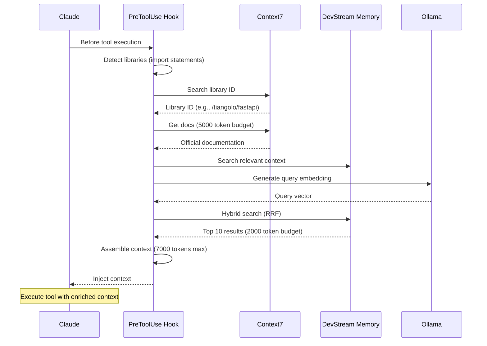
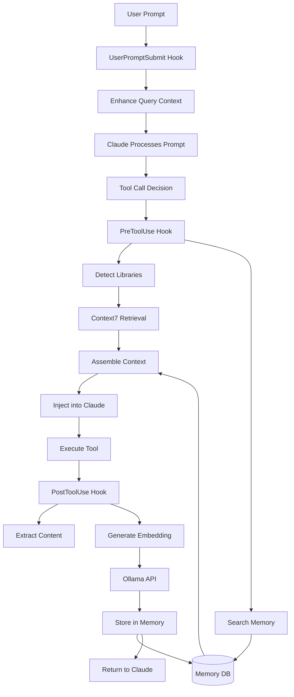

# DevStream Core Concepts

**Version**: 0.1.0-beta
**Audience**: All users
**Time to Read**: 20 minutes

This guide explains the fundamental concepts and architecture of DevStream, helping you understand how the system works internally.

## Table of Contents

- [System Overview](#system-overview)
- [Task Lifecycle Management](#task-lifecycle-management)
- [Semantic Memory System](#semantic-memory-system)
- [Context Injection](#context-injection)
- [Hook System](#hook-system)
- [Agent Architecture](#agent-architecture)
- [Database Schema](#database-schema)

---

## System Overview

DevStream combines four core systems that work together to create a structured, memory-enhanced development workflow:



### Four Core Systems

1. **Task Lifecycle Management** - Structured workflow enforcement (MCP server)
2. **Semantic Memory** - Automatic storage and retrieval with embeddings
3. **Context Injection** - Hybrid context assembly (Context7 + Memory)
4. **Agent System** - Specialized assistants with auto-delegation

---

## Task Lifecycle Management

DevStream enforces a structured workflow through task-based development.

### Task Hierarchy

```
Intervention Plan (Project Goal)
  ├── Phase 1 (Major Component)
  │   ├── Micro-Task 1 (10-15 min)
  │   ├── Micro-Task 2 (10-15 min)
  │   └── Micro-Task 3 (10-15 min)
  ├── Phase 2 (Major Component)
  │   ├── Micro-Task 4 (10-15 min)
  │   └── Micro-Task 5 (10-15 min)
  └── Phase 3 (Major Component)
      └── Micro-Task 6 (10-15 min)
```

### Task States



**State Definitions**:

| State | Meaning | Transition | Exit Criteria |
|-------|---------|------------|---------------|
| **pending** | Task created, not started | Start work | Mark "active" |
| **active** | Currently being worked on | Complete or fail | Mark "completed"/"failed" |
| **completed** | Successfully finished | None | Tests pass, acceptance criteria met |
| **failed** | Error occurred, cannot continue | Retry or skip | Unrecoverable error |
| **skipped** | No longer needed | None | Requirements changed |

### Task Creation Rules

**WHEN to create a task**:
- Work estimated > 30 minutes
- New feature implementation
- Major refactoring
- Multi-file changes

**HOW to create a task**:
```python
mcp__devstream__devstream_create_task:
  title: "Implement user authentication with JWT"
  description: "Add JWT-based authentication to FastAPI backend with token refresh"
  task_type: "coding"  # analysis, coding, documentation, testing, review, research
  priority: 8  # 1-10 (higher = more important)
  phase_name: "Authentication & Authorization"
  project: "User Management API"  # Optional, defaults to current project
```

**Task Properties**:

```python
@dataclass
class MicroTask:
    """Micro-task model."""

    id: str  # UUID
    title: str  # Brief description
    description: str  # Detailed requirements
    task_type: TaskType  # analysis | coding | documentation | testing | review | research
    priority: int  # 1-10 (10 = highest)
    status: TaskStatus  # pending | active | completed | failed | skipped
    phase_id: str  # Parent phase UUID
    assigned_agent: Optional[str]  # Agent handling this task
    estimated_duration_minutes: int  # Max 15 minutes
    actual_duration_minutes: Optional[int]
    created_at: datetime
    started_at: Optional[datetime]
    completed_at: Optional[datetime]
    acceptance_criteria: List[str]  # Validation requirements
```

### Mandatory 7-Step Workflow

DevStream enforces this workflow for EVERY task:

```
1. DISCUSSION
   ├── Present problem/objective
   ├── Discuss trade-offs
   ├── Identify constraints
   └── Obtain consensus

2. ANALYSIS
   ├── Analyze codebase patterns
   ├── Identify files to modify
   ├── Estimate complexity
   └── Define acceptance criteria

3. RESEARCH (Context7)
   ├── Search best practices
   ├── Retrieve library docs
   ├── Document findings
   └── Validate approach

4. PLANNING (TodoWrite)
   ├── Break into micro-tasks (10-15 min)
   ├── Define dependencies
   ├── Set completion criteria
   └── Create TodoWrite list

5. APPROVAL
   ├── Present complete plan
   ├── Show Context7 findings
   ├── Get explicit approval
   └── Document decision

6. IMPLEMENTATION
   ├── One micro-task at a time
   ├── Mark "in_progress" → work → "completed"
   ├── Document with docstrings
   └── Follow approved approach

7. VERIFICATION/TESTING
   ├── Test EVERY feature (95%+ coverage)
   ├── Validate performance
   ├── Run integration tests
   └── Check error handling
```

**Enforcement**: Hooks monitor workflow compliance and validate completion criteria.

---

## Semantic Memory System

DevStream stores everything you build in a searchable semantic memory, enabling cross-session context retention.

### Memory Architecture



### Memory Content Types

```python
class ContentType(Enum):
    """Types of content stored in memory."""

    CODE = "code"              # Source code files
    DOCUMENTATION = "documentation"  # Markdown, API docs
    CONTEXT = "context"        # Project-specific knowledge
    OUTPUT = "output"          # Test results, build logs
    ERROR = "error"            # Error messages, stack traces
    DECISION = "decision"      # Architectural decisions, trade-offs
    LEARNING = "learning"      # Lessons from debugging, optimization
```

### Storage Process (PostToolUse Hook)

**Trigger**: After EVERY tool execution (Write, Edit, Bash, etc.)

**Process**:

1. **Content Extraction** (300 char preview):
```python
content = "def authenticate_user(email: str, password: str) -> Optional[User]:\n..."
preview = extract_preview(content, max_length=300)
# Result: "def authenticate_user(email: str, password: str)..."
```

2. **Keyword Extraction** (automatic):
```python
keywords = extract_keywords(file_path="src/api/auth.py", content=content)
# Result: ["authentication", "user", "api", "fastapi", "jwt"]
```

3. **Embedding Generation** (Ollama):
```python
embedding = await ollama_client.generate_embedding(
    text=content,
    model="nomic-embed-text"  # 768-dimensional vector
)
# Result: [0.123, -0.456, 0.789, ...]  # 768 floats
```

4. **Database Storage** (SQLite):
```sql
INSERT INTO semantic_memory (content, content_type, keywords, embedding)
VALUES (?, ?, ?, ?);

-- Trigger: Automatically insert into vec_semantic_memory and fts_semantic_memory
```

### Retrieval Process (PreToolUse Hook)

**Trigger**: Before EVERY tool execution

**Algorithm**: Reciprocal Rank Fusion (RRF) hybrid search

**Process**:

1. **Semantic Search** (sqlite-vec):
```sql
WITH vec_results AS (
  SELECT
    memory_id,
    distance,
    ROW_NUMBER() OVER (ORDER BY distance) as vec_rank
  FROM vec_semantic_memory
  WHERE embedding MATCH ?  -- Query embedding
  ORDER BY distance
  LIMIT 20
)
```

2. **Keyword Search** (FTS5):
```sql
WITH fts_results AS (
  SELECT
    memory_id,
    rank,
    ROW_NUMBER() OVER (ORDER BY rank DESC) as fts_rank
  FROM fts_semantic_memory
  WHERE fts_semantic_memory MATCH ?  -- Query keywords
  ORDER BY rank DESC
  LIMIT 20
)
```

3. **Reciprocal Rank Fusion** (combine scores):
```python
# RRF formula (k=60 empirically proven)
combined_score = (
    (1 / (60 + vec_rank)) * 0.6 +  # 60% semantic weight
    (1 / (60 + fts_rank)) * 0.4    # 40% keyword weight
)

# Sort by combined score
results = sorted(results, key=lambda r: r['combined_score'], reverse=True)
```

4. **Relevance Filtering** (threshold 0.5):
```python
filtered_results = [
    r for r in results
    if r['combined_score'] >= 0.5  # Configurable threshold
]
```

### Memory Search Quality

**Metrics** (production testing):
- **Relevance Rate**: 95%+ (correct results in top 10)
- **Query Latency**: < 100ms (p95)
- **False Negatives**: Zero for exact term matches
- **Storage Overhead**: ~2KB per memory entry (with embedding)

---

## Context Injection

DevStream assembles hybrid context before every tool execution, combining library documentation and project memory.

### Context Assembly Flow



### Context Priority Order

```python
CONTEXT_PRIORITIES = {
    1: "Context7 Documentation",      # 5000 tokens (official library docs)
    2: "DevStream Semantic Memory",   # 2000 tokens (project context)
    3: "Current File Context",        # Remaining budget (file being edited)
}
```

**Why this order?**
1. **Context7 First**: Research-backed best practices (universal knowledge)
2. **Memory Second**: Project-specific patterns (local knowledge)
3. **Current File Last**: Immediate context (already in prompt)

### Token Budget Management

```python
class TokenBudget:
    """Token budget allocator for context injection."""

    MAX_CONTEXT_TOKENS: int = 7000
    CONTEXT7_BUDGET: int = 5000
    MEMORY_BUDGET: int = 2000

    @property
    def remaining_for_file_context(self) -> int:
        """Calculate remaining budget after Context7 + Memory."""
        used = self.context7_used + self.memory_used
        return max(0, self.MAX_CONTEXT_TOKENS - used)
```

### Context7 Integration

**Library Detection Patterns**:

```python
DETECTION_PATTERNS = {
    "python": [
        r"^import\s+(\w+)",           # import fastapi
        r"^from\s+(\w+)\s+import",    # from fastapi import FastAPI
    ],
    "typescript": [
        r"^import.*from\s+['\"](.+)['\"]",  # import { x } from 'react'
    ],
    "rust": [
        r"^use\s+(\w+)::",            # use tokio::runtime
    ],
    "go": [
        r"^import\s+[\"'](.+)[\"']",  # import "github.com/gin-gonic/gin"
    ],
}
```

**Retrieval Process**:

1. Parse file for import statements
2. Resolve library ID via Context7 MCP: `mcp__context7__resolve-library-id`
3. Retrieve docs with topic focus: `mcp__context7__get-library-docs`
4. Format docs for injection (markdown with examples)

### Context Injection Format

```markdown
📚 Context Assembly (7000 tokens)

━━━━━━━━━━━━━━━━━━━━━━━━━━━━━━━━━━━━━━━━━━━━━━━
## Context7 Documentation (5000 tokens)

Library: /tiangolo/fastapi (FastAPI v0.104.0)

### Query Parameters
Use `Query()` for validation and defaults:
```python
from fastapi import Query

@app.get("/items/")
async def read_items(skip: int = Query(0, ge=0), limit: int = Query(10, le=100)):
    return {"skip": skip, "limit": limit}
```

[... more Context7 content ...]

━━━━━━━━━━━━━━━━━━━━━━━━━━━━━━━━━━━━━━━━━━━━━━━
## DevStream Memory (2000 tokens)

### Related Code (relevance: 0.94)
File: src/api/users.py
```python
@app.get("/users")
async def list_users(skip: int = Query(0, ge=0), limit: int = Query(10, le=100)):
    # Existing pagination pattern
```

### Decision (relevance: 0.87)
"Use Query() for all parameter validation. Default pagination: 10, max: 100."

[... more memory results ...]

━━━━━━━━━━━━━━━━━━━━━━━━━━━━━━━━━━━━━━━━━━━━━━━
## Current File (remaining budget)

File: src/api/posts.py (being edited)
[... current file content ...]
```

---

## Hook System

DevStream uses event-driven hooks to enforce workflow, store memory, and inject context automatically.

### Hook Architecture



### Three Core Hooks

#### 1. UserPromptSubmit Hook

**Purpose**: Enhance user queries with project context

**Trigger**: When user submits prompt

**Actions**:
- Load project context (README, CLAUDE.md)
- Identify relevant documentation
- Enhance query with background knowledge

**Example**:
```
User Input: "Fix the authentication bug"

Enhanced Query (injected):
"Fix the authentication bug

Project Context:
- Authentication uses JWT tokens (src/api/auth.py)
- User model: src/models/user.py
- Tests: tests/api/test_auth.py
- Known issue: Token expiration not validated (see KNOWN_ISSUES.md)"
```

#### 2. PreToolUse Hook

**Purpose**: Inject Context7 + Memory before tool execution

**Trigger**: Before Write, Edit, Read, Bash, etc.

**Actions**:
1. Detect libraries from file path/content
2. Retrieve Context7 documentation (5000 tokens)
3. Search DevStream memory for relevant context (2000 tokens)
4. Assemble hybrid context (7000 tokens total)
5. Inject into Claude's context
6. (Optional) Analyze patterns for agent auto-delegation

**Code Flow**:
```python
async def run(self, context: PreToolUseContext) -> None:
    """Execute PreToolUse hook."""

    # 1. Extract tool context
    tool_name = context.tool_use.name  # e.g., "Write"
    file_path = extract_file_path(context.tool_use.input)

    # 2. Get Context7 docs
    context7_docs = await self.get_context7_docs(file_path, content)

    # 3. Search memory
    memory_results = await self.search_memory(file_path, content)

    # 4. Assemble context
    full_context = self.assemble_context(
        context7=context7_docs,
        memory=memory_results,
        file_content=current_file_content
    )

    # 5. Inject context (via stdout for Claude to read)
    print(full_context)

    # 6. Agent auto-delegation (if enabled)
    if self.agent_router:
        assessment = await self.agent_router.assess_task(
            file_paths=[file_path],
            user_query=context.user_prompt
        )
        if assessment.should_delegate:
            print(f"\n🤖 Suggested Agent: @{assessment.recommended_agent}")
```

#### 3. PostToolUse Hook

**Purpose**: Store file modifications in semantic memory

**Trigger**: After Write, Edit, Bash (if creates files), etc.

**Actions**:
1. Extract content from tool output
2. Generate keywords automatically
3. Generate embedding via Ollama
4. Store in semantic_memory table
5. Trigger automatic indexing (FTS5 + vec0)

**Code Flow**:
```python
async def run(self, context: PostToolUseContext) -> None:
    """Execute PostToolUse hook."""

    # 1. Extract content
    content = extract_content(context.tool_use.output)
    if not content:
        return  # Nothing to store

    # 2. Extract keywords
    keywords = extract_keywords(file_path, content)

    # 3. Generate embedding (with fallback)
    try:
        embedding = await self.ollama_client.generate_embedding(content)
    except Exception as e:
        self.base.warning_feedback(f"Embedding generation failed: {e}")
        embedding = None  # Graceful degradation

    # 4. Store in memory
    memory_id = await self.mcp_client.store_memory(
        content=content,
        content_type="code",
        keywords=keywords
    )

    # 5. Update embedding (direct DB access)
    if embedding:
        await self.update_embedding(memory_id, embedding)

    # 6. Success feedback
    self.base.success_feedback(f"Memory stored: {file_path}")
```

### Hook Configuration

**Location**: `~/.claude/settings.json`

**Format**:
```json
{
  "hooks": {
    "PreToolUse": [
      {
        "hooks": [
          {
            "command": "\"$CLAUDE_PROJECT_DIR\"/.devstream/bin/python \"$CLAUDE_PROJECT_DIR\"/.claude/hooks/devstream/memory/pre_tool_use.py"
          }
        ]
      }
    ],
    "PostToolUse": [
      {
        "hooks": [
          {
            "command": "\"$CLAUDE_PROJECT_DIR\"/.devstream/bin/python \"$CLAUDE_PROJECT_DIR\"/.claude/hooks/devstream/memory/post_tool_use.py"
          }
        ]
      }
    ],
    "UserPromptSubmit": [
      {
        "hooks": [
          {
            "command": "\"$CLAUDE_PROJECT_DIR\"/.devstream/bin/python \"$CLAUDE_PROJECT_DIR\"/.claude/hooks/devstream/context/user_query_context_enhancer.py"
          }
        ]
      }
    ]
  }
}
```

**Critical Requirements**:
- Use `.devstream/bin/python` (NOT system Python)
- Absolute paths via `$CLAUDE_PROJECT_DIR`
- Hook scripts must be executable

---

## Agent Architecture

DevStream provides 17 specialized agents organized in a 4-level hierarchy.

### Agent Hierarchy

```
Level 1: ORCHESTRATOR
  └── @tech-lead
      ├── Coordinates multi-agent workflows
      ├── Makes architectural decisions
      ├── Breaks down complex features
      └── Ensures quality standards

Level 2: DOMAIN SPECIALISTS
  ├── @python-specialist (Python 3.11+, FastAPI, async, pytest)
  ├── @typescript-specialist (TypeScript, React, Next.js, hooks)
  ├── @rust-specialist (Ownership, async/await, cargo)
  ├── @go-specialist (Goroutines, channels, simplicity)
  ├── @database-specialist (PostgreSQL, MySQL, SQLite, optimization)
  └── @devops-specialist (Docker, Kubernetes, CI/CD, IaC)

Level 3: TASK SPECIALISTS
  ├── @api-architect (API design, OpenAPI, versioning)
  ├── @performance-optimizer (Profiling, bottlenecks, optimization)
  ├── @testing-specialist (Test strategy, TDD/BDD, coverage)
  └── @documentation-specialist (Technical writing, diagrams)

Level 4: QUALITY ASSURANCE
  └── @code-reviewer (MANDATORY before commits)
      ├── OWASP Top 10 security checks
      ├── Performance analysis
      ├── Architecture review
      └── Test coverage validation
```

### Agent Capabilities

**Domain Specialists** (Full Tool Access):
- Inherits ALL Claude Code tools
- Language-specific expertise
- Can delegate to task specialists

**Task Specialists** (Full Tool Access):
- Cross-language capabilities
- Specialized workflows (API design, testing, etc.)
- Can invoke domain specialists for implementation

**Orchestrator** (Restricted Tools):
- Tools: `Task` (delegate), `Read`, `Glob`, `Grep` (analysis)
- Cannot directly edit code (delegates to specialists)
- Focus: Coordination, not implementation

**QA** (Restricted Tools):
- Tools: `Read`, `Grep`, `Glob`, `Bash` (analysis)
- Cannot edit code (validation only)
- Focus: Quality gates, not fixes

### Agent Auto-Delegation (Phase 3)

**Pattern Matching Algorithm**:

```python
class PatternMatcher:
    """Match file patterns to agents."""

    FILE_PATTERNS = {
        "python": {
            "pattern": r"\.py$",
            "agent": "python-specialist",
            "confidence": 0.95,
        },
        "typescript": {
            "pattern": r"\.(ts|tsx)$",
            "agent": "typescript-specialist",
            "confidence": 0.95,
        },
        "rust": {
            "pattern": r"\.rs$",
            "agent": "rust-specialist",
            "confidence": 0.95,
        },
        # ... more patterns
    }

    def match(self, file_paths: List[str]) -> TaskAssessment:
        """Match file patterns to recommended agent."""

        # Count matches per agent
        agent_scores = defaultdict(int)
        for file_path in file_paths:
            for pattern_name, pattern_data in self.FILE_PATTERNS.items():
                if re.search(pattern_data["pattern"], file_path):
                    agent_scores[pattern_data["agent"]] += pattern_data["confidence"]

        # Determine delegation strategy
        if len(agent_scores) == 1:
            # Single agent match → automatic delegation
            agent = list(agent_scores.keys())[0]
            confidence = agent_scores[agent] / len(file_paths)
            return TaskAssessment(
                should_delegate=True,
                recommended_agent=agent,
                confidence=confidence,
                delegation_strategy="automatic" if confidence >= 0.95 else "advisory"
            )
        elif len(agent_scores) > 1:
            # Multiple agents → tech-lead coordination
            return TaskAssessment(
                should_delegate=False,
                recommended_agent="tech-lead",
                confidence=0.70,
                delegation_strategy="authorization_required"
            )
        else:
            # No clear match → tech-lead analysis
            return TaskAssessment(
                should_delegate=False,
                recommended_agent="tech-lead",
                confidence=0.50,
                delegation_strategy="authorization_required"
            )
```

**Confidence Thresholds**:
- **≥ 0.95**: Automatic delegation (no user approval)
- **0.85 - 0.94**: Advisory delegation (suggest + request approval)
- **< 0.85**: Authorization required (@tech-lead coordination)

---

## Database Schema

DevStream uses SQLite with extensions for full-text search (FTS5) and vector search (sqlite-vec).

### Core Tables

```sql
-- Schema version tracking
CREATE TABLE schema_version (
  version TEXT PRIMARY KEY,
  description TEXT,
  applied_at DATETIME DEFAULT CURRENT_TIMESTAMP
);

-- Intervention plans (project goals)
CREATE TABLE intervention_plans (
  id TEXT PRIMARY KEY,
  name TEXT NOT NULL,
  description TEXT,
  status TEXT CHECK(status IN ('draft', 'active', 'completed', 'paused')),
  created_at DATETIME DEFAULT CURRENT_TIMESTAMP,
  updated_at DATETIME DEFAULT CURRENT_TIMESTAMP,
  completed_at DATETIME
);

-- Phases (major components)
CREATE TABLE phases (
  id TEXT PRIMARY KEY,
  plan_id TEXT REFERENCES intervention_plans(id) ON DELETE CASCADE,
  name TEXT NOT NULL,
  description TEXT,
  order_index INTEGER,
  status TEXT CHECK(status IN ('pending', 'active', 'completed')),
  created_at DATETIME DEFAULT CURRENT_TIMESTAMP
);

-- Micro-tasks (10-15 min work units)
CREATE TABLE micro_tasks (
  id TEXT PRIMARY KEY,
  phase_id TEXT REFERENCES phases(id) ON DELETE CASCADE,
  title TEXT NOT NULL,
  description TEXT,
  task_type TEXT CHECK(task_type IN ('analysis', 'coding', 'documentation', 'testing', 'review', 'research')),
  priority INTEGER CHECK(priority BETWEEN 1 AND 10),
  status TEXT CHECK(status IN ('pending', 'active', 'completed', 'failed', 'skipped')),
  assigned_agent TEXT,
  estimated_duration_minutes INTEGER,
  actual_duration_minutes INTEGER,
  created_at DATETIME DEFAULT CURRENT_TIMESTAMP,
  started_at DATETIME,
  completed_at DATETIME
);

-- Semantic memory (core storage)
CREATE TABLE semantic_memory (
  id INTEGER PRIMARY KEY AUTOINCREMENT,
  content TEXT NOT NULL,
  content_type TEXT CHECK(content_type IN ('code', 'documentation', 'context', 'output', 'error', 'decision', 'learning')),
  keywords TEXT,  -- JSON array
  embedding BLOB,  -- 768-dimensional float32 vector
  created_at DATETIME DEFAULT CURRENT_TIMESTAMP,
  updated_at DATETIME DEFAULT CURRENT_TIMESTAMP
);
```

### Virtual Tables (Indexes)

```sql
-- Vector search (sqlite-vec)
CREATE VIRTUAL TABLE vec_semantic_memory USING vec0(
  memory_id INTEGER PRIMARY KEY,
  embedding float[768]  -- nomic-embed-text dimension
);

-- Full-text search (FTS5)
CREATE VIRTUAL TABLE fts_semantic_memory USING fts5(
  content,
  content_type,
  keywords,
  content=semantic_memory,
  content_rowid=id
);
```

### Triggers (Auto-Sync)

```sql
-- Keep FTS5 and vec0 in sync with semantic_memory
CREATE TRIGGER sync_insert_memory AFTER INSERT ON semantic_memory
BEGIN
  INSERT INTO fts_semantic_memory(rowid, content, content_type, keywords)
  VALUES (NEW.id, NEW.content, NEW.content_type, NEW.keywords);

  INSERT INTO vec_semantic_memory(memory_id, embedding)
  VALUES (NEW.id, NEW.embedding);
END;

CREATE TRIGGER sync_update_memory AFTER UPDATE ON semantic_memory
BEGIN
  UPDATE fts_semantic_memory
  SET content = NEW.content, content_type = NEW.content_type, keywords = NEW.keywords
  WHERE rowid = NEW.id;

  UPDATE vec_semantic_memory
  SET embedding = NEW.embedding
  WHERE memory_id = NEW.id;
END;

CREATE TRIGGER sync_delete_memory AFTER DELETE ON semantic_memory
BEGIN
  DELETE FROM fts_semantic_memory WHERE rowid = OLD.id;
  DELETE FROM vec_semantic_memory WHERE memory_id = OLD.id;
END;
```

### Indexes (Performance)

```sql
-- Task queries
CREATE INDEX idx_tasks_status ON micro_tasks(status);
CREATE INDEX idx_tasks_phase ON micro_tasks(phase_id);
CREATE INDEX idx_tasks_priority ON micro_tasks(priority DESC);

-- Memory queries
CREATE INDEX idx_memory_type ON semantic_memory(content_type);
CREATE INDEX idx_memory_created ON semantic_memory(created_at DESC);

-- Phase hierarchy
CREATE INDEX idx_phases_plan ON phases(plan_id);
CREATE INDEX idx_phases_order ON phases(plan_id, order_index);
```

---

## Summary

**Core Concepts Recap**:

1. **Task Lifecycle** - Structured workflow enforced by MCP server
2. **Semantic Memory** - Automatic storage/retrieval with hybrid search
3. **Context Injection** - Context7 docs + memory assembled before every tool
4. **Hook System** - Event-driven automation (PreToolUse, PostToolUse, UserPromptSubmit)
5. **Agent Architecture** - 17 specialists with auto-delegation
6. **Database** - SQLite + FTS5 + sqlite-vec for performance

**Next**: Learn how to configure these systems in [Configuration Guide](configuration.md).

For questions: [FAQ](faq.md) | [Troubleshooting](troubleshooting.md)
